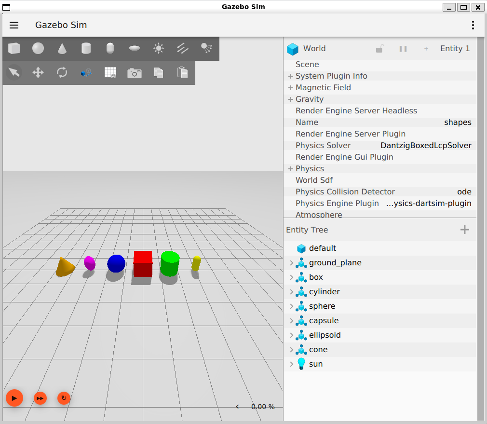

# EEL 4332 Software Setup

## Goal

Prepare one consistent environment for the EEL 4332 simulation labs.

The recommended Windows workflow is:

```text
Windows 11
└── WSL2
    └── Ubuntu 24.04
        ├── ROS 2 Jazzy
        ├── Gazebo Harmonic
        ├── RViz2
        ├── Nav2
        ├── SLAM Toolbox
        ├── robot_localization
        └── Python tools
```

F1TENTH / RoboRacer Gym is optional and is not required to begin the course. The required simulation environment uses TurtleBot 3 in Gazebo.

## Background

Autonomous-vehicle software spans several layers. Ubuntu provides the operating environment; ROS 2 connects software components; Gazebo simulates a physical world and sensors; RViz2 visualizes ROS data; and Nav2 supplies localization, planning, and navigation components. Installing the programs is only the first step—students must also learn how to inspect each layer and the interfaces between them.

For that reason, Lab 00 includes two required practices after installation. The ROS 2 practice starts with small publisher/subscriber systems so the communication graph is understandable. The Gazebo practice starts with a small SDF world so physics, entities, simulation time, and bridging can be observed without the complexity of TurtleBot and Nav2. Lab 01 then combines the same ideas in a complete robot simulation.

The setup and practice steps are part of the laboratory work. Save the requested evidence and resolve missing prerequisites now; otherwise a later algorithm problem can be confused with an installation, clock, frame, or bridge problem.

---

## Part 1 — Install WSL2 and Ubuntu 24.04

From Windows PowerShell:

```powershell
wsl --install -d Ubuntu-24.04
```

After installation:

```powershell
wsl -l -v
```

Confirm that Ubuntu is using WSL version 2.

---

## Part 2 — Install ROS 2 Jazzy

Follow the official ROS 2 Jazzy Ubuntu Debian-package instructions:

https://docs.ros.org/en/jazzy/Installation/Ubuntu-Install-Debs.html

For this course, install the Desktop variant.

Install the beginner examples and ROS development tools used later in this setup lab:

```bash
sudo apt update
sudo apt install \
  ros-jazzy-demo-nodes-py \
  ros-jazzy-turtlesim \
  ros-jazzy-rqt-graph \
  python3-colcon-common-extensions \
  python3-rosdep
```

After installation:

```bash
source /opt/ros/jazzy/setup.bash
ros2 --help
```

Part 7 provides guided ROS 2 and Gazebo exercises before students use the larger TurtleBot/Nav2 system.

To source ROS automatically:

```bash
echo "source /opt/ros/jazzy/setup.bash" >> ~/.bashrc
```

---

## Part 3 — Install ROS–Gazebo integration

```bash
sudo apt update
sudo apt install ros-jazzy-ros-gz
```

Test Gazebo:

```bash
gz sim shapes.sdf
```
A Gazebo window look like the below will open


Press Ctrl + C to close the window.

Test ROS–Gazebo launch support:

```bash
ros2 launch ros_gz_sim gz_sim.launch.py gz_args:="shapes.sdf"
```
The same window opens.

---

## Part 4 — Install navigation / localization packages

```bash
sudo apt update
sudo apt install \
  ros-jazzy-navigation2 \
  ros-jazzy-nav2-bringup \
  ros-jazzy-nav2-minimal-tb3-sim \
  ros-jazzy-slam-toolbox \
  ros-jazzy-robot-localization
```


Official Nav2 setup guide:

https://docs.nav2.org/setup_guides/gazebo.html

Official TurtleBot 3 learning references:

- [TurtleBot 3 Gazebo simulation — Jazzy](https://docs.robotis.com/docs/systems/turtlebot3/simulation/gazebo_simulation/?ros=jazzy)
- [TurtleBot 3 SLAM simulation — Jazzy](https://docs.robotis.com/docs/systems/turtlebot3/simulation/slam_simulation/?ros=jazzy)

These ROBOTIS pages are useful for learning the usual simulation sequence: launch a world, move the robot, visualize its data, run SLAM, and save a map. They use the ROBOTIS `turtlebot3_gazebo` package workflow, while the first course labs use the installed `nav2_bringup` and `nav2_minimal_tb3_sim` packages. Do not clone another TurtleBot workspace or substitute ROBOTIS launch commands for course commands unless the instructor asks you to do so. Also confirm that the **Jazzy** tab is selected before using a command from the website.

---

## Part 5 — Clone this repository and enter its root

Run these commands in Ubuntu/WSL:

```bash
mkdir -p ~/courses
cd ~/courses
git clone https://github.com/hoanbklucky/eel4332-autonomous-vehicle-labs.git
cd eel4332-autonomous-vehicle-labs
```

If you already cloned the repository, do not clone it again. Enter the existing copy instead:

```bash
cd ~/courses/eel4332-autonomous-vehicle-labs
```

The **repository root** is the `eel4332-autonomous-vehicle-labs` directory that contains the top-level `README.md`, `requirements.txt`, `lab00_setup/`, and the other lab directories. Confirm your current location:

```bash
pwd
ls
```

`pwd` should end with `/eel4332-autonomous-vehicle-labs`, and the `ls` output should include `requirements.txt`. If you cloned the repository somewhere other than `~/courses`, use that location in the `cd` command.

---

## Part 6 — Create the course Python environment

### Why use a virtual environment?

A Python virtual environment gives this course its own location for packages installed with `pip`. This provides several benefits:

- course packages do not overwrite Ubuntu or ROS 2 system packages;
- different projects can use different package versions;
- students can reproduce a known set of dependencies from `requirements.txt`;
- packages can be installed without `sudo`, reducing the risk of damaging the system Python installation.

The environment isolates packages installed by `pip`; it does not contain a second installation of ROS 2. ROS packages from `/opt/ros/jazzy` remain available when the ROS setup file is sourced. This is why the course environment also installs a few Python helpers required by ROS-visible packages.

After activation, the terminal prompt normally begins with `(eel4332)`, and `python` and `pip` refer to the course environment. Run `deactivate` to return to the normal system environment. If you open a new terminal, activate the environment again before running the pure-Python lab programs:

```bash
source ~/venvs/eel4332/bin/activate
```

In Ubuntu:

```bash
sudo apt install python3-venv python3-pip
python3 -m venv ~/venvs/eel4332
source ~/venvs/eel4332/bin/activate
python -m pip install --upgrade pip setuptools
```

Make sure you are still at the repository root established in Part 5, then run:

```bash
python -m pip install -r requirements.txt
```

The command is successful when it ends with `Successfully installed` or reports that all requirements are already satisfied.

If an older copy of this repository reports that ROS packages such as `generate-parameter-library-py` or `launch-ros` require `setuptools`, `jinja2`, or `typeguard`, update the repository and run the requirements command again:

```bash
git pull
python -m pip install -r requirements.txt
```

Those messages come from ROS 2 Python packages exposed by `/opt/ros/jazzy/setup.bash`. The updated requirements install the corresponding helpers inside the isolated course environment. Do not use `sudo pip` and do not delete the ROS installation.

Verify:

```bash
python -c "import numpy, matplotlib, yaml; print('Python dependencies OK')"
python -c "import setuptools, jinja2, typeguard; print('ROS Python helpers OK')"
python -m pip check
```

All three verification commands should complete without dependency-conflict messages. Use `deactivate` when you want to leave the course Python environment.

---

## Part 7 — Complete the ROS 2 and Gazebo fundamentals practices

Most students are not expected to have previous ROS 2 or Gazebo experience. Before working with the much larger TurtleBot/Nav2 system, complete both required guided practices in this order:

1. [ROS 2 Fundamentals Practice](ros2_fundamentals.md)
2. [Gazebo Fundamentals Practice](gazebo_fundamentals.md)

The ROS 2 practice covers:

- the ROS graph and the roles of nodes;
- topics and typed messages;
- services, actions, and parameters;
- command-line introspection and `rqt_graph`;
- ROS packages and colcon workspaces;
- sourcing order;
- running multiple nodes with a launch file.

The Gazebo practice covers:

- the different jobs of Gazebo, ROS 2, and RViz2;
- worlds, models, links, visuals, collisions, inertial properties, sensors, and plugins;
- play, pause, reset, camera, and entity-inspection controls;
- SDF world files, poses, simulation time, and real-time factor;
- Gazebo Transport topics and services;
- an explicit Gazebo-to-ROS clock bridge.

Do not skip directly to TurtleBot merely because Gazebo opens successfully. Being able to launch a window is different from being able to inspect, modify, and debug a simulated robotic system.

---

## Part 8 — Optional F1TENTH / RoboRacer Gym

F1TENTH, now also known as RoboRacer, is an autonomous-driving education and racing platform built around a small car-like vehicle. Unlike the differential-drive TurtleBot used in this course's primary Gazebo simulation, an F1TENTH vehicle uses car-like steering. Its simulator can therefore be useful when studying vehicle kinematics, planning, and control.

The [F1TENTH Gym repository](https://github.com/f1tenth/f1tenth_gym) provides an optional simulation environment for experimenting with this type of vehicle. It is not required for Lab 00 or Lab 01, and students should not delay the required TurtleBot/Gazebo setup to install it.

The F1TENTH organization also publishes an [open collection of teaching labs](https://github.com/f1tenth/f1tenth_labs_openrepo). These are examples and exercises developed for F1TENTH courses at other institutions. They may be useful as supplemental reading, but they are not EEL 4332 assignments and their installation instructions, software versions, and deliverables may differ from this repository.

Lab 02 uses the pure-Python bicycle model included in this repository, so F1TENTH Gym is optional. Install or explore it only if the instructor specifically assigns an extension that uses it.

---

## Part 9 — Run the verification script

Source both ROS 2 and the practice workspace before running the verification:

```bash
source ~/venvs/eel4332/bin/activate
source /opt/ros/jazzy/setup.bash
source ~/eel4332_ws/install/setup.bash
chmod +x lab00_setup/verify_installation.sh
./lab00_setup/verify_installation.sh
```

Fix any required item marked `MISSING` before starting Lab 01.

---

## Part 10 — Goosebot

Do **not** install Goosebot-specific dependencies during the first week unless instructed.

The final physical deployment will use:

https://github.com/hoanbklucky/goose

The instructor will provide the final ROS 2 branch/package names and network/hardware configuration before the physical-robot project.

Goosebot is a four-wheel skid-steer robot. It has four conventional wheels, each powered by a DC motor, with fixed parallel wheel axes and no geometric steering linkage. Turning requires different left- and right-side wheel velocities and lateral tire slip. Before deployment, the instructor must document how motion commands are mapped to the four motors. The TurtleBot simulation is not an exact Goosebot model; it is used to exercise the ROS 2 autonomy layers before the physical interface is introduced.

---

# Setup Success Criteria

Before Lab 01, you should be able to:

- [ ] run `ros2 --help`
- [ ] run `gz sim shapes.sdf`
- [ ] launch Gazebo through `ros_gz_sim`
- [ ] open RViz2
- [ ] import NumPy and Matplotlib
- [ ] clone and edit this repository
- [ ] explain the difference between a topic, service, and action
- [ ] inspect a node, topic, message type, service, action, and parameter from the command line
- [ ] build and source a colcon workspace
- [ ] launch the `eel4332_ros_practice` publisher and subscriber together
- [ ] produce an `rqt_graph` screenshot of the practice nodes
- [ ] inspect and modify the provided Gazebo practice world
- [ ] explain the difference between Gazebo, ROS 2, and RViz2
- [ ] inspect Gazebo topics and services
- [ ] bridge `/clock` from Gazebo to ROS 2 and verify it
