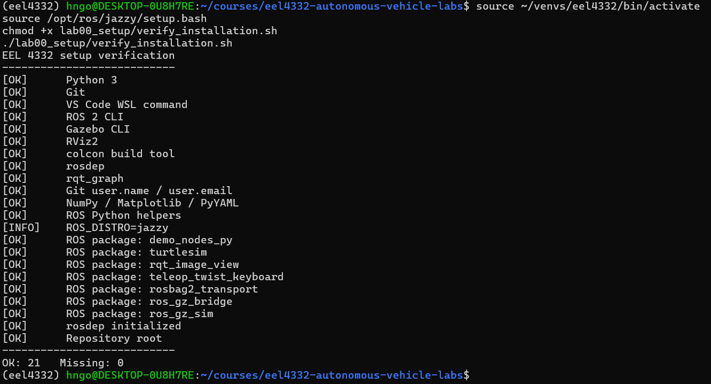

# EEL 4332 Software Setup

## Before You Begin — Update Course Files

If this is your first setup, skip this update check; Part 6 installs Git and clones the repository. If you already have a local copy, open a **WSL/Ubuntu Terminal** and run:

```bash
cd ~/courses/eel4332-autonomous-vehicle-labs
git status --short
```

**Command breakdown:** `cd` changes to the repository directory; `~` means your Ubuntu home directory. `git status --short` gives a compact list of local changes and prints nothing when the working tree is clean.

If the command prints nothing, run `git pull --rebase`. If it lists files, protect your work first by following [Updating the Course Repository](../docs/UPDATING_COURSE_REPOSITORY.md). Use your actual repository path if you cloned it elsewhere.

## Goal

Prepare one consistent environment for the EEL 4332 simulation labs.

The recommended Windows workflow is:

```text
Windows 11
└── WSL2
    └── Ubuntu 24.04
        ├── ROS 2 Jazzy
        ├── Gazebo Harmonic
        ├── RViz2
        ├── Nav2
        ├── SLAM Toolbox
        ├── robot_localization
        └── Python tools
```

F1TENTH / RoboRacer Gym is optional and is not required to begin the course. The required simulation environment uses TurtleBot 3 in Gazebo.

## Background

Autonomous-vehicle software spans several layers. Ubuntu provides the operating environment; ROS 2 connects software components; Gazebo simulates a physical world and sensors; RViz2 visualizes ROS data; and Nav2 supplies localization, planning, and navigation components. Installing the programs is only the first step—students must also learn how to inspect each layer and the interfaces between them.

Lab 00 installs and verifies those tools. [Lab 1](../lab01_ros2_gazebo_fundamentals/README.md) teaches ROS 2 and Gazebo through small systems, [Lab 2](../lab02_turtlebot_playground/README.md) provides a low-pressure TurtleBot driving playground, Lab 3 models the motion students observed, and Lab 4 combines the ROS and Gazebo ideas in a complete TurtleBot/Nav2 simulation.

Resolve missing prerequisites now; otherwise a later algorithm problem can be confused with an installation or environment problem.

## WSL/Ubuntu Terminal Shortcuts

You do not need to retype every long path or command. Bash, the shell used by the WSL/Ubuntu Terminal, provides shortcuts that reduce typing and mistakes.

### Complete names with Tab

Type the beginning of a command, folder, or filename and press `Tab`. Bash completes the name when there is one match. If several names match, type another character or press `Tab` twice to list the choices.

For example, the following keystrokes can complete the course repository path. Do not type the text `<Tab>`; press the `Tab` key at those positions.

```text
cd ~/cou<Tab>/eel4332<Tab>
```

Tab completion works only for names that already exist, which also makes it a useful check for misspelled paths.

### Reuse and edit previous commands

| Key or command | What it does |
|---|---|
| `Up Arrow` / `Down Arrow` | move backward or forward through commands already entered |
| `Ctrl+R` | search backward through command history; type part of a command and press `Ctrl+R` again for an older match |
| `Ctrl+A` / `Ctrl+E` | move the cursor to the beginning or end of the current command |
| `Alt+B` / `Alt+F` | move backward or forward by one word |
| `Ctrl+W` | delete the word immediately before the cursor |
| `Ctrl+U` / `Ctrl+K` | delete from the cursor to the beginning or end of the line |
| `Ctrl+L` | clear the visible terminal while keeping command history |
| `Ctrl+C` | cancel the current command or stop a running ROS/Gazebo process |
| `history` | display numbered commands from the current shell's history |

When using `Ctrl+R`, inspect the matched command before running it. Press `Enter` to execute it, use an arrow key to leave the search and edit it, or press `Ctrl+C` to cancel the search.

### Move among common directories

| Command | Destination |
|---|---|
| `cd ~` | your Ubuntu home directory |
| `cd ..` | the parent of the current directory |
| `cd -` | the previous directory |
| `pwd` | prints the current directory instead of changing it |
| `ls` | lists files and folders in the current directory |

Use `pwd` and `ls` whenever you are unsure where you are, and use Tab completion before pressing `Enter` on a long path.

## Required Software

| Component | Where it is installed | Course use |
|---|---|---|
| WSL2 + Ubuntu 24.04 | Windows / WSL | Linux environment for all course commands |
| Git | inside Ubuntu/WSL | clone, update, and track lab work |
| VS Code | Windows | course-supported editor |
| Microsoft WSL extension | VS Code on Windows | opens and runs tools inside Ubuntu/WSL |
| Microsoft Python extension | VS Code WSL environment | Python editing, interpreter selection, and debugging |
| ROS 2 Jazzy Desktop | inside Ubuntu/WSL | robot middleware and visualization |
| Gazebo Harmonic through `ros_gz` | inside Ubuntu/WSL | physics and sensor simulation |
| Nav2, SLAM Toolbox, and localization packages | inside Ubuntu/WSL | later navigation labs |
| Python virtual environment and requirements | inside Ubuntu/WSL | numerical lab dependencies |

F1TENTH/RoboRacer and Goosebot software are not required for the initial setup.

---

## Part 1 — Install WSL2 and Ubuntu 24.04

**Why this part matters:** ROS 2 and Gazebo are Linux tools; WSL2 gives Windows users the consistent Ubuntu environment used throughout the course.

From Windows PowerShell:

```powershell
wsl --install -d Ubuntu-24.04
```

**Command breakdown:** `wsl --install` installs a WSL distribution, and `-d Ubuntu-24.04` selects Ubuntu 24.04 rather than the default distribution.

After installation:

```powershell
wsl -l -v
```

**Command breakdown:** `wsl -l` lists installed WSL distributions, while `-v` adds their state and WSL version. Ubuntu should report version `2`.

Confirm that Ubuntu is using WSL version 2.

**Terminal terminology used throughout this repository:** a **WSL/Ubuntu Terminal** means a shell whose prompt is running inside Ubuntu. It may be an Ubuntu tab in the Windows Terminal application, the Ubuntu application, or VS Code's integrated terminal after VS Code connects to WSL. It does **not** mean a PowerShell or Command Prompt tab.

---

## Part 2 — Install Git and Visual Studio Code

**Why this part matters:** Git delivers course files and updates, while VS Code with WSL lets you edit and run those Linux files from one workspace.

### Install and configure Git inside Ubuntu/WSL

Git downloads the course repository, records changes to your work, and obtains instructor updates. Install Git inside Ubuntu because the course commands and repository live in the WSL environment:

```bash
sudo apt update
sudo apt install git
git --version
which git
```

**Command breakdown:** `sudo apt update` refreshes Ubuntu's package index, `sudo apt install git` installs Git, `git --version` verifies it, and `which git` shows the executable being used.

`which git` should normally print `/usr/bin/git`. Configure the identity attached to your commits, replacing the examples with your real information:

```bash
git config --global user.name "Your Full Name"
git config --global user.email "your.email@example.com"
git config --global --get user.name
git config --global --get user.email
```

**Command breakdown:** `git config --global` stores identity settings for your Ubuntu user. The `--get` commands read the saved values so you can verify them; replace the example name and email with your own.

Use an email associated with GitHub or your GitHub-provided private `noreply` address. The name and email identify commits; they are not your GitHub password and do not authenticate `git push`.

If Git is also installed on Windows, it has a separate configuration. For this course, run Git commands from Ubuntu/WSL so paths, permissions, and line endings stay consistent with ROS 2.

### Install VS Code on Windows and connect it to WSL

VS Code is the course-supported editor. Install the graphical application on **Windows**, not inside Ubuntu/WSL:

1. Download and install [Visual Studio Code for Windows](https://code.visualstudio.com/download).
2. During installation, enable **Add to PATH** when offered.
3. Open VS Code and install the **WSL** extension published by Microsoft.
4. Install the **Python** extension published by Microsoft. When a course folder is open through WSL, make sure the extension is also installed in that WSL environment if VS Code offers **Install in WSL**.
5. Close and reopen the WSL/Ubuntu Terminal so it receives the updated Windows PATH.

Test the connection from a WSL/Ubuntu Terminal:

```bash
code --version
mkdir -p ~/courses
cd ~/courses
code .
```

**Command breakdown:** `code --version` verifies the VS Code command, `mkdir -p` creates `~/courses` if needed, `cd` enters it, and `code .` opens the current directory in VS Code through WSL.

VS Code should open with an indicator such as **WSL: Ubuntu-24.04** in the lower-left corner. Open **Terminal → New Terminal** inside VS Code to create an integrated WSL/Ubuntu Terminal, then run:

```bash
pwd
uname -a
```

**Command breakdown:** `pwd` prints the directory opened by VS Code, and `uname -a` displays Linux system information. Seeing Linux output confirms that the terminal is connected to WSL/Ubuntu.

The integrated WSL/Ubuntu Terminal should show a Linux path and identify Linux/WSL. If VS Code opens the folder locally on Windows instead, use the lower-left remote indicator and select **Connect to WSL**, then reopen the folder.

Keep course repositories in the Linux filesystem, such as `~/courses`, rather than under `/mnt/c`, unless the instructor directs otherwise. After creating the Python environment later in this lab, select `~/venvs/eel4332/bin/python` when VS Code asks for the course Python interpreter.

Official references:

- [Developing in WSL with VS Code](https://code.visualstudio.com/docs/remote/wsl)
- [Git installation for Linux](https://git-scm.com/install/linux)
- [First-time Git configuration](https://git-scm.com/book/en/v2/Getting-Started-First-Time-Git-Setup)

---

## Part 3 — Install ROS 2 Jazzy

**Why this part matters:** ROS 2 provides the command-line tools, communication middleware, and software packages used by every later robotics lab.

Follow the official ROS 2 Jazzy Ubuntu Debian-package instructions:

https://docs.ros.org/en/jazzy/Installation/Ubuntu-Install-Debs.html

For this course, install the Desktop variant.

Install the beginner examples and ROS development tools used in Lab 1 and later labs:

```bash
sudo apt update
sudo apt install \
  ros-jazzy-demo-nodes-py \
  ros-jazzy-turtlesim \
  ros-jazzy-rqt-graph \
  ros-jazzy-rqt-image-view \
  ros-jazzy-teleop-twist-keyboard \
  ros-jazzy-rosbag2 \
  python3-colcon-common-extensions \
  python3-rosdep
```

**Command breakdown:** `apt update` refreshes package information and `apt install` installs the listed ROS utilities. Each trailing `\` continues the same command on the next displayed line.

After installation:

```bash
source /opt/ros/jazzy/setup.bash
ros2 --help
```

**Command breakdown:** `source` loads ROS 2 Jazzy into the current terminal environment. `ros2 --help` then verifies the CLI and lists its command groups.

Initialize `rosdep`, which later resolves ROS package dependencies:

```bash
sudo rosdep init
rosdep update
```

**Command breakdown:** `sudo rosdep init` creates the system-wide rosdep configuration and is normally run once per Ubuntu installation. `rosdep update` downloads the current dependency database for your user.

Run `sudo rosdep init` only once. If it reports that the default sources list already exists, leave that file in place and continue with `rosdep update`.

Lab 1 provides guided ROS 2 and Gazebo exercises, and Lab 2 provides manual TurtleBot practice before students model its motion in Lab 3 and use the larger TurtleBot/Nav2 system in Lab 4.

To source ROS automatically:

```bash
echo "source /opt/ros/jazzy/setup.bash" >> ~/.bashrc
```

**Command breakdown:** `echo` produces the source command, `>>` appends it to `~/.bashrc`, and Bash reads that file for future interactive terminals. Do not repeat this command unnecessarily, or duplicate lines will be added.

---

## Part 4 — Install ROS–Gazebo integration

**Why this part matters:** Gazebo simulates the physical world, while the integration packages let ROS 2 programs exchange data with that simulation.

```bash
sudo apt update
sudo apt install ros-jazzy-ros-gz
```

**Command breakdown:** `apt update` refreshes package information, and `apt install ros-jazzy-ros-gz` installs the ROS 2 Jazzy packages that integrate modern Gazebo with ROS.

Test Gazebo:

```bash
gz sim shapes.sdf
```

**Command breakdown:** `gz sim` starts Gazebo Sim, and `shapes.sdf` selects Gazebo's installed example world.
A Gazebo window look like the below will open


Press Ctrl + C to close the window.

Test ROS–Gazebo launch support:

```bash
ros2 launch ros_gz_sim gz_sim.launch.py gz_args:="shapes.sdf"
```

**Command breakdown:** `ros2 launch PACKAGE FILE` starts `gz_sim.launch.py` from `ros_gz_sim`. The launch argument `gz_args:="shapes.sdf"` passes the example world name to Gazebo.
The same window opens.

---

## Part 5 — Install navigation / localization packages

**Why this part matters:** Later labs use these packages for mapping, localization, planning, and navigation, so installing them now prevents interruptions later.

```bash
sudo apt update
sudo apt install \
  ros-jazzy-navigation2 \
  ros-jazzy-nav2-bringup \
  ros-jazzy-nav2-minimal-tb3-sim \
  ros-jazzy-slam-toolbox \
  ros-jazzy-robot-localization
```

**Command breakdown:** `apt install` installs the navigation, TurtleBot simulation, SLAM, and localization packages listed after it. The trailing `\` characters make the displayed lines one command.

For Lab 00, installing these packages is the only required action in this part. You do **not** need to complete a TurtleBot, Nav2, or SLAM tutorial yet. The course introduces those workflows gradually in later labs using course-tested commands.

<details>
<summary><strong>Optional references for later labs — not required in Lab 00</strong></summary>

The following official pages are useful when you reach navigation and mapping later in the course:

- [Nav2 Gazebo setup guide](https://docs.nav2.org/setup_guides/gazebo.html)
- [TurtleBot 3 Gazebo simulation — Jazzy](https://docs.robotis.com/docs/systems/turtlebot3/simulation/gazebo_simulation/?ros=jazzy)
- [TurtleBot 3 SLAM simulation — Jazzy](https://docs.robotis.com/docs/systems/turtlebot3/simulation/slam_simulation/?ros=jazzy)

The ROBOTIS pages use the `turtlebot3_gazebo` package workflow, while the first course labs use the installed `nav2_bringup` and `nav2_minimal_tb3_sim` packages. Do not clone another TurtleBot workspace, install additional packages, or substitute website launch commands for course commands unless the instructor asks you to do so.

When a later lab directs you to one of these pages, confirm that its **Jazzy** tab is selected and return to the course README for the required command and deliverables.

</details>

---

## Part 6 — Clone this repository and enter its root

**Why this part matters:** Your local clone contains the instructions and starter files, and its Git history lets you receive future course updates.

Run these commands in a WSL/Ubuntu Terminal:

```bash
mkdir -p ~/courses
cd ~/courses
git clone https://github.com/hoanbklucky/eel4332-autonomous-vehicle-labs.git
cd eel4332-autonomous-vehicle-labs
```

**Command breakdown:** `mkdir -p` creates the course parent directory, `cd` enters it, `git clone` downloads a local repository copy, and the final `cd` enters the new repository root.

If you already cloned the repository, do not clone it again. Enter the existing copy instead:

```bash
cd ~/courses/eel4332-autonomous-vehicle-labs
```

**Command breakdown:** `cd` changes directly to the recommended repository location. `~` expands to your Ubuntu home directory.

The **repository root** is the `eel4332-autonomous-vehicle-labs` directory that contains the top-level `README.md`, `requirements.txt`, `lab00_setup/`, and the other lab directories. Confirm your current location:

```bash
pwd
ls
```

**Command breakdown:** `pwd` prints the current location, and `ls` lists its contents. Use both to confirm that you are at the repository root.

`pwd` should end with `/eel4332-autonomous-vehicle-labs`, and the `ls` output should include `requirements.txt`. If you cloned the repository somewhere other than `~/courses`, use that location in the `cd` command.

Inspect the repository and open it through the WSL connection:

```bash
git status
git remote -v
git branch --show-current
code .
```

**Command breakdown:** `git status` summarizes local changes, `git remote -v` shows the connected remote repository, `git branch --show-current` identifies the active branch, and `code .` opens the repository in VS Code.

The VS Code Explorer should show `lab00_setup`, `lab01_ros2_gazebo_fundamentals`, and the remaining lab folders. The Source Control panel should recognize the Git repository. Run Git commands in integrated WSL/Ubuntu Terminals in this workspace, not from a separate Windows copy of the folder.

---

## Part 7 — Create the course Python environment

**Why this part matters:** A dedicated virtual environment keeps course Python dependencies consistent without changing ROS 2 or system Python packages.

### Why use a virtual environment?

A Python virtual environment gives this course its own location for packages installed with `pip`. This provides several benefits:

- course packages do not overwrite Ubuntu or ROS 2 system packages;
- different projects can use different package versions;
- students can reproduce a known set of dependencies from `requirements.txt`;
- packages can be installed without `sudo`, reducing the risk of damaging the system Python installation.

The environment isolates packages installed by `pip`; it does not contain a second installation of ROS 2. ROS packages from `/opt/ros/jazzy` remain available when the ROS setup file is sourced. This is why the course environment also installs a few Python helpers required by ROS-visible packages.

After activation, the WSL/Ubuntu Terminal prompt normally begins with `(eel4332)`, and `python` and `pip` refer to the course environment. Run `deactivate` to return to the normal system environment. If you open a new WSL/Ubuntu Terminal, activate the environment again before running the pure-Python lab programs:

```bash
source ~/venvs/eel4332/bin/activate
```

**Command breakdown:** `source` runs the virtual environment's activation script in the current shell, changing `python` and `pip` to the isolated course versions.

When the repository is open in VS Code, use **Python: Select Interpreter** from the Command Palette and choose:

```text
~/venvs/eel4332/bin/python
```

The selected interpreter controls Python editing, running, and debugging in VS Code. It does not replace the need to source `/opt/ros/jazzy/setup.bash` in WSL/Ubuntu Terminals that run ROS commands.

In Ubuntu:

```bash
sudo apt install python3-venv python3-pip
python3 -m venv ~/venvs/eel4332
source ~/venvs/eel4332/bin/activate
python -m pip install --upgrade pip setuptools
```

**Command breakdown:** `apt install` provides Python's virtual-environment and package tools. `python3 -m venv` creates the environment, `source` activates it, and `python -m pip install --upgrade` updates its packaging tools.

Make sure you are still at the repository root established in Part 6, then run:

```bash
python -m pip install -r requirements.txt
```

**Command breakdown:** `python -m pip` uses pip from the active Python interpreter, while `-r requirements.txt` installs every dependency declared in the course requirements file.

The command is successful when it ends with `Successfully installed` or reports that all requirements are already satisfied.

If an older copy of this repository reports that ROS packages such as `generate-parameter-library-py` or `launch-ros` require `setuptools`, `jinja2`, or `typeguard`, update the repository and run the requirements command again:

```bash
git pull
python -m pip install -r requirements.txt
```

**Command breakdown:** `git pull` retrieves course updates from the configured remote, and the pip command synchronizes the active environment with any updated Python requirements. Protect local changes before pulling as described at the beginning of this lab.

Those messages come from ROS 2 Python packages exposed by `/opt/ros/jazzy/setup.bash`. The updated requirements install the corresponding helpers inside the isolated course environment. Do not use `sudo pip` and do not delete the ROS installation.

Verify:

```bash
python -c "import numpy, matplotlib, yaml; print('Python dependencies OK')"
python -c "import setuptools, jinja2, typeguard; print('ROS Python helpers OK')"
python -m pip check
```

**Command breakdown:** The two `python -c` commands run short import checks. `python -m pip check` verifies that installed Python packages have compatible declared dependencies.

All three verification commands should complete without dependency-conflict messages. Use `deactivate` when you want to leave the course Python environment.

---

## Part 8 — Optional F1TENTH / RoboRacer Gym

**Why this part matters:** This optional simulator offers another vehicle-control environment without making it a dependency for the required labs.

F1TENTH, now also known as RoboRacer, is an autonomous-driving education and racing platform built around a small car-like vehicle. Unlike the differential-drive TurtleBot used in this course's primary Gazebo simulation, an F1TENTH vehicle uses car-like steering. Its simulator can therefore be useful when studying vehicle kinematics, planning, and control.

The [F1TENTH Gym repository](https://github.com/f1tenth/f1tenth_gym) provides an optional simulation environment for experimenting with this type of vehicle. It is not required for Labs 00–02, and students should not delay the required TurtleBot/Gazebo setup or playground to install it.

The F1TENTH organization also publishes an [open collection of teaching labs](https://github.com/f1tenth/f1tenth_labs_openrepo). These are examples and exercises developed for F1TENTH courses at other institutions. They may be useful as supplemental reading, but they are not EEL 4332 assignments and their installation instructions, software versions, and deliverables may differ from this repository.

Lab 3 first implements differential-drive odometry and then uses the repository's pure-Python bicycle model for comparison. F1TENTH Gym is optional; install or explore it only if the instructor specifically assigns an extension that uses it.

---

## Part 9 — Run the verification script

**Why this part matters:** Verification catches missing tools and packages now, before they appear as harder-to-diagnose failures during a lab.

Source ROS 2 and activate the Python environment before running the verification:

```bash
source ~/venvs/eel4332/bin/activate
source /opt/ros/jazzy/setup.bash
chmod +x lab00_setup/verify_installation.sh
./lab00_setup/verify_installation.sh
```

**Command breakdown:** The two `source` commands activate the course Python environment and ROS 2 Jazzy. `chmod +x` makes the verification script executable, and `./` runs that script from the repository root.

Fix any required item marked `MISSING` before starting Lab 01.
If there is no missing, the output should look like below



---

## Part 10 — Goosebot

**Why this part matters:** Identifying the simulation-to-hardware boundary prepares you for later Goosebot work without assuming an unverified hardware interface.

Do **not** install Goosebot-specific dependencies during the first week unless instructed.

The final physical deployment will use:

https://github.com/hoanbklucky/goose

The instructor will provide the final ROS 2 branch/package names and network/hardware configuration before the physical-robot project.

Goosebot is a four-wheel skid-steer robot. It has four conventional wheels, each powered by a DC motor, with fixed parallel wheel axes and no geometric steering linkage. Turning requires different left- and right-side wheel velocities and lateral tire slip. Before deployment, the instructor must document how motion commands are mapped to the four motors. The TurtleBot simulation is not an exact Goosebot model; it is used to exercise the ROS 2 autonomy layers before the physical interface is introduced.

---

## What to Submit

Submit the following two screenshots:

1. **Gazebo shapes:** the Gazebo window from Part 4 showing the world with several different shapes.
2. **Installation verification:** the complete Terminal output from Part 9 showing that the installation verification script ran successfully and that no required item is marked `MISSING`.

Make sure both screenshots are readable and show enough of the application window to identify Gazebo or the WSL/Ubuntu Terminal.

---

# Setup Success Criteria

Before Lab 01, you should be able to:

- [ ] run `ros2 --help`
- [ ] run `git --version` and confirm Git name/email configuration
- [ ] run `code .` from WSL and confirm VS Code reports a WSL connection
- [ ] confirm VS Code recognizes the repository and selects `~/venvs/eel4332/bin/python`
- [ ] run `rosdep update` successfully
- [ ] run `gz sim shapes.sdf`
- [ ] launch Gazebo through `ros_gz_sim`
- [ ] open RViz2
- [ ] import NumPy and Matplotlib
- [ ] clone and edit this repository
- [ ] verify `ros2 bag`, `teleop_twist_keyboard`, and `rqt_image_view` are available

After every item passes, continue to [Lab 1 — ROS 2 and Gazebo Fundamentals](../lab01_ros2_gazebo_fundamentals/README.md).
