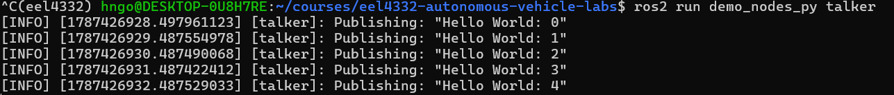
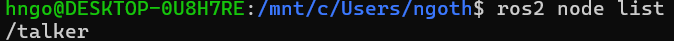
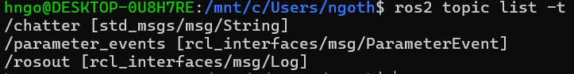
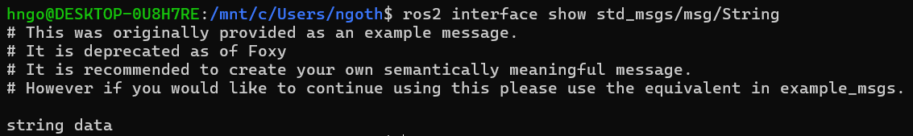
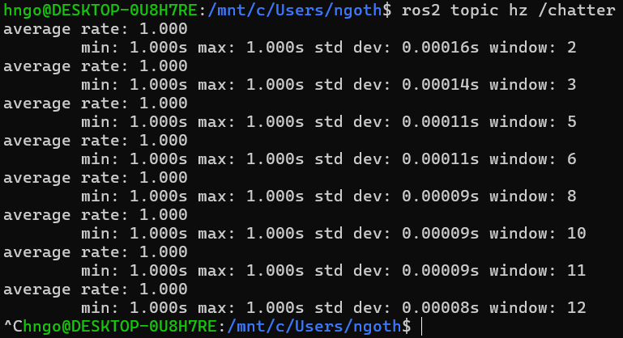
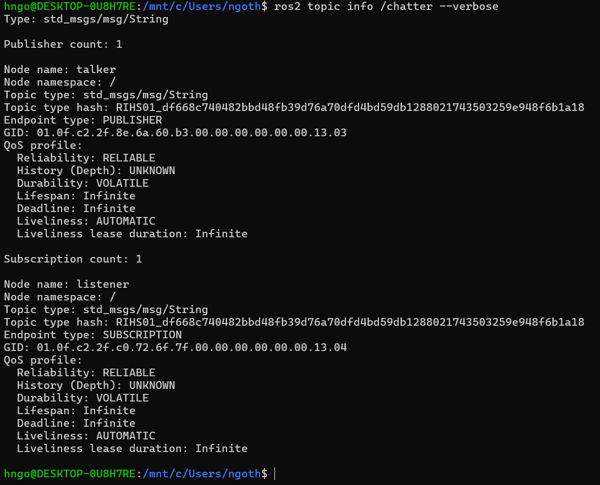
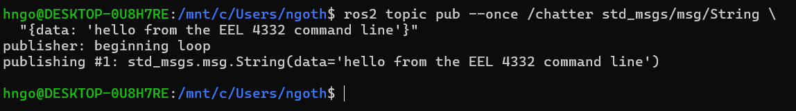
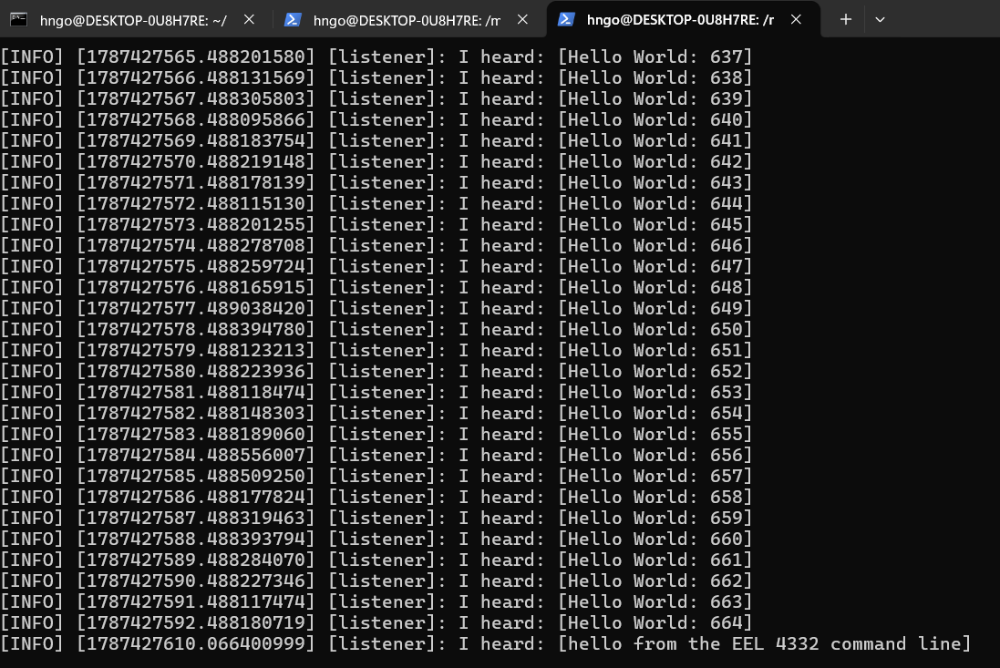

# ROS 2 Fundamentals Practice

## Purpose

Complete this practice before Lab 01. It introduces the ROS 2 workflow with small systems whose behavior is easy to understand. Allow approximately 60–90 minutes.

Run **one command block at a time** and examine its output before continuing. Do not copy an entire practice section into the WSL/Ubuntu Terminal at once. Commands split across two displayed lines with a trailing `\` are one command, not two commands.

The official [ROS 2 Jazzy beginner CLI tutorials](https://docs.ros.org/en/jazzy/Tutorials/Beginner-CLI-Tools.html) provide additional explanations and examples.

## Mental Model

ROS 2 is middleware and a collection of development tools, not a simulator or a robot model.

| Term | Meaning | Typical autonomous-vehicle example |
|---|---|---|
| node | one running ROS program or component | LiDAR driver or planner |
| topic | asynchronous stream for continuous data | laser scans or velocity commands |
| message | typed data carried by a topic | `sensor_msgs/msg/LaserScan` |
| service | short request followed by one response | reset or configuration request |
| action | longer operation with feedback and cancellation | navigate to a goal |
| parameter | named configuration value owned by a node | update rate or frame name |
| launch file | reproducible description for starting nodes together | simulator and navigation bringup |
| package | installable unit containing ROS code and metadata | `nav2_bringup` |
| workspace | directory in which one or more packages are built | `~/eel4332_ws` |

Topics suit continuous streams, services suit quick request/response operations, and actions suit longer, cancelable tasks that report feedback. Do not select an interface only by its name; inspect its type and communication pattern.

## Practice 1 — Source ROS in Every WSL/Ubuntu Terminal

Open a WSL/Ubuntu Terminal and run:

```bash
source /opt/ros/jazzy/setup.bash
```

Confirm the selected ROS distribution:

```bash
echo "$ROS_DISTRO"
```

Locate the ROS 2 command:

```bash
which ros2
```

The expected distribution is `jazzy`, and `which ros2` should resolve to `/opt/ros/jazzy/bin/ros2`.

`source` changes the environment of the current shell only. Every newly opened WSL/Ubuntu Terminal must source ROS, either manually or through `~/.bashrc`. Commands entered at a PowerShell prompt are not Ubuntu commands; enter `wsl` first.

## Practice 2 — Run and Inspect Publisher/Subscriber Nodes

Open three WSL/Ubuntu Terminals.

In **WSL/Ubuntu Terminal 1**, start a publisher:

```bash
source /opt/ros/jazzy/setup.bash
```

```bash
ros2 run demo_nodes_py talker
```



*Expected talker output. The node publishes a new numbered string approximately once per second.*

Keep it running. In **WSL/Ubuntu Terminal 2**, inspect the graph:

```bash
source /opt/ros/jazzy/setup.bash
```

List the running nodes:

```bash
ros2 node list
```



*The running publisher appears as the `/talker` node.*

Inspect the talker node:

```bash
ros2 node info /talker
```


*Node information identifies the talker's publishers, service servers, and other interfaces.*

List topics together with their message types:

```bash
ros2 topic list -t
```



*The `/chatter` topic carries `std_msgs/msg/String` messages.*

Inspect the publishers, subscribers, type, and Quality of Service settings for `/chatter`:

```bash
ros2 topic info /chatter --verbose
```


*Before the listener starts, `/chatter` has one publisher and no subscribers.*

Inspect the fields in the message type:

```bash
ros2 interface show std_msgs/msg/String
```



*The message definition contains one string field named `data`.*

Display one message and return to the prompt:

```bash
ros2 topic echo /chatter --once
```


*The `--once` option prints one message and then returns to the shell prompt.*

Measure the publication rate:

```bash
ros2 topic hz /chatter
```



*The measured average rate is approximately `1 Hz`, matching the talker's behavior.*

Let `ros2 topic hz` collect data for approximately 10 seconds and then press `Ctrl+C`.

In **WSL/Ubuntu Terminal 3**, start a subscriber:

```bash
source /opt/ros/jazzy/setup.bash
```

```bash
ros2 run demo_nodes_py listener
```


*The listener subscribes to `/chatter` and prints each received message.*

Return to WSL/Ubuntu Terminal 2 and inspect the topic again:

```bash
ros2 topic info /chatter --verbose
```



*After the listener starts, the topic has one publisher and one subscriber.*

Confirm that the graph now contains a publisher and a subscriber. Notice that a topic is not a process: nodes publish or subscribe to a named, typed topic.

Stop the talker with `Ctrl+C`, but keep the listener running. Publish one message manually from WSL/Ubuntu Terminal 2:

```bash
ros2 topic pub --once /chatter std_msgs/msg/String \
  "{data: 'hello from the EEL 4332 command line'}"
```



*The command-line publisher sends one correctly typed message.*

Confirm that the listener receives it:



*The final listener line confirms that the manually published message traveled through `/chatter`.*

Then stop the listener.

## Practice 3 — Services, Parameters, and Actions

In WSL/Ubuntu Terminal 1, start turtlesim:

```bash
source /opt/ros/jazzy/setup.bash
```

```bash
ros2 run turtlesim turtlesim_node
```

### Inspect and call a service

In WSL/Ubuntu Terminal 2:

```bash
source /opt/ros/jazzy/setup.bash
```

List available services and their types:

```bash
ros2 service list -t
```

Show the type of the `/spawn` service:

```bash
ros2 service type /spawn
```

Inspect the request and response fields:

```bash
ros2 interface show turtlesim/srv/Spawn
```

Call the service:

```bash
ros2 service call /spawn turtlesim/srv/Spawn \
  "{x: 2.0, y: 2.0, theta: 0.0, name: 'practice_turtle'}"
```

A second turtle should appear. The request contains input fields; the service returns one response.

### Inspect and change a parameter

```bash
ros2 param list /turtlesim
```

```bash
ros2 param get /turtlesim background_r
```

```bash
ros2 param set /turtlesim background_r 100
```

Parameters configure a node. They are not intended to replace a high-rate sensor or command topic.

### Inspect and send an action goal

```bash
ros2 action list -t
```

```bash
ros2 action info /turtle1/rotate_absolute
```

```bash
ros2 action send_goal /turtle1/rotate_absolute \
  turtlesim/action/RotateAbsolute "{theta: 1.57}" --feedback
```

Observe the feedback while the turtle rotates. An action is appropriate because the operation takes time and has a goal, feedback, and final result.

Stop turtlesim with `Ctrl+C`.

## Practice 4 — Build a Course ROS Package

ROS packages are normally built inside a colcon workspace. The provided `eel4332_ros_practice` package contains a small counter publisher, counter subscriber, and launch file. The code is intentionally simple so you can concentrate on package structure and tools.

First leave the course Python virtual environment if it is active:

```bash
deactivate
```

If the command reports that `deactivate` is not found, no virtual environment is active and you may continue.

From the course repository root, create a workspace and link the practice package into its `src` directory:

```bash
source /opt/ros/jazzy/setup.bash
```

```bash
mkdir -p ~/eel4332_ws/src
```

```bash
ln -s "$PWD/lab00_setup/eel4332_ros_practice" \
  ~/eel4332_ws/src/eel4332_ros_practice
```

```bash
cd ~/eel4332_ws
```

If the link already exists, do not create a second one. Confirm the workspace layout:

```bash
find src/eel4332_ros_practice -maxdepth 2 -type f | sort
```

Install declared dependencies and build only the practice package:

```bash
rosdep update
```

```bash
rosdep install --from-paths src --ignore-src -r -y
```

```bash
colcon build --symlink-install --packages-select eel4332_ros_practice
```

If `rosdep update` says that rosdep has not been initialized, initialize it once and then retry:

```bash
sudo rosdep init
```

```bash
rosdep update
```

After a successful build, source the workspace overlay:

```bash
source /opt/ros/jazzy/setup.bash
```

```bash
source ~/eel4332_ws/install/setup.bash
```

```bash
ros2 pkg prefix eel4332_ros_practice
```

The final command should print a path under `~/eel4332_ws/install`. The sourcing order matters: source the base Jazzy installation first and the course workspace second.

Do not commit the workspace `build/`, `install/`, or `log/` directories to the course repository.

## Practice 5 — Use a Launch File and Parameters

In WSL/Ubuntu Terminal 1, source both environments and launch the provided publisher and subscriber:

```bash
source /opt/ros/jazzy/setup.bash
```

```bash
source ~/eel4332_ws/install/setup.bash
```

```bash
ros2 launch eel4332_ros_practice practice.launch.py rate_hz:=5.0
```

In WSL/Ubuntu Terminal 2:

```bash
source /opt/ros/jazzy/setup.bash
```

```bash
source ~/eel4332_ws/install/setup.bash
```

List the practice nodes:

```bash
ros2 node list
```

List topics and their types:

```bash
ros2 topic list -t
```

Inspect the practice topic:

```bash
ros2 topic info /practice/count --verbose
```

Display one counter message:

```bash
ros2 topic echo /practice/count --once
```

Measure its update rate:

```bash
ros2 topic hz /practice/count
```

After stopping the rate measurement with `Ctrl+C`, inspect the launch parameter:

```bash
ros2 param get /counter_publisher rate_hz
```

The measured topic rate should be close to the configured value, allowing for scheduling and measurement variation. Stop `ros2 topic hz` after approximately 10 seconds.

Launch `rqt_graph` from WSL/Ubuntu Terminal 2:

```bash
rqt_graph
```

Select **Nodes/Topics (all)** if necessary. Confirm that the graph shows:

```text
/counter_publisher → /practice/count → /counter_subscriber
```

Save a screenshot for your setup record. Close `rqt_graph` and stop the launch with `Ctrl+C`. In WSL/Ubuntu Terminal 1, relaunch at a different configured rate:

```bash
ros2 launch eel4332_ros_practice practice.launch.py rate_hz:=2.0
```

In WSL/Ubuntu Terminal 2, measure the topic again:

```bash
ros2 topic hz /practice/count
```

Let it collect data for approximately 10 seconds and press `Ctrl+C`. Verify that the observed rate changed. This demonstrates the difference between reusable node code and launch-time configuration.

## Practice 6 — Read the Package Structure

Inspect these provided files:

```text
eel4332_ros_practice/
├── package.xml
├── setup.py
├── setup.cfg
├── launch/practice.launch.py
└── eel4332_ros_practice/
    ├── counter_publisher.py
    └── counter_subscriber.py
```

Be able to explain:

- where dependencies are declared;
- how `console_scripts` make Python nodes available to `ros2 run`;
- why launch files must be installed by `setup.py`;
- why rebuilding and sourcing are separate steps;
- why another WSL/Ubuntu Terminal cannot see a newly built package until its overlay is sourced.

The official [developing a ROS 2 package guide](https://docs.ros.org/en/jazzy/How-To-Guides/Developing-a-ROS-2-Package.html) and [launch-file integration tutorial](https://docs.ros.org/en/jazzy/Tutorials/Intermediate/Launch/Launch-system.html) provide further details.

## ROS 2 Working Practices

- Source the correct distribution and workspace in every WSL/Ubuntu Terminal.
- Use one clear responsibility per node.
- Inspect live topic types rather than assuming a name implies a type.
- Use parameters and launch arguments for configuration instead of editing code for every run.
- Use topics for streams, services for quick requests, and actions for long-running goals.
- Check timestamps, frame IDs, update rates, and Quality of Service when data appears missing.
- Use `ros2 node info`, `ros2 topic info --verbose`, and `rqt_graph` before blaming the simulator.
- Stop nodes cleanly with `Ctrl+C`; do not leave old simulations or bridges running.
- Never send an unvalidated simulation command directly to a physical robot.

## Completion Check

Before returning to the main Lab 00 README, confirm that you can:

- [ ] describe nodes, topics, messages, services, actions, parameters, packages, and workspaces;
- [ ] inspect a running graph with ROS CLI tools;
- [ ] publish a correctly typed message from the command line;
- [ ] call a service and send an action goal;
- [ ] build and source a colcon workspace;
- [ ] launch two nodes together with a launch argument;
- [ ] explain the practice graph shown by `rqt_graph`.
