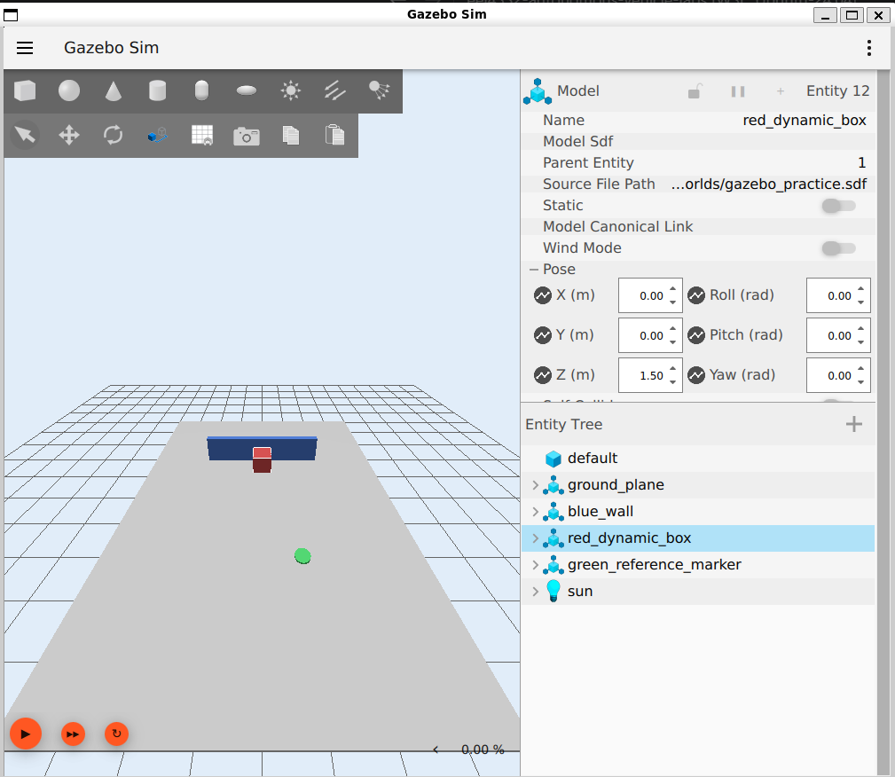
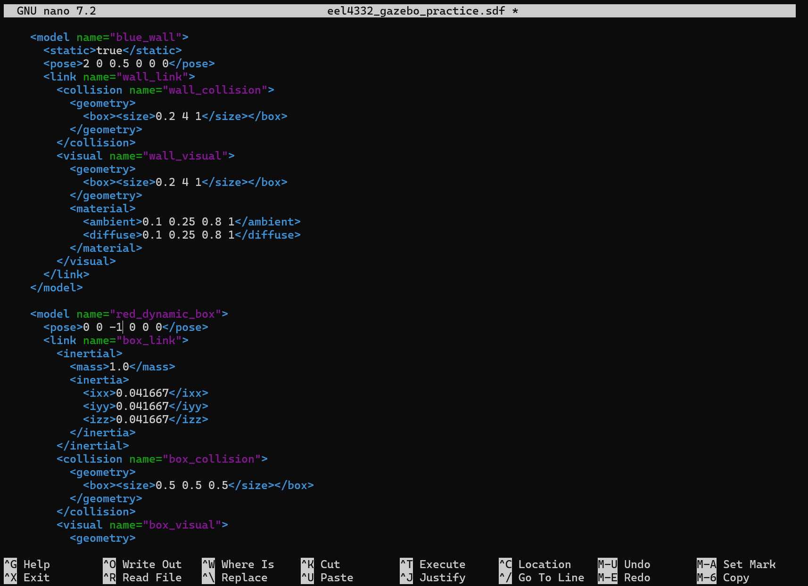
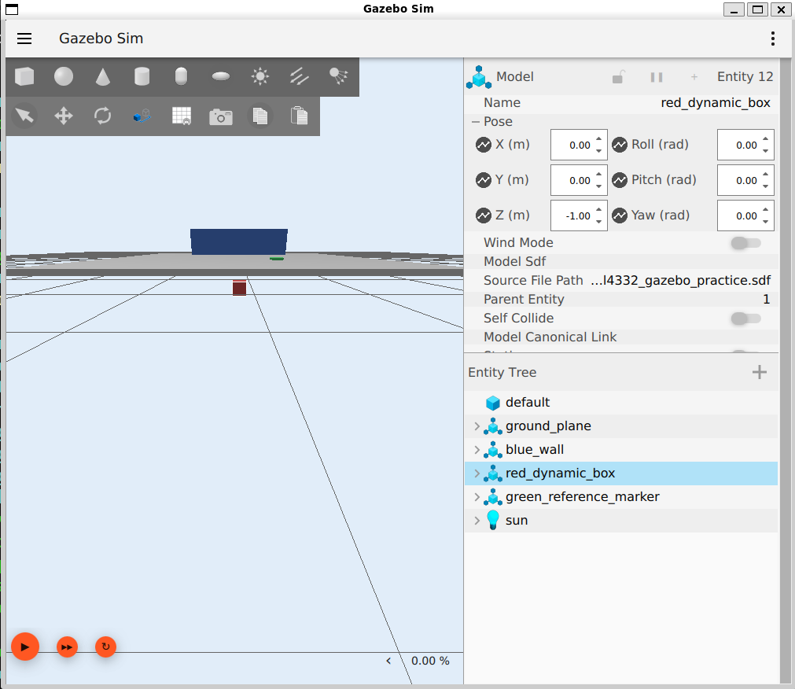
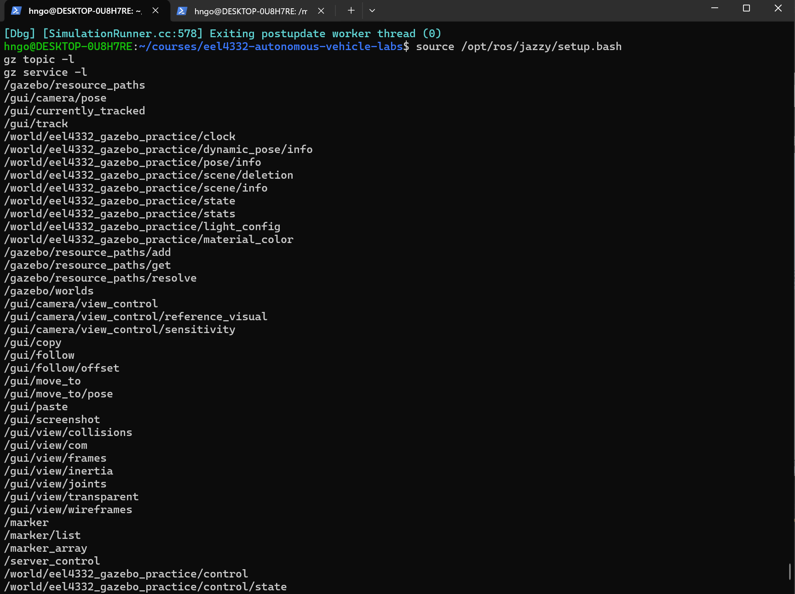
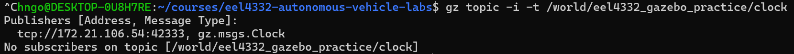
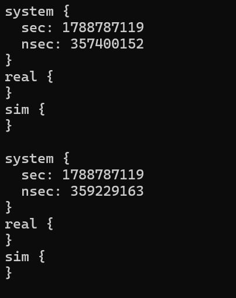
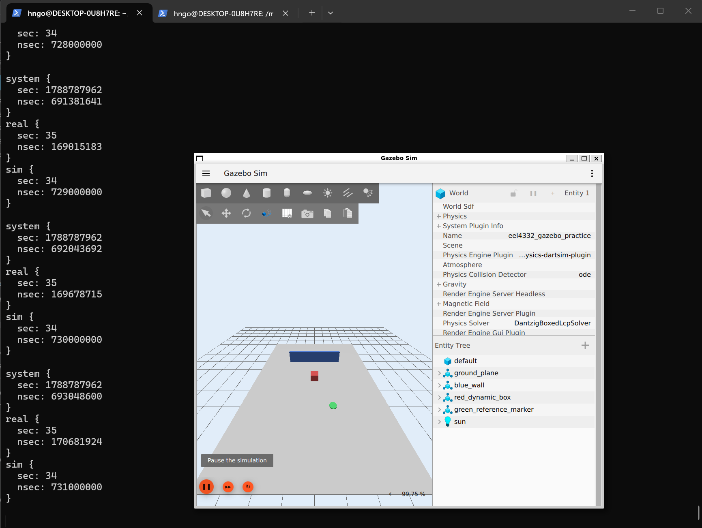
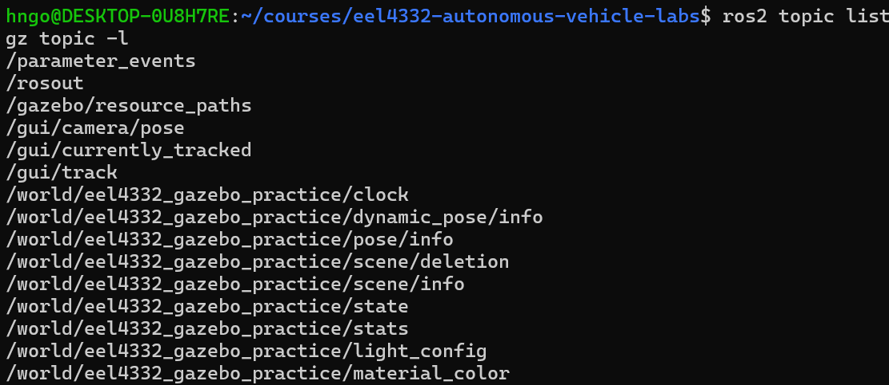
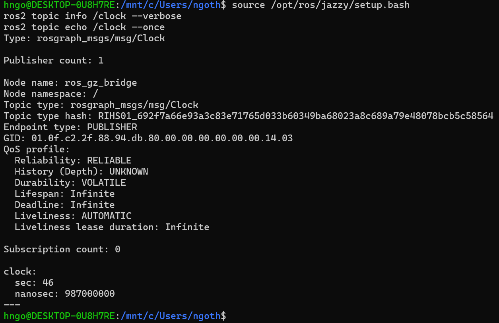

# Gazebo Fundamentals Practice

## Before You Begin — Update Course Files

In a **WSL/Ubuntu Terminal**, go to your local course repository and check for changes:

```bash
cd ~/courses/eel4332-autonomous-vehicle-labs
git status --short
```

**Command breakdown:** `cd` changes to the repository directory; `~` means your Ubuntu home directory. `git status --short` gives a compact list of local changes and prints nothing when the working tree is clean.

If the command prints nothing, run `git pull --rebase`. If it lists files, protect your work first by following [Updating the Course Repository](../docs/UPDATING_COURSE_REPOSITORY.md). Use your actual repository path if you cloned it elsewhere.

Complete this guided practice after both ROS 2 fundamentals parts. It assumes ROS 2 Jazzy, Gazebo Harmonic, and `ros_gz` were installed in [Lab 00](../lab00_setup/README.md).

Use the [WSL/Ubuntu Terminal shortcuts from Lab 00](../lab00_setup/README.md#wslubuntu-terminal-shortcuts) to complete long paths with `Tab`, recall commands with the arrow keys or `Ctrl+R`, and edit a recalled command before running it again.

## Learning Objectives

By the end of this practice, you should be able to:

- distinguish Gazebo, ROS 2, and RViz2;
- identify worlds, models, links, joints, visuals, collisions, inertial properties, and sensors;
- pause, play, reset, and inspect a simulation;
- recognize simulation time and real-time factor;
- inspect the Gazebo Transport graph;
- explain why a ROS–Gazebo bridge is needed;
- make and verify one controlled change to an SDF world.

## Background — Three Tools with Different Jobs

Gazebo, ROS 2, and RViz2 often run together, but they are not the same program.

| Tool | Main job | Typical evidence |
|---|---|---|
| Gazebo | Simulates a 3-D world, rigid-body motion, contacts, and sensors | a model falls, collides, or moves in the world |
| ROS 2 | Connects autonomy software through nodes, messages, services, actions, and parameters | nodes and typed topics appear in the ROS graph |
| RViz2 | Visualizes ROS messages and coordinate frames | a map, scan, path, robot model, or TF tree appears |

Gazebo does not automatically make every value available to ROS 2. Gazebo Transport and ROS 2 are separate communication systems. A `ros_gz_bridge` process translates selected message types and topics between them. A bridge is therefore an explicit interface, not a second simulator.

### The Gazebo model hierarchy

- A **world** contains the complete scene, physics settings, lights, and models.
- A **model** is an object such as a robot, wall, or box.
- A **link** is one rigid body within a model.
- A **joint** constrains the motion between links.
- A **visual** controls what an object looks like.
- A **collision** controls the geometry used for contacts.
- **Inertial** properties describe mass and resistance to rotation.
- A **sensor** is normally attached to a link and generates simulated measurements.
- A Gazebo **system plugin** adds behavior such as physics, sensors, or joint control.

These elements are normally described using SDF, an XML-based simulation-description format. A visually convincing model can still behave incorrectly if its collision or inertial properties are wrong.

### Simulation time

Gazebo advances **simulation time** while the world is playing. Pausing Gazebo stops simulation time even though your computer's wall clock continues. The **real-time factor** compares simulated elapsed time with wall-clock elapsed time. A value near `1.0` means one simulated second takes about one real second; a lower value means the simulation is running more slowly.

ROS nodes that process simulated sensors should normally use the Gazebo clock consistently. Mixing wall time, stale data from an older run, and reset simulation time can cause timestamp and TF errors.

## Practice 1 — Open and Inspect the Course World

**Why this practice matters:** Learning the simulation controls and entity tree first gives you a known visual baseline before robots and ROS connections add complexity.

First, use `cd` to move to the course repository root. If you used the recommended location from Lab 00, run:

```bash
cd ~/courses/eel4332-autonomous-vehicle-labs
pwd
```

**Command breakdown:** `cd` changes the current directory to the repository root. `pwd` means **print working directory** and displays the full path of your current location.

`cd` changes the current directory, and `pwd` prints it so you can confirm that the final directory name is `eel4332-autonomous-vehicle-labs`. If you cloned the repository somewhere else, replace the path above with its actual location.

Then source ROS 2 and open the provided world:

```bash
source /opt/ros/jazzy/setup.bash
gz sim -v 4 lab01_ros2_gazebo_fundamentals/worlds/gazebo_practice.sdf
```

**Command breakdown:** `source` loads the ROS 2 Jazzy environment into this terminal. `gz sim` starts Gazebo Sim, `-v 4` requests detailed console messages, and the final argument is the SDF world file to open.

<details>
<summary>Expected Gazebo window</summary>



*The Entity Tree on the right lists the same models that appear in the simulated world.*

</details>

The world contains:

- a gray ground plane;
- a static blue wall;
- a red dynamic box initially above the ground;
- a green reference marker at approximately `x = -2 m`, `y = -1 m`.

In the Gazebo window:

1. Find the **play/pause** control. Play the world and observe the red box fall under gravity.
2. Pause the world and confirm that the simulated scene stops changing.
3. Use the camera controls to orbit, pan, and zoom. The exact mouse bindings are shown in the Gazebo interface and may depend on the selected camera tool.
4. Open the **Entity Tree** if it is hidden. Select `red_dynamic_box`, `blue_wall`, and `ground_plane` one at a time.
5. Inspect each entity's pose. Notice that a pose has position `(x, y, z)` and orientation `(roll, pitch, yaw)`.
6. Reset the world and verify that the red box returns to its original pose.

Do not continue until you can reliably play, pause, reset, select an entity, and move the camera.

## Practice 2 — Read and Modify SDF

**Why this practice matters:** SDF is the source description for simulated worlds and models, so small edits connect file contents to what Gazebo displays.

Return to the WSL/Ubuntu Terminal running Gazebo and press `Ctrl+C` to close the first simulation. The terminal should return to the repository root.

Do not edit the course copy. Make a working copy in your Ubuntu home directory:

```bash
cp lab01_ros2_gazebo_fundamentals/worlds/gazebo_practice.sdf ~/eel4332_gazebo_practice.sdf
```

**Command breakdown:** `cp SOURCE DESTINATION` copies a file. The first path is the protected course file, while the second creates `eel4332_gazebo_practice.sdf` under `~`, your Ubuntu home directory.

Change to the directory containing the copied file and confirm your location:

```bash
cd ~
pwd
```

**Command breakdown:** `cd ~` returns to your Ubuntu home directory. `pwd` displays that directory so you can verify where the copied file is located.

`pwd` should print your Ubuntu home directory, such as `/home/your_username`. Open the copied file with the `nano` terminal editor:

```bash
nano eel4332_gazebo_practice.sdf
```

**Command breakdown:** `nano` opens the named text file in a terminal editor. Because the command uses only a filename, `nano` looks for it in the current directory.

Use the arrow keys to navigate. Find:

```xml
<model name="red_dynamic_box">
  <pose>0 0 1.5 0 0 0</pose>
```

The six pose numbers are `x y z roll pitch yaw`, using meters and radians. To make the change easy to see, move the box below the ground by changing only the third number, which is `z`, from `1.5` to `-1`. The edited line must be:

```xml
  <pose>0 0 -1 0 0 0</pose>
```

<details>
<summary>Expected edit in nano</summary>



*The asterisk beside the filename at the top means the file has unsaved changes. Save it before exiting.*

</details>

Save and close `nano`:

1. Press `Ctrl+O` (**Write Out**).
2. Press `Enter` to confirm the displayed filename.
3. Press `Ctrl+X` to exit.

Launch the copied world from your home directory:

```bash
gz sim -v 4 eel4332_gazebo_practice.sdf
```

**Command breakdown:** `gz sim` launches Gazebo, `-v 4` enables detailed messages, and the filename selects your modified copy rather than the original course world.

Select `red_dynamic_box` in the Entity Tree and verify that its `Z` position is `-1.00`. The box should appear below the ground plane; you may need to move the camera lower or tilt the view to see it clearly. This deliberately unrealistic position makes the effect of the SDF pose change obvious.

<details>
<summary>Example: red box below the ground</summary>



*The Model inspector confirms that the red box is at `Z = -1.00`.*

</details>

Close this second simulation before continuing; running multiple worlds with overlapping names makes troubleshooting harder.

Record the original pose, modified pose, and what changed visually. This is a controlled experiment: one input changed while the rest of the world remained constant.

## Practice 3 — Inspect Gazebo Transport

**Why this practice matters:** Gazebo has its own native transport system; inspecting it prevents you from assuming every simulated signal is automatically a ROS 2 topic.

In your current WSL/Ubuntu Terminal (**Terminal 1**), return to the course repository root and launch the original, unmodified world:

```bash
cd ~/courses/eel4332-autonomous-vehicle-labs
source /opt/ros/jazzy/setup.bash
gz sim -v 4 lab01_ros2_gazebo_fundamentals/worlds/gazebo_practice.sdf
```

**Command breakdown:** `cd` returns to the repository root, `source` prepares this terminal for ROS 2 Jazzy, and `gz sim -v 4` launches the original course SDF with detailed logging.

If you cloned the repository somewhere else, replace the `cd` path with its actual location. Keep Gazebo and Terminal 1 running; the `gz sim` command occupies that terminal until you stop the simulation.

Open a second WSL/Ubuntu Terminal (**Terminal 2**) from Windows Terminal or VS Code. Source ROS 2 in the new terminal, then list the Gazebo Transport topics and services:

```bash
source /opt/ros/jazzy/setup.bash
gz topic -l
gz service -l
```

**Command breakdown:** `source` prepares the newly opened terminal. In the Gazebo CLI, `topic -l` lists Transport topics and `service -l` lists Transport services; `-l` means **list**.

<details>
<summary>Expected Gazebo topic and service lists</summary>



*The exact list may vary, but it should include world-scoped entries containing `eel4332_gazebo_practice`, including the clock topic.*

</details>

Terminal 1 runs the simulated world. Terminal 2 lets you inspect that running simulation without stopping it.

These lists belong to Gazebo Transport, not ROS 2. Find the clock topic:

```bash
gz topic -l | grep '/clock$'
gz topic -i -t /world/eel4332_gazebo_practice/clock
```

**Command breakdown:** The pipe (`|`) sends the topic list to `grep`, which keeps the name ending in `/clock`. `gz topic -i` requests publisher and subscriber information, and `-t` selects the fully qualified clock topic for this world.

The expected topic is `/world/eel4332_gazebo_practice/clock`. Gazebo topic names are exact: querying `/clock` instead may report `No publishers on topic [/clock]` because `/clock` and the world-scoped name are different topics.

<details>
<summary>Expected clock topic information</summary>



*The `gz.msgs.Clock` publisher confirms that Gazebo is providing the topic. `No subscribers` is normal at this point because the echo command and bridge have not been started yet.*

</details>

Echo a few clock messages, then stop with `Ctrl+C`:

```bash
gz topic -e -t /world/eel4332_gazebo_practice/clock
```

**Command breakdown:** `gz topic -e` echoes incoming messages and `-t` chooses the world's clock topic. The command continues until you press `Ctrl+C`.

Each clock message can contain three different time values:

- `system` is the computer's wall-clock timestamp. Its large `sec` value counts from the Unix epoch, so it advances whether Gazebo is playing or paused.
- `real` is the wall-clock duration Gazebo has accumulated while actively running the simulation. It describes how much actual computer time the active simulation has used and excludes time spent paused.
- `sim` is time inside the simulated world. Gazebo advances it using the physics step size, so simulated sensors, motion, and ROS nodes using simulation time follow this clock.

Therefore, your observation is correct: while the world is playing, both `real` and `sim` increase; while it is paused, both stop; `system` continues in either state.

`real` and `sim` answer different questions. If Gazebo runs near real time, they increase by similar amounts. If the computer needs two real seconds to calculate one simulated second, `real` increases faster than `sim` and the real-time factor is approximately `0.5`. In general:

$$
\text{real-time factor} = \frac{\Delta \text{sim time}}{\Delta \text{real time}}
$$

A factor near `1.0` means simulation time and active real time advance at nearly the same rate. A factor below `1.0` means the simulation is running slower than real time; a factor above `1.0` means it is running faster.

Gazebo uses Protocol Buffers text formatting, which omits numeric fields whose value is zero. Therefore, `real {}` or `sim {}` represents a time value whose seconds and nanoseconds are currently zero; it does not mean that the clock command failed.

<details>
<summary>Expected output before the simulation begins playing</summary>



*This output is valid while the world is paused at its initial time: `system` changes while the zero-valued `real` and `sim` fields appear empty.*

</details>

<details>
<summary>Expected output while the simulation is playing</summary>



*Both `real` and `sim` increase while Gazebo is playing. Their similar values and the displayed real-time factor near 100% show that this simulation is running close to real time.*

</details>

Perform this comparison while the echo command remains running:

1. Leave the world paused and observe that `real` and `sim` remain unchanged. They may appear as empty braces while their values are zero.
2. Click **Play** in Gazebo and verify that values appear inside `real` and `sim` and begin increasing.
3. Compare the change in `real` with the change in `sim`. They should be similar when the displayed real-time factor is near 100%.
4. Click **Pause** again. Confirm that `system` continues changing while both `real` and `sim` stop increasing.
5. Press `Ctrl+C` in Terminal 2 to stop echoing messages.

World-specific topics and services include the world name `eel4332_gazebo_practice`. Names can differ in other worlds, so discover them with `gz topic -l` and `gz service -l` instead of guessing.

## Practice 4 — Bridge the Gazebo Clock to ROS 2

**Why this practice matters:** Creating one explicit bridge demonstrates how selected data crosses between Gazebo and ROS 2.

First compare the two communication graphs:

```bash
ros2 topic list
gz topic -l
```

**Command breakdown:** `ros2 topic list` displays the ROS 2 topic graph, while `gz topic -l` displays the separate Gazebo Transport topic graph. Comparing them reveals which data has not yet been bridged.

<details>
<summary>Expected ROS 2 and Gazebo topic lists before bridging</summary>



*The first two entries, `/parameter_events` and `/rosout`, are the ROS 2 topic list. The entries beginning with `/gazebo`, `/gui`, and `/world/eel4332_gazebo_practice` are the separate Gazebo Transport topic list. The exact entries may vary slightly.*

</details>

### Why a bridge is necessary

Gazebo and ROS 2 use separate communication systems. Gazebo publishes `gz.msgs.Clock` messages through Gazebo Transport, while ROS 2 nodes exchange `rosgraph_msgs/msg/Clock` messages through ROS middleware. A topic existing in the Gazebo graph therefore does not make it visible in the ROS graph.

> **In one sentence:** A bridge converts Gazebo messages into the corresponding ROS 2 message types and relays them between the two communication systems. A bridge can also work in the other direction—for example, converting a ROS 2 velocity command into a message Gazebo understands.

The bridge acts as a translator and relay:

```text
Gazebo physics
    │ publishes gz.msgs.Clock
    ▼
/world/eel4332_gazebo_practice/clock       ← Gazebo Transport topic
    │
    ▼
ros_gz_bridge                              ← receives and converts each message
    │ publishes rosgraph_msgs/msg/Clock
    ▼
/clock                                     ← ROS 2 topic
    │
    ▼
ROS 2 nodes using simulation time
```

The bridge does not run the physics or create a second clock. It copies the simulated time produced by Gazebo into a message and transport format that ROS 2 nodes understand. A ROS node configured with `use_sim_time:=true` reads `/clock`, so its timers and timestamps advance with Gazebo and stop when Gazebo is paused. Similar bridges later carry camera images, laser scans, odometry, transforms, and robot commands between the two systems.

Seeing the world-scoped clock in Gazebo does not guarantee that `/clock` is available to ROS 2. Start a one-way Gazebo-to-ROS bridge in a third WSL/Ubuntu Terminal and remap its ROS-side name to the conventional `/clock` topic:

```bash
source /opt/ros/jazzy/setup.bash
ros2 run ros_gz_bridge parameter_bridge \
  '/world/eel4332_gazebo_practice/clock@rosgraph_msgs/msg/Clock[gz.msgs.Clock' \
  --ros-args -r '/world/eel4332_gazebo_practice/clock:=/clock'
```

**Command breakdown:** `ros2 run PACKAGE EXECUTABLE` starts `parameter_bridge` from the `ros_gz_bridge` package. The bridge specification names the Gazebo topic, ROS message type, and Gazebo message type. The `[` requests the Gazebo-to-ROS direction. `--ros-args` introduces ROS options, and `-r OLD:=NEW` renames only the ROS side to `/clock`. Each `\` continues the command on the next displayed line.

Keep the bridge running. In another WSL/Ubuntu Terminal, verify the ROS topic:

```bash
source /opt/ros/jazzy/setup.bash
ros2 topic info /clock --verbose
ros2 topic echo /clock --once
```

**Command breakdown:** `source` prepares the verification terminal. `ros2 topic info /clock --verbose` shows the topic type and endpoint details. `ros2 topic echo /clock --once` prints one bridged clock message and exits.

<details>
<summary>Expected ROS clock information and one bridged message</summary>



*The bridge appears as the ROS publisher, and the final `clock` value confirms that Gazebo simulation time reached the ROS graph.*

</details>

Read the important lines of the output as follows:

| Output | Meaning |
|---|---|
| `Type: rosgraph_msgs/msg/Clock` | ROS sees `/clock` with the standard ROS clock-message type, not the original Gazebo message type. |
| `Publisher count: 1` | One ROS publisher currently supplies `/clock`. |
| `Node name: ros_gz_bridge` | That publisher is the bridge process, confirming where the ROS data came from. |
| `Endpoint type: PUBLISHER` | The displayed endpoint sends messages into the ROS topic. |
| `Reliability: RELIABLE` | The endpoint requests reliable delivery rather than intentionally dropping messages. |
| `Durability: VOLATILE` | Old clock messages are not retained for subscribers that join later; they receive new messages. |
| `Subscription count: 0` | No persistent subscriber existed when `topic info` took its snapshot. This is normal because the next `echo --once` command had not started yet. |
| `clock: sec: 46, nanosec: 987000000` | The bridged simulation time was `46.987` seconds when that message was received. |
| `---` | This marks the end of the message printed by `ros2 topic echo`. |

`ros2 topic echo /clock --once` temporarily becomes a subscriber, waits for one message, prints it, and exits. That is why it can receive a message even though the earlier `topic info` output reported zero subscribers. The type hash, GID, and other low-level endpoint fields help ROS verify compatibility and uniquely identify connections; students do not need to memorize those values.

The bridge syntax used here means:

- `/world/eel4332_gazebo_practice/clock` is the Gazebo topic name;
- `rosgraph_msgs/msg/Clock` is the ROS message type;
- `gz.msgs.Clock` is the Gazebo message type;
- `[` requests Gazebo-to-ROS communication;
- the remapping rule publishes the converted data as ROS topic `/clock`.

Stop the bridge with `Ctrl+C`. Gazebo can continue simulating, but ROS 2 no longer receives new clock messages through that bridge. Later course launch files create several bridges automatically. Lab 4 also makes one TF bridge explicit so you can see exactly how Gazebo motion reaches ROS localization and visualization.

## Practice 5 — Connect the Concepts to a Robot

**Why this practice matters:** Relating world files, simulated components, transport topics, bridges, and ROS tools gives you a reusable debugging model for later robot labs.

Before launching TurtleBot, be able to explain this chain in your own words:

```text
SDF world and robot model
        ↓
Gazebo physics and simulated sensors
        ↓  selected ros_gz bridges
ROS 2 topics and coordinate transforms
        ↓
RViz2, localization, planning, and control nodes
```

A failure at a lower layer can appear as a higher-layer symptom. For example, a robot may move in Gazebo but remain stationary in RViz2 when its motion transform is not bridged into ROS 2.

## Required Evidence

Submit or show the instructor:

- one screenshot of the practice world with the Entity Tree visible;
- the original and modified red-box poses;
- output showing `/world/eel4332_gazebo_practice/clock` in the Gazebo topic list;
- output from `ros2 topic echo /clock --once` while the bridge is running;
- two or three sentences explaining the different jobs of Gazebo, ROS 2, and RViz2.

## Success Criteria

- [ ] play, pause, reset, camera movement, and entity selection demonstrated;
- [ ] world, model, link, visual, collision, inertial property, sensor, and plugin described;
- [ ] one SDF pose changed and verified;
- [ ] simulation time observed while playing and paused;
- [ ] Gazebo and ROS topic graphs compared;
- [ ] one Gazebo-to-ROS bridge launched and verified;
- [ ] required evidence saved.

## Troubleshooting

- Run all Linux, ROS, and Gazebo commands in a WSL/Ubuntu Terminal, not PowerShell.
- Close extra Gazebo instances before retrying a world.
- If `gz` is not found, return to Part 4 of [Lab 00](../lab00_setup/README.md).
- If `ros2` is not found, source `/opt/ros/jazzy/setup.bash`.
- If the bridge package is missing, install `ros-jazzy-ros-gz`.
- If `gz topic -i -t /clock` reports no publishers, use the discovered world-scoped topic `/world/eel4332_gazebo_practice/clock` instead.
- If the Gazebo clock does not advance, confirm Gazebo is playing.
- If the ROS `/clock` topic is missing, confirm the bridge is still running and that its command uses the world-scoped Gazebo topic plus the `/clock` remapping rule.
- If a model is visible but passes through another object, inspect its collision geometry rather than only its visual geometry.

## Official References

- [Gazebo Harmonic: Getting Started](https://gazebosim.org/docs/harmonic/getstarted/)
- [Gazebo Harmonic GUI](https://gazebosim.org/docs/harmonic/gui/)
- [Building your own world with SDF](https://gazebosim.org/docs/harmonic/sdf_worlds/)
- [Gazebo sensors](https://gazebosim.org/docs/harmonic/sensors/)
- [ROS 2 integration and bridge syntax](https://gazebosim.org/docs/harmonic/ros2_integration/)

The course README remains authoritative for required commands, versions, and deliverables.
