# ROS 2 Fundamentals — Part 1: Graph and Communication

[Lab 1 overview](README.md) | [Part 2: Packages, Workspaces, and Launch](ros2_fundamentals_part2.md)

## Before You Begin — Update Course Files

In a **WSL/Ubuntu Terminal**, go to your local course repository and check for changes:

```bash
cd ~/courses/eel4332-autonomous-vehicle-labs
git status --short
```

**Command breakdown:** `cd` changes to the repository directory; `~` means your Ubuntu home directory. `git status --short` gives a compact list of local changes and prints nothing when the working tree is clean.

If the command prints nothing, run `git pull --rebase`. If it lists files, protect your work first by following [Updating the Course Repository](../docs/UPDATING_COURSE_REPOSITORY.md). Use your actual repository path if you cloned it elsewhere.

## Purpose

Complete Part 1 before Part 2. It introduces the ROS graph and the four interaction patterns students will use throughout the course: topics, services, actions, and parameters. Allow approximately 60–75 minutes.

Run **one command block at a time** and examine its output before continuing. After running a command, expand **Expected output** to compare your result with the example output or screenshot. Do not copy an entire practice section into the WSL/Ubuntu Terminal at once. Commands split across two displayed lines with a trailing `\` are one command, not two commands.

Use the [WSL/Ubuntu Terminal shortcuts from Lab 00](../lab00_setup/README.md#wslubuntu-terminal-shortcuts) to complete long names with `Tab`, recall commands with the arrow keys or `Ctrl+R`, and edit commands instead of retyping them.

The official [ROS 2 Jazzy beginner CLI tutorials](https://docs.ros.org/en/jazzy/Tutorials/Beginner-CLI-Tools.html) provide additional explanations and examples.

Most ROS 2 commands follow this pattern:

```text
ros2 <command group> <operation> [name] [options]
```

For example, in `ros2 topic list -t`, `topic` selects the topic command group, `list` selects the operation, and `-t` requests type information. Names beginning with `/`, such as `/chatter`, identify resources in the live ROS graph. Press the `Tab` key while typing to explore available commands and names.

## Mental Model

ROS 2 is middleware and a collection of development tools, not a simulator or a robot model.

| Term | Meaning | Typical autonomous-vehicle example |
|---|---|---|
| node | one running ROS program or component | LiDAR driver or planner |
| topic | asynchronous stream for continuous data | laser scans or velocity commands |
| message | typed data carried by a topic | `sensor_msgs/msg/LaserScan` |
| service | short request followed by one response | reset or configuration request |
| action | longer operation with feedback and cancellation | navigate to a goal |
| parameter | named configuration value owned by a node | update rate or frame name |
| launch file | reproducible description for starting nodes together | simulator and navigation bringup |
| package | installable unit containing ROS code and metadata | `nav2_bringup` |
| workspace | directory in which one or more packages are built | `~/eel4332_ws` |

Topics suit continuous streams, services suit quick request/response operations, and actions suit longer, cancelable tasks that report feedback. Do not select an interface only by its name; inspect its type and communication pattern.


## Communication Patterns at a Glance

The arrows below show who initiates each interaction and what information returns. These patterns solve different problems; none is a universally better replacement for the others.

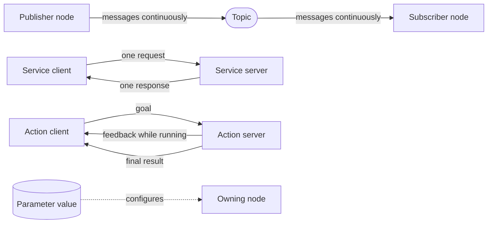

- A **topic** carries an asynchronous stream; publishers do not wait for subscribers to reply.
- A **service** handles a short request and returns one response.
- An **action** handles a longer, cancelable goal and can return feedback before its result.
- A **parameter** is a configuration value owned by a node; it is not a communication stream.

Use the diagram as a map while completing the practices. The command output and screenshots show how each relationship appears in a running ROS graph.

## Practice 1 — Source ROS in Every WSL/Ubuntu Terminal

**Why this practice matters:** Sourcing tells the current terminal where ROS 2 commands and packages are located; without it, otherwise correct commands may appear to be missing.

Open a WSL/Ubuntu Terminal and run:

```bash
source /opt/ros/jazzy/setup.bash
```

**Command breakdown:** `source` executes the Jazzy setup script in the current shell, adding ROS 2 commands, packages, and environment variables to this terminal.

Confirm the selected ROS distribution:

```bash
echo "$ROS_DISTRO"
```

**Command breakdown:** `echo` prints a value, and `$ROS_DISTRO` expands to the selected ROS distribution stored in that environment variable.

Locate the ROS 2 command:

```bash
which ros2
```

**Command breakdown:** `which` prints the executable that the shell will run for `ros2`, confirming that it comes from the Jazzy installation.

The expected distribution is `jazzy`, and `which ros2` should resolve to `/opt/ros/jazzy/bin/ros2`.

`source` changes the environment of the current shell only. Every newly opened WSL/Ubuntu Terminal must source ROS, either manually or through `~/.bashrc`. Commands entered at a PowerShell prompt are not Ubuntu commands; enter `wsl` first.

## Practice 2 — Run and Inspect Publisher/Subscriber Nodes

**Why this practice matters:** A small talker/listener system makes continuous, typed topic communication visible before you encounter a larger robot graph.

The system in this practice has the following intended ROS graph:

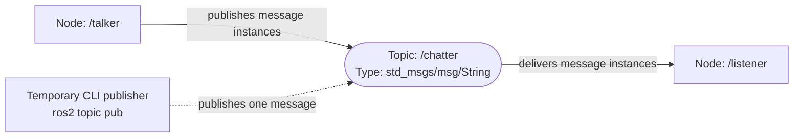

Read the graph from left to right:

- `/talker` and `/listener` are running nodes;
- `/chatter` is the named communication channel connecting them;
- `std_msgs/msg/String` is the message **type** allowed on that topic;
- each numbered `Hello World` value is one message **instance** moving through the topic;
- `ros2 topic pub` creates a temporary command-line publisher, shown with a dashed connection;
- the listener and its connection do not exist until you start the listener node.

The graph shows communication relationships, not the order in which terminal windows were opened. A topic is not a program, and a message is not a permanent graph component. Use `rqt_graph` to visualize live connections, and use the ROS CLI to inspect message types, fields, rates, and Quality of Service details that the graph does not show.

Open three WSL/Ubuntu Terminals.

In **WSL/Ubuntu Terminal 1**, start a publisher:

```bash
source /opt/ros/jazzy/setup.bash
```

**Command breakdown:** Source ROS 2 separately in Terminal 1 because each terminal has its own environment.

```bash
ros2 run demo_nodes_py talker
```

**Command breakdown:** `run` starts one executable from an installed package. Here, `demo_nodes_py` is the package and `talker` is the executable. The executable creates a node named `/talker` and keeps running until you press `Ctrl+C`.

<details>
<summary>Expected output</summary>


*Expected talker output. The node publishes a new numbered string approximately once per second.*

</details>

Keep it running. In **WSL/Ubuntu Terminal 2**, inspect the graph:

```bash
source /opt/ros/jazzy/setup.bash
```

**Command breakdown:** Source ROS 2 in Terminal 2 before using its graph-inspection commands.

List the running nodes:

```bash
ros2 node list
```

**Command breakdown:** `node list` asks the ROS graph for the names of all currently discoverable nodes. It does not start or stop anything.

<details>
<summary>Expected output</summary>


*The running publisher appears as the `/talker` node.*

</details>

Inspect the talker node:

```bash
ros2 node info /talker
```

**Command breakdown:** `node info` inspects one named node. `/talker` is the node name; the output shows its publishers, subscribers, services, and actions.

<details>
<summary>Expected output</summary>

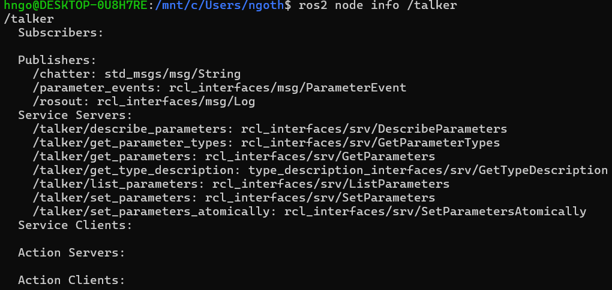

*Node information identifies the talker's publishers, service servers, and other interfaces.*

</details>

List topics together with their message types:

```bash
ros2 topic list -t
```

**Command breakdown:** `topic list` prints the currently discoverable topic names. The `-t` option adds the message type associated with each topic.

<details>
<summary>Expected output</summary>


*The `/chatter` topic carries `std_msgs/msg/String` messages.*

</details>

Inspect the publishers, subscribers, type, and Quality of Service settings for `/chatter`:

```bash
ros2 topic info /chatter --verbose
```

**Command breakdown:** `topic info` examines one topic. `/chatter` is the topic name, and `--verbose` adds endpoint details such as node names, publisher and subscriber counts, and Quality of Service settings.

<details>
<summary>Expected output</summary>

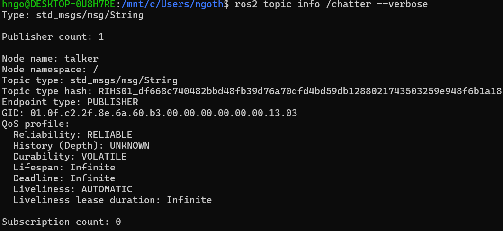

*Before the listener starts, `/chatter` has one publisher and no subscribers.*

</details>

Inspect the fields in the message type:

```bash
ros2 interface show std_msgs/msg/String
```

**Command breakdown:** `interface show` prints the definition of a ROS interface type. `std_msgs/msg/String` means the `String` message in the `msg` directory of the `std_msgs` package.

<details>
<summary>Expected output</summary>


*The message definition contains one string field named `data`.*

</details>

Display one message and return to the prompt:

```bash
ros2 topic echo /chatter --once
```

**Command breakdown:** `topic echo` temporarily subscribes to `/chatter` and prints received messages. The `--once` option exits after the first message instead of continuing indefinitely.

<details>
<summary>Expected output</summary>

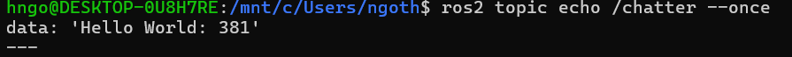

*The `--once` option prints one message and then returns to the shell prompt.*

</details>

Measure the publication rate:

```bash
ros2 topic hz /chatter
```

**Command breakdown:** `topic hz` temporarily subscribes to `/chatter`, measures message arrival times, and reports the estimated frequency in hertz. It continues until you press `Ctrl+C`.

<details>
<summary>Expected output</summary>


*The measured average rate is approximately `1 Hz`, matching the talker's behavior.*

</details>

Let `ros2 topic hz` collect data for approximately 10 seconds and then press `Ctrl+C`.

In **WSL/Ubuntu Terminal 3**, start a subscriber:

```bash
source /opt/ros/jazzy/setup.bash
```

**Command breakdown:** Source ROS 2 in Terminal 3 before starting the listener node.

```bash
ros2 run demo_nodes_py listener
```

**Command breakdown:** this uses `run` again, now starting the `listener` executable from `demo_nodes_py`. It creates the `/listener` node, which subscribes to `/chatter`.

<details>
<summary>Expected output</summary>

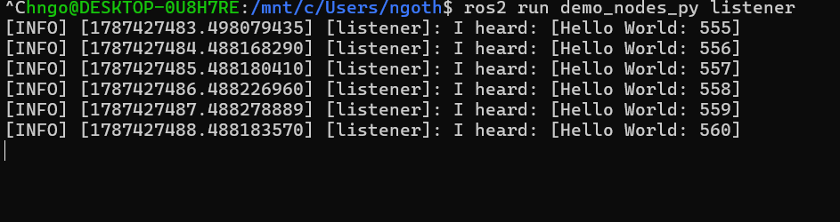

*The listener subscribes to `/chatter` and prints each received message.*

</details>

Return to WSL/Ubuntu Terminal 2 and inspect the topic again:

```bash
ros2 topic info /chatter --verbose
```

**Command breakdown:** repeat the verbose inspection after starting `/listener`. Comparing the two outputs reveals that the subscriber count changed from zero to one.

<details>
<summary>Expected output</summary>


*After the listener starts, the topic has one publisher and one subscriber.*

</details>

Confirm that the graph now contains a publisher and a subscriber. Notice that a topic is not a process: nodes publish or subscribe to a named, typed topic.

Visualize the live graph from WSL/Ubuntu Terminal 2:

```bash
rqt_graph
```

**Command breakdown:** `rqt_graph` starts the graphical ROS graph viewer. It discovers running nodes and the topic connections between them.

When the `rqt_graph` window opens:

1. Make sure both the `/talker` and `/listener` nodes are still running.
2. Open the drop-down menu near the upper-left corner and select **Nodes/Topics (all)**.
3. Click the **Refresh** button (the circular-arrow icon at the far left of the toolbar).

The graph area may initially be empty. Selecting **Nodes/Topics (all)** and clicking **Refresh** forces `rqt_graph` to rediscover and display the current ROS graph. Confirm that it contains:

<details>
<summary>Expected output</summary>

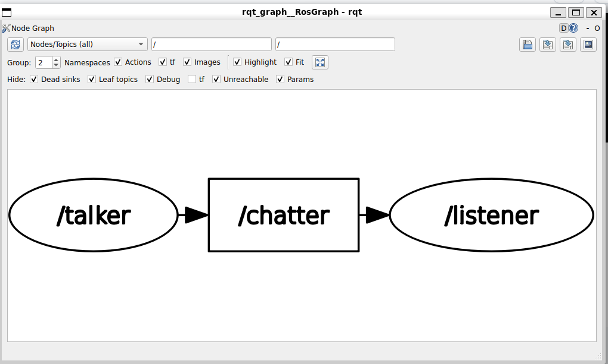

*The live graph after selecting **Nodes/Topics (all)** and clicking **Refresh**.*

</details>

```text
/talker → /chatter → /listener
```

Compare it with the conceptual graph above. The temporary CLI tools used by `ros2 topic echo` or `ros2 topic hz` may appear only while those commands are running. Close `rqt_graph` before continuing.

Stop the talker with `Ctrl+C`, but keep the listener running. Publish one message manually from WSL/Ubuntu Terminal 2:

```bash
ros2 topic pub --once /chatter std_msgs/msg/String \
  "{data: 'hello from the EEL 4332 command line'}"
```

**Command breakdown:** `topic pub` creates a temporary publisher. `--once` sends one message, `/chatter` is the destination topic, `std_msgs/msg/String` is its required type, and the YAML expression supplies the `data` field. The trailing `\` only continues the same shell command on the next displayed line.

<details>
<summary>Expected output</summary>


*The command-line publisher sends one correctly typed message.*

</details>

Confirm that the listener receives it:

<details>
<summary>Expected output</summary>


*The final listener line confirms that the manually published message traveled through `/chatter`.*

</details>

Then stop the listener.

## Practice 3 — Services, Parameters, and Actions

**Why this practice matters:** Using each interaction pattern helps you recognize when a robot needs a one-time request, a configurable setting, or a longer task with feedback instead of a continuous topic stream.

In WSL/Ubuntu Terminal 1, start turtlesim:

```bash
source /opt/ros/jazzy/setup.bash
```

**Command breakdown:** Source ROS 2 in Terminal 1 before starting turtlesim.

```bash
ros2 run turtlesim turtlesim_node
```

**Command breakdown:** `run` starts the `turtlesim_node` executable from the installed `turtlesim` package. The process creates a node named `/turtlesim` and opens the graphical simulator window.

<details>
<summary>Expected output</summary>


*The turtlesim node opens a graphical window containing the original turtle.*

</details>

### Inspect and call a service

In WSL/Ubuntu Terminal 2:

```bash
source /opt/ros/jazzy/setup.bash
```

**Command breakdown:** Source ROS 2 in Terminal 2 before inspecting or calling turtlesim services.

List available services and their types:

```bash
ros2 service list -t
```

**Command breakdown:** `service list` prints the names of currently available services. The `-t` option also shows the service type required by each service.

<details>
<summary>Expected output</summary>

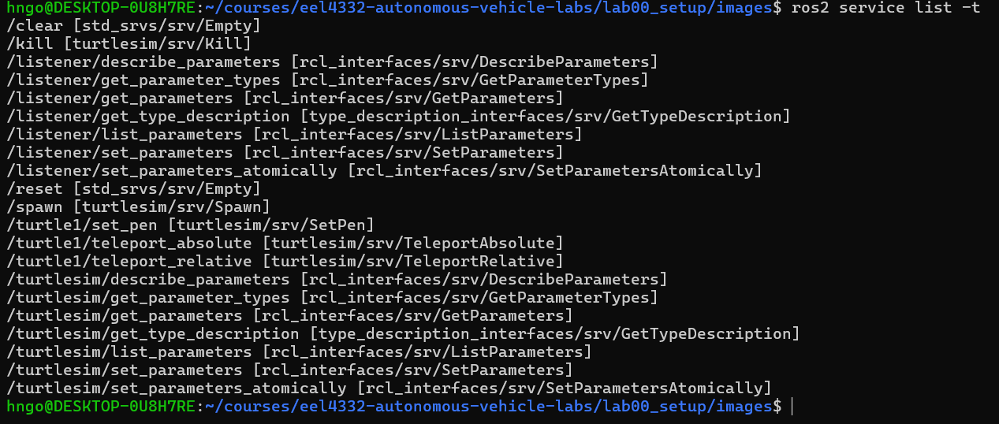

*The list includes `/spawn` with the service type `turtlesim/srv/Spawn`.*

</details>

Show the type of the `/spawn` service:

```bash
ros2 service type /spawn
```

**Command breakdown:** `service type` looks up the interface type used by one service. `/spawn` is the service name; its returned type is needed to inspect or call it.

<details>
<summary>Expected output</summary>

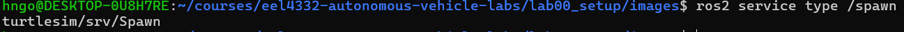

*The command confirms the type required when calling `/spawn`.*

</details>

Inspect the request and response fields:

```bash
ros2 interface show turtlesim/srv/Spawn
```

**Command breakdown:** `interface show` prints the `Spawn` service definition from the `turtlesim` package. The `srv` portion identifies it as a service interface. The `---` line separates request fields from response fields.

<details>
<summary>Expected output</summary>


*Fields above `---` belong to the request; fields below it belong to the response.*

</details>

Call the service:

```bash
ros2 service call /spawn turtlesim/srv/Spawn \
  "{x: 2.0, y: 2.0, theta: 0.0, name: 'practice_turtle'}"
```

**Command breakdown:** `service call` sends one request to `/spawn`. The next argument declares the expected service type, and the YAML expression supplies values for its request fields. The command waits for and then prints the response.

<details>
<summary>Expected output</summary>

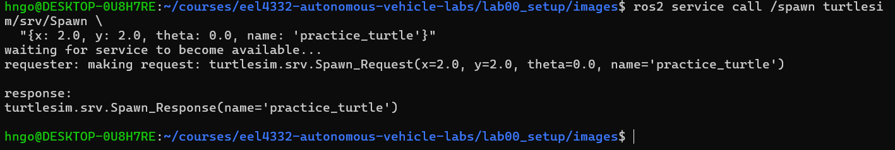

*A successful response returns the name assigned to the new turtle.*

</details>

A second turtle should appear. The request contains input fields; the service returns one response.

<details>
<summary>Expected output</summary>


*The new turtle appears at the requested position while the original turtle remains in the simulation.*

</details>

### Move the turtle to exact positions

The `/turtle1/teleport_absolute` service places the original turtle at an exact pose. In turtlesim, `x` increases toward the right, `y` increases toward the top, and `theta` is the heading in radians.

First inspect the service type and its request fields:

```bash
ros2 service type /turtle1/teleport_absolute
```

**Command breakdown:** `ros2 service type SERVICE_NAME` prints the interface type required to call that service. Here it identifies the request format for `/turtle1/teleport_absolute`.

<details>
<summary>Expected output</summary>

```text
turtlesim/srv/TeleportAbsolute
```

*This is the interface type required to inspect or call the service.*

</details>

```bash
ros2 interface show turtlesim/srv/TeleportAbsolute
```

**Command breakdown:** `service type` identifies the interface as `turtlesim/srv/TeleportAbsolute`. `interface show` reveals that its request requires `x`, `y`, and `theta` values. This service has no response fields.

<details>
<summary>Expected output</summary>

```text
float32 x
float32 y
float32 theta
---
```

*The fields above `---` form the request. Nothing appears below it because this service returns no data fields.*

</details>

Move `/turtle1` near the upper-right area of the window, facing right:

```bash
ros2 service call /turtle1/teleport_absolute \
  turtlesim/srv/TeleportAbsolute "{x: 8.0, y: 8.0, theta: 0.0}"
```

**Command breakdown:** `service call` sends one request to the `/turtle1/teleport_absolute` service. `turtlesim/srv/TeleportAbsolute` specifies the required service interface. The YAML request supplies its three input fields: `x: 8.0` and `y: 8.0` set the position, while `theta: 0.0` sets the heading in radians. A heading of `0.0` points right.

<details>
<summary>Expected output</summary>

```text
waiting for service to become available...
requester: making request: turtlesim.srv.TeleportAbsolute_Request(
  x=8.0, y=8.0, theta=0.0)

response:
turtlesim.srv.TeleportAbsolute_Response()
```

*The exact formatting may vary. An empty `TeleportAbsolute_Response()` is successful: it is empty because the service definition has no response fields. The turtle's new position in the simulator is the visible result.*

</details>

Move it to another position, this time facing upward:

```bash
ros2 service call /turtle1/teleport_absolute \
  turtlesim/srv/TeleportAbsolute "{x: 8.0, y: 2.0, theta: 1.57}"
```

**Command breakdown:** This repeats `service call` with a new YAML request. The position becomes `(8.0, 2.0)`, and `theta: 1.57` turns the turtle to approximately 90 degrees, pointing upward.

This request uses the same service and interface but supplies a different pose. The heading `1.57` radians is approximately 90 degrees, so the turtle points upward. It should produce the same empty response form as the first call.

Confirm the turtle's current pose:

```bash
ros2 topic echo /turtle1/pose --once
```

**Command breakdown:** `topic echo` temporarily subscribes to `/turtle1/pose` and prints a pose message. The `--once` option exits after receiving one message. In addition to position and heading, the message reports the turtle's current linear and angular velocities.

<details>
<summary>Expected output</summary>

```text
x: 8.0
y: 2.0
theta: 1.57
linear_velocity: 0.0
angular_velocity: 0.0
---
```

*Values may differ slightly because of floating-point representation. The position and heading should be close to the most recent teleport request, and the velocities should be zero while the turtle is stationary.*

</details>

The reported `x`, `y`, and `theta` values should be close to those in the most recent request. The teleport service changes the pose immediately; it does not simulate the turtle driving between the two positions.

### Inspect and change a parameter

```bash
ros2 param list /turtlesim
```

**Command breakdown:** `param list` prints the parameter names owned by the `/turtlesim` node. Parameters are node-specific configuration values.

<details>
<summary>Expected output</summary>


*The output includes the configurable background color components and other turtlesim parameters.*

</details>

```bash
ros2 param get /turtlesim background_r
```

**Command breakdown:** `param get` reads one parameter. `/turtlesim` identifies the node and `background_r` identifies its red-background component.

<details>
<summary>Expected output</summary>


*The command reports the parameter type and its current value. The initial value may differ between installations.*

</details>

```bash
ros2 param set /turtlesim background_r 100
```

**Command breakdown:** `param set` requests a new value for a node parameter. It asks `/turtlesim` to change `background_r` to `100` and reports whether the update succeeded.

<details>
<summary>Expected output</summary>

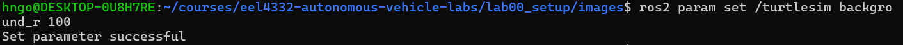

*`Set parameter successful` confirms that the node accepted the new value.*

</details>

Parameters configure a node. They are not intended to replace a high-rate sensor or command topic.

### Inspect and send an action goal

```bash
ros2 action list -t
```

**Command breakdown:** `action list` prints available action names. The `-t` option adds each action's interface type.

<details>
<summary>Expected output</summary>

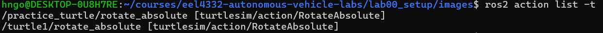

*Each turtle has a `rotate_absolute` action using the `turtlesim/action/RotateAbsolute` type.*

</details>

```bash
ros2 action info /turtle1/rotate_absolute
```

**Command breakdown:** `action info` inspects an action endpoint. It reports the action type and the nodes acting as action clients or servers for `/turtle1/rotate_absolute`.

<details>
<summary>Expected output</summary>

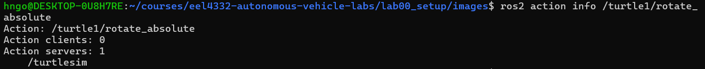

*The `/turtlesim` node provides one action server; no action client exists until a goal is sent.*

</details>

```bash
ros2 action type /turtle1/rotate_absolute
```

**Command breakdown:** `action type` asks ROS 2 which interface type the named action uses. It should print:

```text
turtlesim/action/RotateAbsolute
```

Use that type name to inspect the action's data fields:

```bash
ros2 interface show turtlesim/action/RotateAbsolute
```

**Command breakdown:** `interface show` displays the action definition. An action interface has three sections separated by `---`:

```text
# The desired heading in radians
float32 theta
---
# The angular displacement in radians to the starting position
float32 delta
---
# The remaining rotation in radians
float32 remaining
```

The first section defines the **goal request**. Because its field is named `theta`, the goal message must provide a value using the form `{theta: value}`. The second section defines the final **result**, and the third defines the **feedback** reported while the action runs. You provide only the goal field when using `action send_goal`.

Now compose and send a goal that requests an absolute heading of `1.57` radians:

```bash
ros2 action send_goal /turtle1/rotate_absolute \
  turtlesim/action/RotateAbsolute "{theta: 1.57}" --feedback
```

**Command breakdown:** `action send_goal` sends a goal to the named action using the stated action type. The YAML expression requests an absolute heading of `1.57` radians, approximately 90 degrees. `--feedback` prints progress messages while the goal is executing, followed by the final result.

<details>
<summary>Expected output</summary>

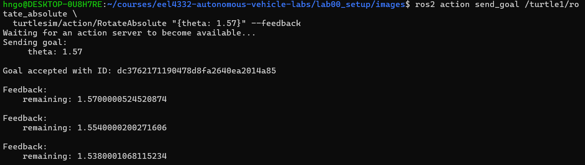

*The server accepts the goal and reports the remaining rotation as feedback. Goal identifiers and numeric feedback values will vary between runs.*

</details>

Observe the feedback while the turtle rotates. An action is appropriate because the operation takes time and has a goal, feedback, and final result.

### Drive the turtle with the keyboard

Keyboard teleoperation is a more interactive way to move the turtle. Unlike teleportation, it publishes velocity commands that make the turtle travel and turn over time.

In WSL/Ubuntu Terminal 2, run:

```bash
ros2 run turtlesim turtle_teleop_key
```

**Command breakdown:** `run` starts the `turtle_teleop_key` executable from the `turtlesim` package. This executable creates a teleoperation node that reads arrow-key input and publishes `geometry_msgs/msg/Twist` velocity commands to `/turtle1/cmd_vel`.

Keep the keyboard focus in that terminal and use the arrow keys:

- **Up arrow:** move forward.
- **Down arrow:** move backward.
- **Left arrow:** turn counterclockwise.
- **Right arrow:** turn clockwise.

Before drawing, observe those commands directly. In **WSL/Ubuntu Terminal 3**, run:

```bash
source /opt/ros/jazzy/setup.bash
```

**Command breakdown:** Source ROS 2 in Terminal 3 before subscribing to the teleoperation command topic.

```bash
ros2 topic echo /turtle1/cmd_vel
```

**Command breakdown:** `topic echo` subscribes to the velocity-command topic and prints every message it receives. This command waits silently until the teleoperation node publishes a command.

Return the keyboard focus to WSL/Ubuntu Terminal 2 and press an arrow key. WSL/Ubuntu Terminal 3 should display a message similar to:

<details>
<summary>Expected output</summary>

```text
linear:
  x: 2.0
  y: 0.0
  z: 0.0
angular:
  x: 0.0
  y: 0.0
  z: 0.0
---
```

*The exact values depend on which arrow key was pressed. Forward or backward commands change `linear.x`; turning commands change `angular.z`.*

</details>

This demonstrates the complete command path:

```text
arrow key → teleoperation node → /turtle1/cmd_vel → turtlesim node → turtle motion
```

Press `Ctrl+C` in WSL/Ubuntu Terminal 3 to stop `topic echo`. Then return to WSL/Ubuntu Terminal 2 and try drawing a simple square or your initials in the turtlesim window.

When finished driving, press `Ctrl+C` in WSL/Ubuntu Terminal 2 to stop the teleoperation node. Then press `Ctrl+C` in WSL/Ubuntu Terminal 1 to stop turtlesim.

## ROS 2 CLI Cheat Sheet

Use this table to review the commands from Part 1. Text inside angle brackets, such as `<topic>`, is a placeholder that you replace; do not type the angle brackets.

| Purpose | General command | Example from this lab |
|---|---|---|
| Prepare a new terminal | `source /opt/ros/<distro>/setup.bash` | `source /opt/ros/jazzy/setup.bash` |
| Run an installed executable | `ros2 run <package> <executable>` | `ros2 run turtlesim turtlesim_node` |
| List nodes | `ros2 node list` | `ros2 node list` |
| Inspect a node | `ros2 node info <node>` | `ros2 node info /talker` |
| List topics with types | `ros2 topic list -t` | `ros2 topic list -t` |
| Inspect topic endpoints and QoS | `ros2 topic info <topic> --verbose` | `ros2 topic info /chatter --verbose` |
| Display topic messages | `ros2 topic echo <topic>` | `ros2 topic echo /turtle1/pose --once` |
| Measure a topic's rate | `ros2 topic hz <topic>` | `ros2 topic hz /chatter` |
| Publish a message | `ros2 topic pub --once <topic> <type> "<YAML>"` | `ros2 topic pub --once /chatter std_msgs/msg/String "{data: 'hello'}"` |
| Inspect message, service, or action fields | `ros2 interface show <interface-type>` | `ros2 interface show std_msgs/msg/String` |
| List services with types | `ros2 service list -t` | `ros2 service list -t` |
| Find a service's type | `ros2 service type <service>` | `ros2 service type /spawn` |
| Call a service | `ros2 service call <service> <type> "<YAML>"` | `ros2 service call /spawn turtlesim/srv/Spawn "{x: 2.0, y: 2.0, theta: 0.0, name: 'practice_turtle'}"` |
| List a node's parameters | `ros2 param list <node>` | `ros2 param list /turtlesim` |
| Read a parameter | `ros2 param get <node> <parameter>` | `ros2 param get /turtlesim background_r` |
| Change a parameter | `ros2 param set <node> <parameter> <value>` | `ros2 param set /turtlesim background_r 100` |
| List actions with types | `ros2 action list -t` | `ros2 action list -t` |
| Inspect action endpoints | `ros2 action info <action>` | `ros2 action info /turtle1/rotate_absolute` |
| Find an action's type | `ros2 action type <action>` | `ros2 action type /turtle1/rotate_absolute` |
| Send an action goal | `ros2 action send_goal <action> <type> "<YAML>" --feedback` | `ros2 action send_goal /turtle1/rotate_absolute turtlesim/action/RotateAbsolute "{theta: 1.57}" --feedback` |
| Visualize the live ROS graph | `rqt_graph` | Select **Nodes/Topics (all)** and click **Refresh** |
| Drive turtlesim with the keyboard | `ros2 run turtlesim turtle_teleop_key` | Use the arrow keys while its terminal has focus |
| Stop a foreground command | `Ctrl+C` | Stop `topic hz`, `topic echo`, or a running node |

### How to investigate an unfamiliar interface

Do not try to memorize every topic, service, or action type. Use the ROS graph to discover what a running system provides:

```text
List available names
        ↓
Choose a name and find its type
        ↓
Inspect the type with ros2 interface show
        ↓
Compose YAML using the displayed field names
        ↓
Publish a message, call the service, or send the action goal
```

The command family depends on the communication pattern:

- **Topic:** `topic list -t` → `topic info` → `interface show` → `topic echo` or `topic pub`
- **Service:** `service list -t` → `service type` → `interface show` → `service call`
- **Action:** `action list -t` → `action type` and `action info` → `interface show` → `action send_goal`

## Part 1 Completion Check

Before continuing to Part 2, confirm that you can:

- [ ] distinguish nodes, topics, messages, services, actions, and parameters;
- [ ] explain the `/talker → /chatter → /listener` graph;
- [ ] distinguish a message type from one message instance;
- [ ] inspect a running graph with ROS CLI tools and `rqt_graph`;
- [ ] publish a correctly typed message from the command line;
- [ ] call a service, change a parameter, and send an action goal;
- [ ] move a turtle to an exact pose and drive it with keyboard teleoperation.

Continue to [Part 2 — Packages, Workspaces, and Launch](ros2_fundamentals_part2.md).
