# ROS 2 Fundamentals — Part 2: Packages, Workspaces, and Launch

[Part 1: Graph and Communication](ros2_fundamentals_part1.md) | [Lab 1 overview](README.md)

## Before You Begin — Update Course Files

In a **WSL/Ubuntu Terminal**, go to your local course repository and check for changes:

```bash
cd ~/courses/eel4332-autonomous-vehicle-labs
git status --short
```

If the command prints nothing, run `git pull --rebase`. If it lists files, protect your work first by following [Updating the Course Repository](../docs/UPDATING_COURSE_REPOSITORY.md). Use your actual repository path if you cloned it elsewhere.

## Purpose

Complete [Part 1](ros2_fundamentals_part1.md) before beginning this guide. Part 2 explains how ROS code is organized into packages, built in a workspace, made visible to the current terminal, and started reproducibly with a launch file. Allow approximately 30–45 minutes.

## Key Terms

| Term | Meaning in this practice |
|---|---|
| package | a unit of ROS code, metadata, dependencies, and installed resources |
| workspace | a directory containing a `src/` folder and generated build products |
| dependency | another system or ROS package required by the package |
| `rosdep` | a tool that reads package declarations and installs system dependencies |
| `colcon` | the command that builds the ROS packages in a workspace and puts the usable results under `install/` |
| underlay | ROS software that is already installed and available before building your workspace; in this lab it is ROS 2 Jazzy under `/opt/ros/jazzy` |
| overlay | packages built in your own workspace and added on top of the underlay; in this lab they are made available by sourcing `~/eel4332_ws/install/setup.bash` |
| launch file | a reproducible description that starts and configures multiple nodes |
| launch argument | a value supplied when launching to change configured behavior |

### Underlay and overlay in plain language

Think of the base ROS 2 installation as the **foundation** and your course workspace as an **additional layer placed on top**:

```text
Your course package                   ← overlay: code you build
─────────────────────────────────
ROS 2 Jazzy and installed packages    ← underlay: software already provided
─────────────────────────────────
Ubuntu
```

The words *underlay* and *overlay* describe the order in which ROS environments are added to a terminal; they are not special kinds of source code.

The following is a preview of the sequence. Do not run it yet; Practice 4 provides the exact commands after the workspace has been created.

```bash
# 1. Make the installed ROS 2 tools and libraries available.
source /opt/ros/jazzy/setup.bash

# 2. Enter the workspace and install declared dependencies.
cd ~/eel4332_ws
rosdep install --from-paths src --ignore-src -r -y

# 3. Build the packages found in the workspace.
colcon build

# 4. Make the newly built course packages available in this terminal.
source ~/eel4332_ws/install/setup.bash
```

`colcon` coordinates the build. It finds ROS packages in the workspace, runs the appropriate build process for each package, and creates three directories:

| Directory | What it contains | How students use it |
|---|---|---|
| `build/` | intermediate files created while each package is being built | normally do not edit or source it; its contents can be regenerated by rebuilding |
| `install/` | the runnable or importable results of the build, plus setup files | source `install/setup.bash` so ROS 2 can discover and run the packages |
| `log/` | detailed output recorded during each build | inspect it when the terminal's build error does not provide enough information |

These are generated directories, not source code. Student-written package files remain under `src/`.

Sourcing the Jazzy setup file first makes the base installation the **underlay**. Sourcing the workspace setup file afterward adds the **overlay**. ROS 2 can then find both the installed Jazzy packages and your course package. If both layers contain a package with the same name, the overlay version is normally found first.

These `source` commands affect only the current WSL/Ubuntu Terminal. Opening another terminal creates a new shell, so that terminal must source the environments again.

## From Source Code to a Running ROS System

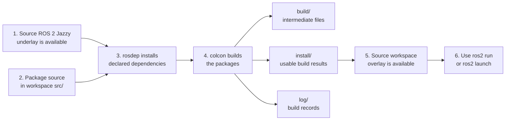

`rosdep` and `colcon` have different jobs: `rosdep` installs dependencies declared by the source packages, while `colcon` builds the packages themselves. Building creates the workspace's generated directories, but it does not modify every open terminal automatically. Sourcing `install/setup.bash` updates the current shell so ROS 2 can discover the newly built package. That is why **install dependencies**, **build**, and **source** are separate steps.

## Practice 4 — Build a Course ROS Package

**Why this practice matters:** ROS 2 cannot run source code as an installed package until a workspace builds it and the current terminal sources the resulting overlay.

ROS packages are normally built inside a colcon workspace. The provided `eel4332_ros_practice` package contains a small counter publisher, counter subscriber, and launch file. The code is intentionally simple so you can concentrate on package structure and tools.

First leave the course Python virtual environment if it is active:

```bash
deactivate
```

If the command reports that `deactivate` is not found, no virtual environment is active and you may continue.

Next, enter the course repository root. If you used the recommended location from Lab 00, run:

```bash
cd ~/courses/eel4332-autonomous-vehicle-labs
```

If you cloned the repository somewhere else, replace that path with its actual location. Confirm that you are in the correct directory:

```bash
pwd
```

```bash
ls lab01_ros2_gazebo_fundamentals/eel4332_ros_practice
```

**Command breakdown:** `cd` changes the current directory. `pwd` prints its full path, which should end with `/eel4332-autonomous-vehicle-labs`. `ls` confirms that the practice package exists below the current directory. This location matters because the later `$PWD` expression expands to the directory printed by `pwd`.

Now source ROS 2 and create the workspace:

```bash
source /opt/ros/jazzy/setup.bash
```

```bash
mkdir -p ~/eel4332_ws/src
```

In a Linux path, `~` is a shortcut for the current user's home directory. For example, if the username is `student`, `~/eel4332_ws` means `/home/student/eel4332_ws`. It does not mean the course repository.

**Command breakdown:** `mkdir -p` creates the workspace directory and its `src/` subdirectory under your Ubuntu home directory. The `-p` option also creates missing parent directories and does not fail if they already exist.

### Why link the package into the workspace?

By convention, `colcon` looks for source packages beneath a workspace's `src/` directory. The practice package is stored beside this lab manual so that it remains part of the course Git repository. A symbolic link lets the same package appear inside the workspace without making a second copy:

```text
Course Git repository
└── lab01_ros2_gazebo_fundamentals/
    └── eel4332_ros_practice/             ← actual package files

ROS 2 workspace
└── ~/eel4332_ws/
    └── src/
        └── eel4332_ros_practice          ← link to the actual package
```

This arrangement has three benefits:

- edits made to the package in VS Code are the same files that `colcon` builds;
- there is no duplicate package that could become out of date;
- generated `build/`, `install/`, and `log/` directories stay outside the course Git repository.

It is also possible to place a ROS workspace inside a Git repository. ROS 2 does not require the workspace to be outside. This course uses a separate workspace to keep instructional files and generated build products clearly separated.

Create the symbolic link:

```bash
ln -sfn "$PWD/lab01_ros2_gazebo_fundamentals/eel4332_ros_practice" \
  ~/eel4332_ws/src/eel4332_ros_practice
```

**Command breakdown:** `ln -sfn` creates or updates a symbolic link inside the workspace. `$PWD` expands to the course repository root verified above. The first path is the actual package, and the second path is where its link appears in the workspace. The `-f` and `-n` options safely replace an older symbolic link, including one created before the lab directories were renumbered; they do not remove a real directory.

```bash
cd ~/eel4332_ws
```

Confirm the workspace layout:

```bash
find src/eel4332_ros_practice -maxdepth 2 -type f | sort
```

Install declared dependencies and build only the practice package:

```bash
rosdep update
```

**Command breakdown:** `rosdep update` downloads the current dependency-rule index. It does not build the package.

```bash
rosdep install --from-paths src --ignore-src -r -y
```

**Command breakdown:** `rosdep install` reads dependency declarations from packages under `src/`. `--ignore-src` skips dependencies already supplied as source packages, `-r` continues past resolvable errors, and `-y` accepts installation prompts.

```bash
colcon build --symlink-install --packages-select eel4332_ros_practice
```

**Command breakdown:** `colcon build` builds the workspace. `--symlink-install` links Python and resource files into the install tree so many source edits do not require copying files again. `--packages-select` limits this build to the named course package.

<details>
<summary>Expected output</summary>

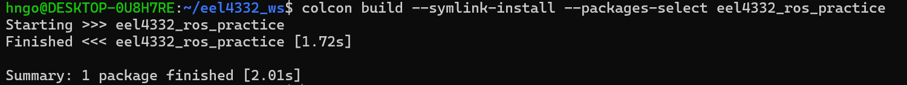

*A successful build finishes `eel4332_ros_practice` and reports one package finished. Build times will vary.*

</details>

If `rosdep update` says that rosdep has not been initialized, initialize it once and then retry:

```bash
sudo rosdep init
```

```bash
rosdep update
```

After a successful build, source the workspace overlay:

```bash
source /opt/ros/jazzy/setup.bash
```

```bash
source ~/eel4332_ws/install/setup.bash
```

**Command breakdown:** sourcing the generated setup file adds this workspace as an overlay in the current terminal. New WSL/Ubuntu Terminals must source it again before they can find the package.

```bash
ros2 pkg prefix eel4332_ros_practice
```

**Command breakdown:** `pkg prefix` prints the installation prefix of an available package. A path under `~/eel4332_ws/install` confirms that ROS 2 found the package in the course workspace overlay rather than only in the base Jazzy installation.

<details>
<summary>Expected output</summary>

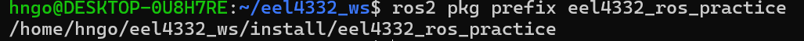

*The path under `~/eel4332_ws/install` confirms that the current terminal can discover the workspace package.*

</details>

The final command should print a path under `~/eel4332_ws/install`. The sourcing order matters: source the base Jazzy installation first and the course workspace second.

Do not commit the workspace `build/`, `install/`, or `log/` directories to the course repository.

## Practice 5 — Use a Launch File and Parameters

**Why this practice matters:** Launch files start a repeatable multi-node system, while parameters let you change its behavior without editing the node source code.

In WSL/Ubuntu Terminal 1, source both environments and launch the provided publisher and subscriber:

```bash
source /opt/ros/jazzy/setup.bash
```

```bash
source ~/eel4332_ws/install/setup.bash
```

```bash
ros2 launch eel4332_ros_practice practice.launch.py rate_hz:=5.0
```

**Command breakdown:** `launch` starts the system described by `practice.launch.py` from the `eel4332_ros_practice` package. `rate_hz:=5.0` overrides the launch argument named `rate_hz`; the launch file passes that value to the publisher node.

In WSL/Ubuntu Terminal 2:

```bash
source /opt/ros/jazzy/setup.bash
```

```bash
source ~/eel4332_ws/install/setup.bash
```

List the practice nodes:

```bash
ros2 node list
```

**Command breakdown:** list the live nodes and confirm that both `/counter_publisher` and `/counter_subscriber` were created by the launch file.

<details>
<summary>Expected output</summary>

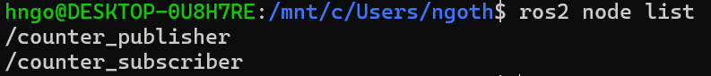

*Both nodes started by the launch file should appear. Other running ROS nodes may also be listed.*

</details>

List topics and their types:

```bash
ros2 topic list -t
```

**Command breakdown:** list the live topics with their message types and locate the `/practice/count` topic used by the two practice nodes.

<details>
<summary>Expected output</summary>

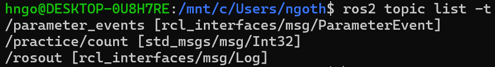

*The launched system provides `/practice/count` with the type `std_msgs/msg/Int32`. Additional ROS topics may also appear.*

</details>

Inspect the practice topic:

```bash
ros2 topic info /practice/count --verbose
```

**Command breakdown:** inspect `/practice/count` and verify its message type, publisher, subscriber, and Quality of Service information.

<details>
<summary>Expected output</summary>

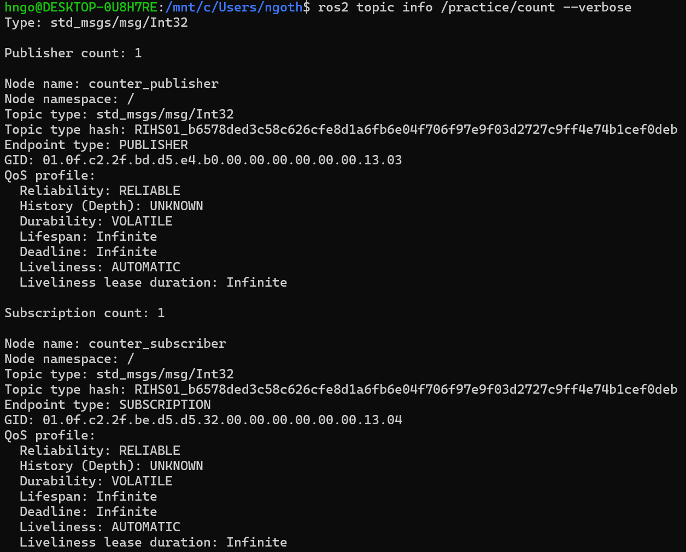

*The topic has one publisher and one subscriber. Endpoint identifiers and some QoS details may vary between runs.*

</details>

Display one counter message:

```bash
ros2 topic echo /practice/count --once
```

**Command breakdown:** subscribe temporarily, print one counter message from `/practice/count`, and then return to the prompt.

<details>
<summary>Expected output</summary>

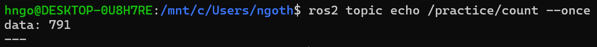

*The exact counter value will differ because the publisher continues counting while it runs.*

</details>

Measure its update rate:

```bash
ros2 topic hz /practice/count
```

**Command breakdown:** measure the arrival frequency of counter messages. With this launch command, the result should settle near `5 Hz` after several samples.

<details>
<summary>Expected output</summary>

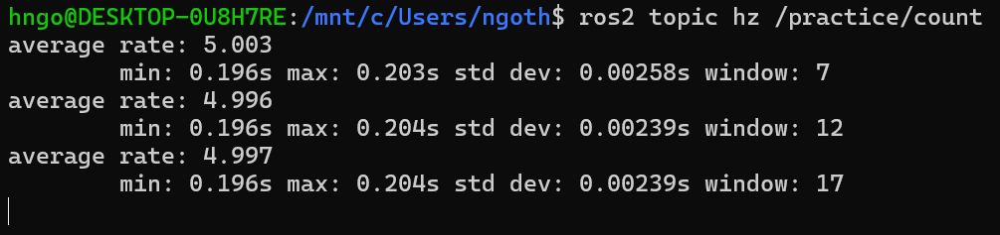

*Small timing variations are normal; the average rate should settle close to the configured `5 Hz`.*

</details>

After stopping the rate measurement with `Ctrl+C`, inspect the launch parameter:

```bash
ros2 param get /counter_publisher rate_hz
```

**Command breakdown:** read the `rate_hz` parameter owned by `/counter_publisher` and confirm that the launch argument configured it to `5.0`.

<details>
<summary>Expected output</summary>

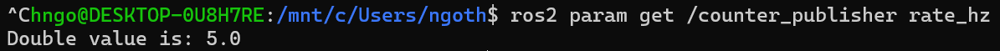

*The node reports a double value of `5.0`, confirming that the launch argument reached the publisher parameter.*

</details>

The measured topic rate should be close to the configured value, allowing for scheduling and measurement variation. Stop `ros2 topic hz` after approximately 10 seconds.

Launch `rqt_graph` from WSL/Ubuntu Terminal 2:

```bash
rqt_graph
```

Select **Nodes/Topics (all)** if necessary. Confirm that the graph shows:

```text
/counter_publisher → /practice/count → /counter_subscriber
```

<details>
<summary>Expected output</summary>

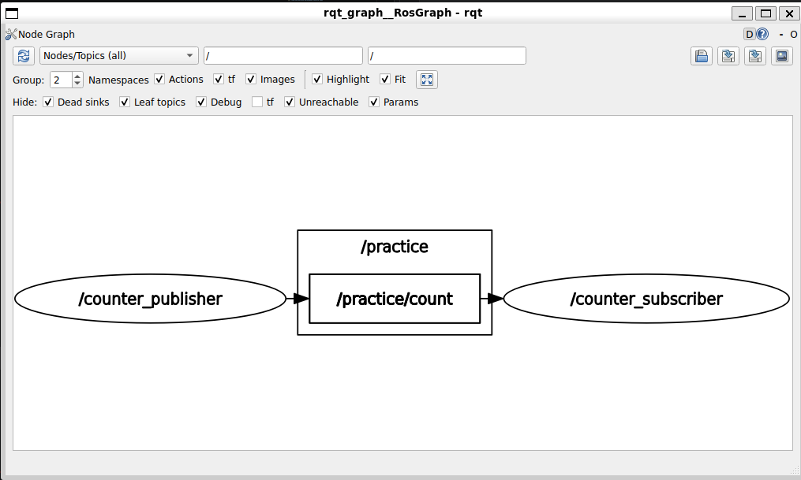

*If the graph is empty, select **Nodes/Topics (all)** and click the **Refresh** button.*

</details>

Save a screenshot for your setup record. Close `rqt_graph` and stop the launch with `Ctrl+C`. In WSL/Ubuntu Terminal 1, relaunch at a different configured rate:

```bash
ros2 launch eel4332_ros_practice practice.launch.py rate_hz:=2.0
```

**Command breakdown:** launch the same nodes and code again while changing only the `rate_hz` launch argument from `5.0` to `2.0`.

In WSL/Ubuntu Terminal 2, measure the topic again:

```bash
ros2 topic hz /practice/count
```

**Command breakdown:** repeat the same measurement; the reported frequency should now settle near `2 Hz`, demonstrating that launch-time configuration changed the behavior.

<details>
<summary>Expected output</summary>

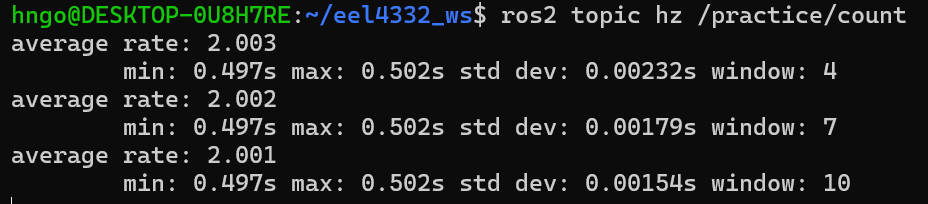

*The approximately `0.5 s` interval between messages corresponds to a publication rate near `2 Hz`.*

</details>

Let it collect data for approximately 10 seconds and press `Ctrl+C`. Verify that the observed rate changed. This demonstrates the difference between reusable node code and launch-time configuration.

## Practice 6 — Read the Package Structure

**Why this practice matters:** Understanding the package files shows how source code, dependencies, executable entry points, and launch files work together.

Inspect these provided files:

```text
eel4332_ros_practice/
├── package.xml
├── setup.py
├── setup.cfg
├── launch/practice.launch.py
└── eel4332_ros_practice/
    ├── counter_publisher.py
    └── counter_subscriber.py
```

Be able to explain:

- where dependencies are declared;
- how `console_scripts` make Python nodes available to `ros2 run`;
- why launch files must be installed by `setup.py`;
- why rebuilding and sourcing are separate steps;
- why another WSL/Ubuntu Terminal cannot see a newly built package until its overlay is sourced.

The official [developing a ROS 2 package guide](https://docs.ros.org/en/jazzy/How-To-Guides/Developing-a-ROS-2-Package.html) and [launch-file integration tutorial](https://docs.ros.org/en/jazzy/Tutorials/Intermediate/Launch/Launch-system.html) provide further details.

## ROS 2 Working Practices

- Source the correct distribution and workspace in every WSL/Ubuntu Terminal.
- Use one clear responsibility per node.
- Inspect live topic types rather than assuming a name implies a type.
- Use parameters and launch arguments for configuration instead of editing code for every run.
- Use topics for streams, services for quick requests, and actions for long-running goals.
- Check timestamps, frame IDs, update rates, and Quality of Service when data appears missing.
- Use `ros2 node info`, `ros2 topic info --verbose`, and `rqt_graph` before blaming the simulator.
- Stop nodes cleanly with `Ctrl+C`; do not leave old simulations or bridges running.
- Never send an unvalidated simulation command directly to a physical robot.

## Part 2 Completion Check

Before returning to the Lab 1 overview, confirm that you can:

- [ ] identify the package, workspace, underlay, and overlay;
- [ ] explain the roles of `rosdep` and `colcon`;
- [ ] build and source a colcon workspace;
- [ ] confirm where ROS 2 found an installed package;
- [ ] launch two nodes together with a launch argument;
- [ ] use ROS graph tools to verify the launched system;
- [ ] explain why changing a launch argument does not require changing node code.

Return to the [Lab 1 overview](README.md), then complete the [Gazebo Fundamentals Practice](gazebo_fundamentals.md).
