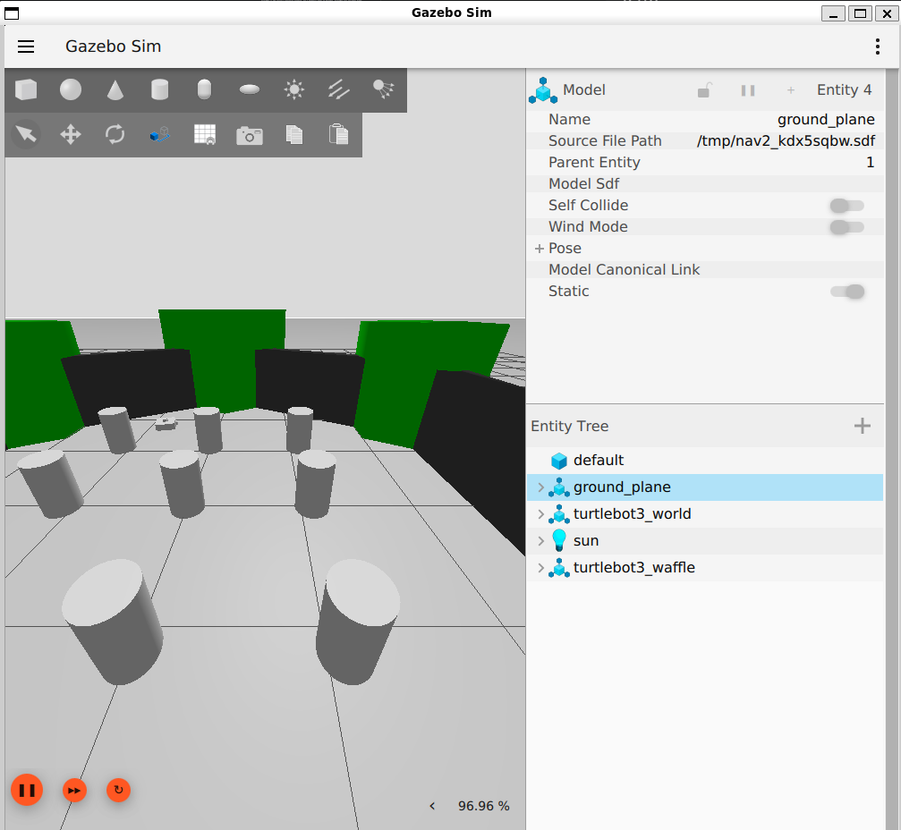
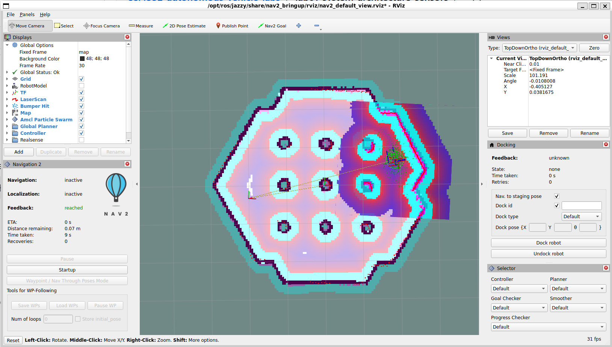

# Lab 1 — Autonomous-System Architecture and Sensors

## Mission

**Inspect a running autonomous-robot simulation and trace how sensor data flows through the ROS 2 system.**

## Learning Objectives

By the end of this lab, you should be able to:

- distinguish ROS 2 nodes, topics, messages, and coordinate frames;
- identify the roles of camera, LiDAR, IMU, and odometry-like data;
- measure topic update rates;
- explain how sensing feeds localization, planning, and control;
- draw a basic autonomy software/data-flow architecture.

## Prerequisites

- Complete `Lab00_setup/README.md`.
- ROS 2 Jazzy and Gazebo must launch.
- Review course material on autonomous-driving architecture and sensor roles.

## Background

A practical autonomous system is not one monolithic program. Sensor drivers, state estimation, mapping, planning, and control are commonly separated into components that exchange typed messages.

The purpose of this lab is **not** to master ROS 2. ROS 2 is the instrumentation layer that lets you inspect the autonomy pipeline.

## Provided Files

```text
lab01_system_architecture_sensors/
├── README.md
├── src/
│   └── topic_inventory.py
├── results/
└── answers.md
```

## Part 1 — Launch a Known-Good Simulation

For Lab 1, use the official Nav2 TurtleBot 3 simulation. It provides an integrated ROS 2 system with a simulated mobile robot, sensor data, odometry, coordinate transforms, RViz2, and navigation components.

TurtleBot is the course's simulation platform, not a geometric model of Goosebot. TurtleBot uses two-wheel differential drive, while Goosebot uses four conventional, independently powered DC wheels on fixed parallel axes and is a four-wheel skid-steer platform. Both use relative left/right motion to turn, but Goosebot experiences additional tire scrub and slip. The ROS 2, TF, localization, mapping, and Nav2 concepts in this lab transfer to the physical platform; exact topics, frames, motor mapping, dimensions, motion limits, and safety behavior must be revalidated on Goosebot.

### What skid steering means

A skid-steer robot has no steering linkage that changes the wheel angles. All wheel axes remain fixed and parallel. The robot changes direction by commanding different velocities on its left and right sides:

- equal left and right velocities produce approximately straight motion;
- a faster right side produces a left turn, and a faster left side produces a right turn;
- opposite left and right velocities can produce an approximately in-place turn.

During a turn, four conventional wheels cannot all roll along their preferred directions without some sideways motion. The tires therefore scrub or **skid** across the surface. This slip makes the relationship between wheel rotation and vehicle motion less exact than an ideal differential-drive model, so physical Goosebot odometry and turning behavior must be measured and tuned rather than copied directly from TurtleBot.

Two graphical applications open during this activity:

- **Gazebo** is the physics simulator. It shows the robot and its environment as a 3D world. Use Gazebo to confirm that the simulated robot physically moves.
- **RViz2** visualizes ROS data. It shows the map, robot model, laser scan, coordinate frames, localization particles, planned path, and navigation controls. Use RViz2 to estimate the robot's starting pose and choose a destination.

The two windows display the same simulated robot in different ways. Moving the robot in Gazebo changes the sensor and odometry data displayed in RViz2.

In Gazebo, expect a 3D world containing the TurtleBot and cylindrical obstacles. In RViz2, expect a top-down occupancy map with toolbar buttons such as **2D Pose Estimate**, **Publish Point**, and **Nav2 Goal**. The colors and costmap overlays in RViz2 can change as localization and navigation start.

**Gazebo example:**



*Figure 1. Gazebo is the 3D physics view. The obstacle world appears in the main view, and `turtlebot3_waffle` appears in the Entity Tree on the right.*

**RViz2 example:**



*Figure 2. RViz2 is the ROS data view. The map is in the center; displays and Navigation 2 status are on the left; **2D Pose Estimate**, **Publish Point**, and **Nav2 Goal** are in the top toolbar. Costmap colors and status values vary during operation.*

### What the `/tf` bridge does

Gazebo and ROS 2 use different communication systems. Gazebo calculates the robot's motion, while ROS tools such as RViz2, AMCL, and Nav2 need that motion expressed as coordinate transforms on the ROS `/tf` topic. The bridge translates Gazebo's pose messages into ROS TF messages.

The transform chain used in this simulation is:

```text
map ──AMCL──> odom ──TF bridge──> base_footprint ──robot state publisher──> sensors
```

Without the bridge, the robot can move in Gazebo while appearing stationary or disconnected in RViz2. Localization and navigation also fail because they cannot determine the robot's pose.

### Simplified workflow

In **Terminal 1**, launch the original Nav2 TurtleBot 3 simulation:

```bash
source /opt/ros/jazzy/setup.bash
ros2 launch nav2_bringup tb3_simulation_launch.py \
  headless:=False autostart:=False
```

Keep Terminal 1 open and wait for Gazebo and RViz2 to appear.

In **Terminal 2**, start the dedicated TF bridge:

```bash
source /opt/ros/jazzy/setup.bash
ros2 run ros_gz_bridge parameter_bridge \
  '/tf@tf2_msgs/msg/TFMessage[gz.msgs.Pose_V'
```

Keep Terminal 2 open. The bridge must continue running while the simulation is in use.

In **Terminal 3**, run the following commands in order.

1. Confirm the bridge is providing robot motion:

   ```bash
   source /opt/ros/jazzy/setup.bash
   ros2 run tf2_ros tf2_echo odom base_footprint
   ```

   Wait for transform data, then press `Ctrl+C`.

2. Start localization exactly once:

   ```bash
   ros2 service call /lifecycle_manager_localization/manage_nodes \
     nav2_msgs/srv/ManageLifecycleNodes "{command: 0}"
   ```

   Continue only after it reports `success: true`.

3. In RViz2, click **2D Pose Estimate**. Click near `x = -2.0 m, y = -0.5 m`, drag toward the positive x-direction, and release.

4. Confirm localization created the complete transform chain:

   ```bash
   ros2 run tf2_ros tf2_echo map base_link
   ```

   Wait for transform data, then press `Ctrl+C`.

5. Start navigation exactly once:

   ```bash
   ros2 service call /lifecycle_manager_navigation/manage_nodes \
     nav2_msgs/srv/ManageLifecycleNodes "{command: 0}"
   ```

   Continue only after it reports `success: true`.

6. In RViz2, click **Nav2 Goal**, then click-drag to a nearby open white area. The robot should move in both Gazebo and RViz2.

If a lifecycle command reports `success: false` after an earlier `success: true`, do not run it again; the nodes are already active. Use the detailed procedure below only when a quick-start step fails.

<details>
<summary><strong>Detailed manual procedure and troubleshooting</strong></summary>

Use this expanded procedure only if a simplified-workflow step fails.

#### 1. Verify the required packages

Run:

```bash
source /opt/ros/jazzy/setup.bash
ros2 pkg prefix nav2_bringup
ros2 pkg prefix nav2_minimal_tb3_sim
```

Both commands should print `/opt/ros/jazzy`. If either package is missing, install the simulation packages:

```bash
sudo apt update
sudo apt install \
  ros-jazzy-navigation2 \
  ros-jazzy-nav2-bringup \
  ros-jazzy-nav2-minimal-tb3-sim
```

#### 2. Launch the simulation

In **Terminal 1**, run:

```bash
source /opt/ros/jazzy/setup.bash
ros2 launch nav2_bringup tb3_simulation_launch.py \
  headless:=False autostart:=False
```

Keep this terminal open. The launch file starts modern Gazebo, RViz2, the robot-state publisher, the simulated TurtleBot 3, and the Nav2 stack. The `autostart:=False` argument prevents navigation from starting before localization has created the complete transform tree. The robot starts stationary; launching the simulation does not automatically command it to move.

Wait until both graphical windows open. At this stage:

- Gazebo should show a TurtleBot inside a small indoor world.
- RViz2 should open, but some displays may be blank or show warnings until localization starts and an initial pose is provided.
- Terminal 1 should remain running and continue printing status messages.

Make sure Gazebo is not paused. If its toolbar shows a **play** triangle, click it to start simulation time. Do not close Gazebo, RViz2, or Terminal 1 while completing the lab.

#### 3. Start the Gazebo-to-ROS TF bridge

The moving transform from `odom` to `base_footprint` is required before localization starts. Although the TurtleBot launch file starts a general ROS–Gazebo bridge, the tested Jazzy environment required a dedicated `/tf` bridge for this transform to appear reliably.

In **Terminal 2**, run:

```bash
source /opt/ros/jazzy/setup.bash
ros2 run ros_gz_bridge parameter_bridge \
  '/tf@tf2_msgs/msg/TFMessage[gz.msgs.Pose_V'
```

Keep Terminal 2 running for the rest of the activity. It should report that it created a Gazebo-to-ROS bridge from `/tf` to `/tf`.

In **Terminal 3**, verify the moving transform:

```bash
source /opt/ros/jazzy/setup.bash
ros2 run tf2_ros tf2_echo odom base_footprint
```

Do not continue until the command prints translation and rotation data. Press `Ctrl+C` to stop `tf2_echo`; do not stop the bridge in Terminal 2. This transform allows RViz2 to display robot motion and allows AMCL to create the `map → odom` transform.

#### 4. Start localization

In **Terminal 3**, start only the localization lifecycle nodes:

```bash
source /opt/ros/jazzy/setup.bash
ros2 service call /lifecycle_manager_localization/manage_nodes \
  nav2_msgs/srv/ManageLifecycleNodes "{command: 0}"
```

Run this command **once**. Wait for it to report `success: true` and for the map to appear in RViz2. Do not run it again: a second startup request reports `success: false` because the localization nodes are already active. That second response does not mean the first startup failed.

In RViz2, look for these signs that localization is ready for an initial pose:

- the **Map** display is checked in the left **Displays** panel;
- a black-and-white occupancy-grid map is visible in the center view;
- the **Navigation 2** panel normally changes to **Localization: active**;
- **Navigation: inactive** is expected at this point because navigation has not been started.

The RViz2 panel can update slowly, and a map retained by RViz2 can remain visible even when the lifecycle nodes are inactive. Use the lifecycle commands below as the authoritative state check:

Confirm the localization state:

```bash
ros2 lifecycle get /map_server
ros2 lifecycle get /amcl
```

Both nodes should report `active` before continuing.

If either node reports `unconfigured` or `inactive`, make sure the localization startup command above has been run exactly once, then wait several seconds and check both states again. If the startup command already returned `success: true` and both lifecycle commands report `active`, continue even if the RViz2 panel has not refreshed yet. Do not click the combined RViz2 **Startup** button.

The red **Global Status: Error** indicator can remain until an initial pose establishes the `map → odom → base_link` transform chain. Continue to the initial-pose step only after `/map_server` and `/amcl` both report `active`.

#### 5. Set the initial pose and start navigation

In RViz2:

1. Find **2D Pose Estimate** in the toolbar at the top of the RViz2 window. Its icon is a green arrow.
2. Click **2D Pose Estimate** once. The mouse pointer is now used to place the robot, not to move the camera.
3. Move the pointer to the robot's starting location on the map. With the default launch settings, this is approximately `x = -2.0 m, y = -0.5 m`.
4. Press and hold the left mouse button at that location.
5. While holding the button, drag the arrow in the direction the robot is facing. The default yaw is approximately `0 rad`, toward the positive x-direction.
6. Release the mouse button. This publishes an initial-pose estimate; it does not command the robot to drive.
7. Wait several seconds for the purple **Amcl Particle Swarm** points to gather around the robot.

A reasonable pose estimate should make the robot model and red laser-scan points line up with the walls on the map. If they are clearly misaligned, repeat the **2D Pose Estimate** action with a corrected position or direction.

##### Finding map coordinates in RViz2

RViz2 does not display the mouse-pointer coordinates prominently. Use the **Publish Point** tool to ask RViz2 to publish the coordinates of each location you click.

To locate `x = -2.0 m, y = -0.5 m`, open another **Ubuntu/WSL terminal** and run:

```bash
source /opt/ros/jazzy/setup.bash
ros2 topic echo /clicked_point
```

Leave this command running. It waits silently until you click with the correct RViz2 tool.

In RViz2:

1. Click **Publish Point** in the top toolbar, as shown in Figure 2.
2. Click an open location on the map. Do not click in Gazebo.
3. Look at the terminal running `ros2 topic echo /clicked_point`. It should print output similar to:

   ```yaml
   header:
     frame_id: map
   point:
     x: -2.04
     y: -0.51
     z: 0.0
   ```

4. If the values are not close to `x = -2.0` and `y = -0.5`, click another map location. Moving left generally decreases `x`; moving right increases `x`. Moving down generally decreases `y`; moving up increases `y`, although the view may be rotated.
5. When the terminal reports a nearby point, remember that location on the map. Values within approximately `0.1 m` are sufficiently close for this initial estimate.
6. Press `Ctrl+C` in the coordinate terminal after you have found the location.
7. Return to RViz2 and click **2D Pose Estimate**. This tool is different from **Publish Point**.
8. Press at the location you just found, drag the green arrow toward the robot's forward direction, and release. For a fresh default launch, drag approximately toward increasing `x`.

The point does not need to be exact. AMCL uses the estimate as a starting guess and refines it using the laser scan. The position and heading are reasonable when the robot model and laser-scan points align with the map walls.

Return to Terminal 3 and verify that localization created the complete transform chain:

```bash
ros2 run tf2_ros tf2_echo map base_link
```

The command may initially print a waiting message. Do not continue until it prints translation and rotation data. Press `Ctrl+C` after confirming the transform. The translation should be close to the initial pose, approximately `x = -2.0 m, y = -0.5 m`, on a fresh launch.

Now start only the navigation lifecycle nodes:

```bash
ros2 service call /lifecycle_manager_navigation/manage_nodes \
  nav2_msgs/srv/ManageLifecycleNodes "{command: 0}"
```

Run this command **once**. Wait for `success: true`. The RViz2 panel should now report **Localization: active** and **Navigation: active**. Confirm the navigation state if needed:

```bash
ros2 lifecycle get /planner_server
ros2 lifecycle get /controller_server
```

Both nodes should report `active`. Then:

1. Find **Nav2 Goal** in the toolbar at the top of RViz2. Its icon is another green arrow.
2. Click **Nav2 Goal** once.
3. Choose a nearby open white area on the map; do not click a black wall or an occupied costmap cell.
4. Press and hold the left mouse button at the destination.
5. Drag in the direction the robot should face when it arrives, then release.
6. Watch for a path in RViz2 and wheel motion in Gazebo.

Start with a short goal in clear space. A long or obstructed goal makes troubleshooting harder.

A successful run prints messages similar to the following in Terminal 1:

```text
Passing new path to controller.
Reached the goal!
Goal succeeded
```

Do not use the RViz2 **Startup** button for this procedure because it attempts to start both lifecycle managers together. Do not send a goal while the Navigation panel reports **inactive**. When navigation is active, the global and local paths should appear in RViz2, and the robot should begin moving in both RViz2 and Gazebo.

If Terminal 1 previously displayed an error similar to:

```text
Failed to activate global_costmap because transform from base_link to map
did not become available before timeout
```

Nav2 attempted to activate before the initial pose created the complete `map → odom → base_link` transform chain. Restart the simulation with `autostart:=False`, then follow the sequential lifecycle procedure above. A brief "extrapolation into the future" warning while setting the initial pose can occur because the sensor and transform timestamps differ by a few milliseconds; wait one second and set the initial pose again if localization does not become active.

If an error says that no transition is registered for a node in the `active` state, a lifecycle manager was asked to start an already-active node. Stop the complete launch with `Ctrl+C`, close its Gazebo and RViz2 windows, launch again with `autostart:=False`, and use the two service commands above exactly once each.

If the terminal reports that the `map` frame does not exist, the initial pose was not accepted after the moving TF bridge became available. Set **2D Pose Estimate** again, then verify the complete transform chain:

```bash
ros2 run tf2_ros tf2_echo map base_link
```

Do not start navigation until this command prints transform data. If the robot was driven far from its starting location during testing, restart the complete simulation before setting the initial pose; the default estimate `x = -2.0 m, y = -0.5 m` is valid only for a fresh launch.

If RViz repeatedly reports that messages are older than the transform cache, stop the entire launch with `Ctrl+C`, close any remaining Gazebo and RViz2 windows, and start one fresh simulation. Do not leave an older simulation running when launching another one because resetting simulation time can invalidate cached transforms.

If navigation is active but nothing changes after sending a goal, check whether simulation time is advancing:

```bash
ros2 topic hz /clock
```

The command should continuously report a rate. If it prints nothing, return to Gazebo and click the **play** control.

#### 6. Verify the simulator can move the robot directly

If the robot does not respond to an RViz2 goal, first test the Gazebo velocity interface without relying on localization or planning. In Terminal 3 or another terminal, run:

```bash
source /opt/ros/jazzy/setup.bash
ros2 topic type /cmd_vel
ros2 topic info /cmd_vel --verbose
```

The topic type should be `geometry_msgs/msg/Twist`, and the topic should have a subscriber from the ROS–Gazebo bridge. Command a slow forward motion:

```bash
ros2 topic pub --rate 10 /cmd_vel geometry_msgs/msg/Twist \
  "{linear: {x: 0.1}, angular: {z: 0.0}}"
```

Let the robot move for only a few seconds, then press `Ctrl+C` and send an explicit stop command:

```bash
ros2 topic pub --once /cmd_vel geometry_msgs/msg/Twist \
  "{linear: {x: 0.0}, angular: {z: 0.0}}"
```

If this direct test moves the robot, the simulator and command bridge work; return to RViz2 and check the initial pose and navigation goal. If it does not move, check Terminal 1 for bridge or Gazebo errors and confirm that `/cmd_vel` has a subscriber.

#### 7. Inspect the ROS graph and sensor topics

After the simulation starts, confirm that ROS topics and transforms are available:

```bash
ros2 topic list
ros2 node list
ros2 topic echo /scan --once
ros2 topic echo /odom --once
ros2 topic echo /imu --once
ros2 topic echo /joint_states --once
ros2 topic echo /tf --once
```

Topic names may differ slightly with the installed Jazzy package version. Use `ros2 topic list` to identify the exact names before continuing.

To observe motion numerically while the robot moves, run:

```bash
ros2 topic echo /odom
```

Stop the command with `Ctrl+C` after confirming that position or orientation changes.

#### Fallback sensor demonstration

If the primary simulation does not launch, use an official `ros_gz_sim_demos` sensor example as a fallback:

```bash
ros2 launch ros_gz_sim_demos imu.launch.py
```

Other available fallback demonstrations include `camera.launch.py` and the Gazebo LiDAR examples.

**INSTRUCTOR VALIDATION REQUIRED:** Test the primary launch command and record the final topic and frame names on the Fall 2026 course image before releasing the lab.

</details>

## Part 2 — Inspect the ROS Graph

Run:

```bash
ros2 node list
ros2 topic list
```

Choose at least four relevant topics and inspect them:

```bash
ros2 topic info /TOPIC
ros2 interface show MESSAGE_TYPE
ros2 topic echo /TOPIC --once
ros2 topic hz /TOPIC
```

Record:

- topic name;
- message type;
- approximate rate;
- physical quantity represented;
- likely downstream consumer.

## Part 3 — Inspect Coordinate Frames

Examine TF:

```bash
ros2 topic echo /tf --once
ros2 topic echo /tf_static --once
```

Use RViz2 to identify the base frame and at least two sensor frames.

Explain why the pose of a sensor relative to the vehicle matters.

## Part 4 — Run the Topic Inventory Helper

```bash
python3 src/topic_inventory.py
```

The helper prints available topics and their message types. It is intentionally a utility; you are still responsible for interpreting the topics.

## Part 5 — Sensor-to-Function Mapping

Create a table containing at least:

- camera;
- LiDAR;
- IMU;
- wheel odometry / encoder-derived motion.

For each, identify:

1. what is measured;
2. common limitation/failure mode;
3. which autonomy function uses it;
4. another sensor that complements it.

## Engineering Questions

Answer in `answers.md`.

1. Why is a high-rate sensor not automatically a high-quality sensor?
2. Why must sensor timestamps and frames be correct before sensor fusion?
3. Which sensor(s) would you trust for short-term motion? Which for long-term global position?
4. If the LiDAR topic continues publishing but its timestamps are delayed by 500 ms, what parts of the autonomy stack could be affected?
5. Draw a block diagram from sensing to actuation for the simulated system.

## Success Criteria

- [ ] simulation launches;
- [ ] ROS nodes/topics can be inspected;
- [ ] at least four sensor/state topics are characterized;
- [ ] TF frames are identified;
- [ ] a sensor-to-function table is completed;
- [ ] an autonomy architecture diagram is produced.

## What to Submit

- completed `answers.md`;
- sensor/topic characterization table;
- architecture diagram;
- one screenshot of RViz2 showing the robot and sensor frames;
- optional short screen recording.

## Troubleshooting

If no topics appear, confirm that the simulation is running and that your ROS environment is sourced.

See [`../docs/TROUBLESHOOTING.md`](../docs/TROUBLESHOOTING.md).
