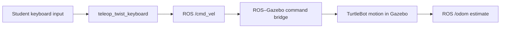
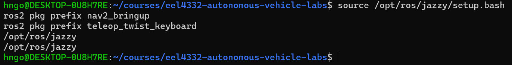
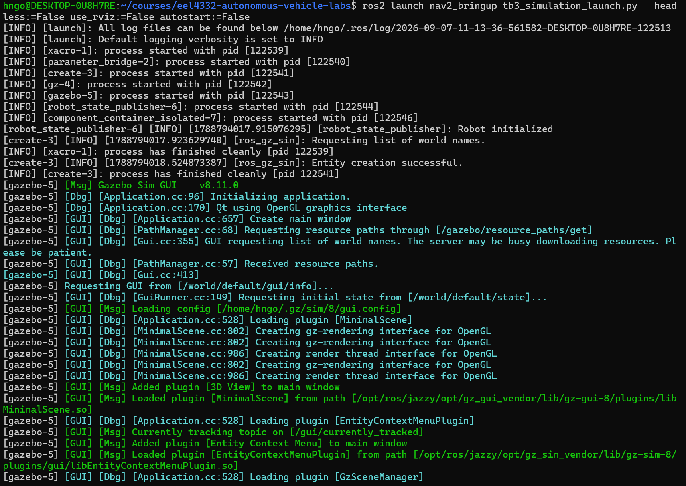
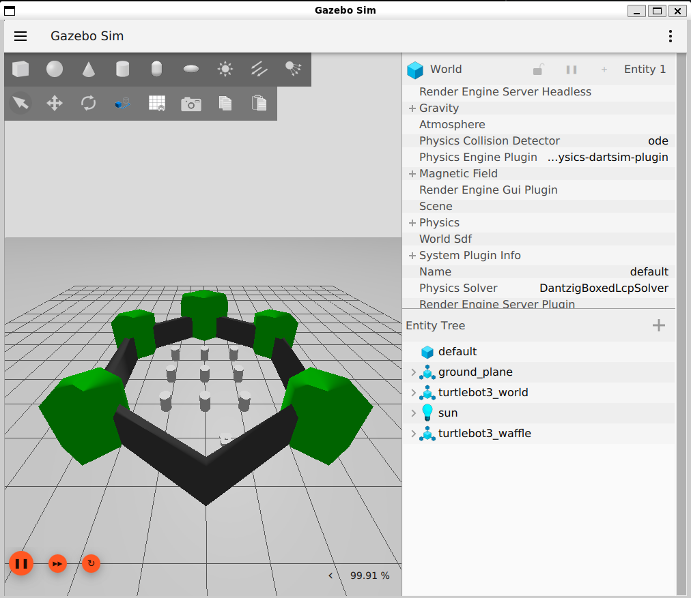
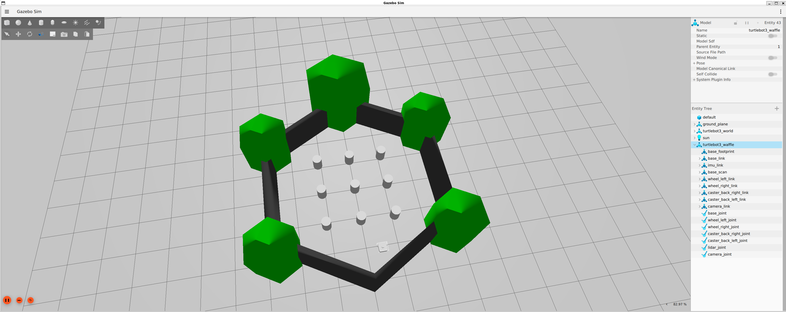
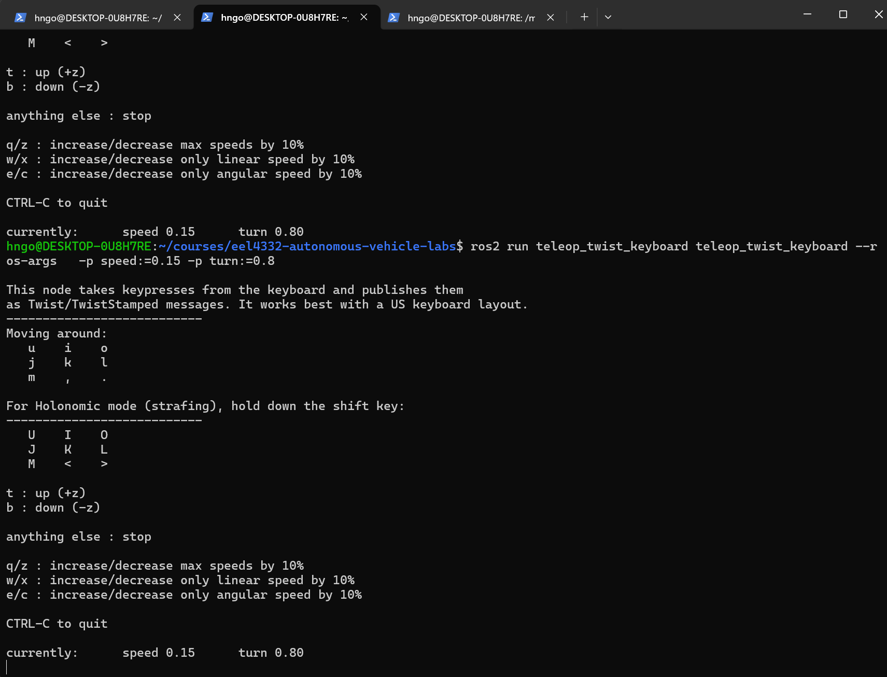
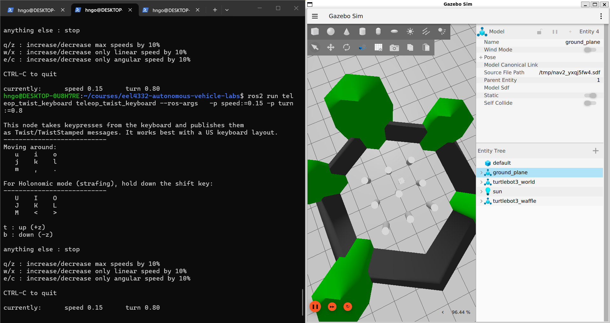
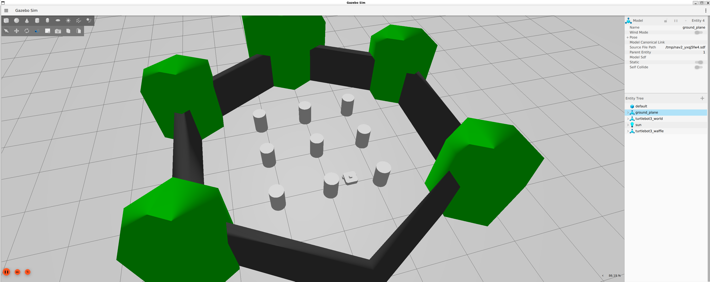
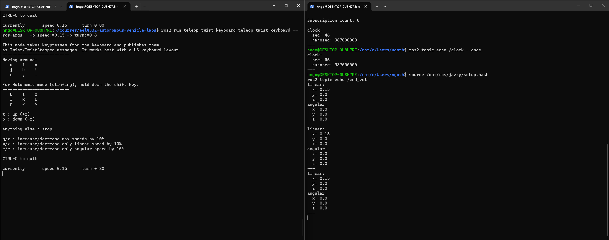
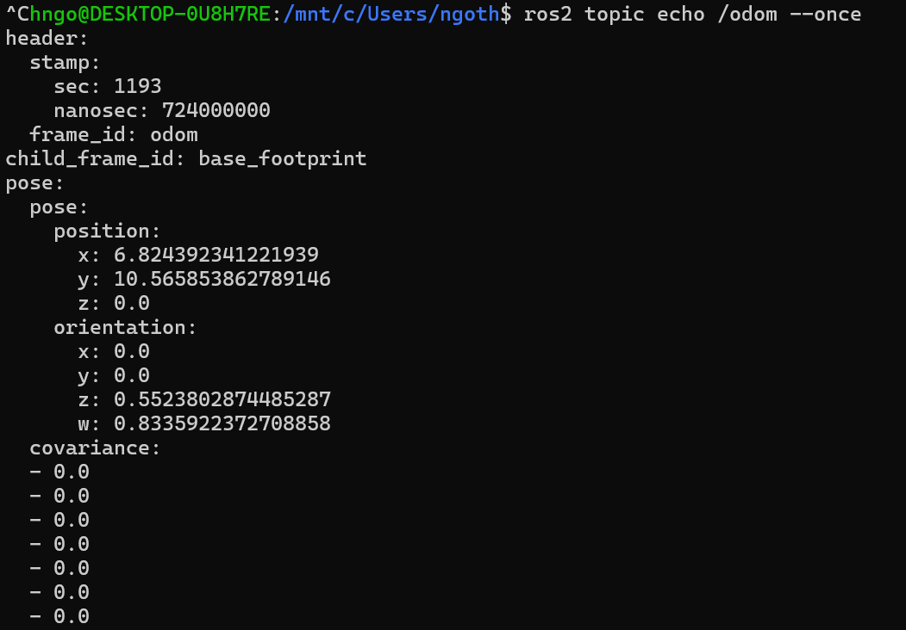

# Lab 2 — TurtleBot Playground

## Before You Begin — Update Course Files

In a **WSL/Ubuntu Terminal**, go to your local course repository and check for changes:

```bash
cd ~/courses/eel4332-autonomous-vehicle-labs
git status --short
```

**Command breakdown:** `cd` changes to the repository directory; `~` means your Ubuntu home directory. `git status --short` gives a compact list of local changes and prints nothing when the working tree is clean.

If the command prints nothing, run `git pull --rebase`. If it lists files, protect your work first by following [Updating the Course Repository](../docs/UPDATING_COURSE_REPOSITORY.md). Use your actual repository path if you cloned it elsewhere.

## Mission

**Take manual control of TurtleBot in Gazebo, explore how it moves, and complete a short obstacle-course challenge.**

This is an exploration lab. You are not expected to understand localization, Nav2, costmaps, or autonomous planning yet. Use observation and trial and error. The motion you observe will motivate the differential-drive model in Lab 3 and the larger autonomous-system investigation in Lab 4.

Plan for approximately 45–60 minutes.

## Learning Objectives

- operate TurtleBot safely in a Gazebo simulation;
- use Gazebo camera, play, pause, and reset controls;
- command forward, reverse, curved, and in-place motion with the keyboard;
- publish a numerical velocity command directly from a ROS 2 terminal;
- relate keyboard commands to the ROS `/cmd_vel` topic;
- recognize `/odom` as the robot's changing motion estimate;
- explain why an autonomous vehicle needs sensing, state estimation, planning, and control rather than continuous human input.

## Prerequisites

- Complete [Lab 00 — Software Setup](../lab00_setup/README.md).
- Complete [Lab 1 — ROS 2 and Gazebo Fundamentals](../lab01_ros2_gazebo_fundamentals/README.md).
- Run commands in WSL/Ubuntu Terminals, not PowerShell.
- Confirm that no older Gazebo or TurtleBot simulation is still running.

No robotics mathematics or student-written code is required.

## Background

### Manual control before autonomy

An autonomous mobile robot eventually chooses its own motion from sensor measurements and a mission. In this lab, you temporarily replace the autonomy software: your keyboard decisions become velocity commands, and Gazebo shows the resulting physical motion.

The simplified control chain is:



Each block has a different job:

| Block | What it does |
|---|---|
| Student keyboard input | You press a key to request forward, backward, or turning motion. In this lab, you perform the decision-making role that autonomy software will perform later. |
| `teleop_twist_keyboard` | This ROS 2 node converts each supported key press into numerical linear- and angular-velocity values. |
| ROS `/cmd_vel` | This topic carries the requested velocity command, normally as a `geometry_msgs/msg/Twist` message. It is a communication channel, not a controller or a destination. |
| ROS–Gazebo command bridge | The bridge translates the ROS velocity message into the corresponding Gazebo message and relays it into Gazebo's separate communication system. |
| TurtleBot motion in Gazebo | The simulated drive system applies the command to the wheels, while Gazebo computes the resulting motion, contacts, and collisions. The actual motion can differ from the request if the robot is blocked or its wheels slip. |
| ROS `/odom` estimate | This topic reports the robot's estimated change in pose and velocity, normally as a `nav_msgs/msg/Odometry` message. It describes what the robot is estimated to have done; it does not command motion. |

The arrows show the direction in which commands and motion information travel. The chain is not automatic feedback control yet: **you close the loop** by observing the robot in Gazebo (and later `/odom`), deciding what to do next, and pressing another key.

The `/cmd_vel` topic does not say where the robot should ultimately go. It requests forward and angular velocity at the current instant. For example, a forward command means “move forward at this speed now,” not “drive to a particular coordinate.” You must repeatedly observe, decide, command, and correct—the same broad loop that later autonomy software performs automatically.

### Why this lab uses only Gazebo

Gazebo is the 3-D physics view and is sufficient for this driving exercise. RViz2, localization, active Nav2 navigation, map initialization, and detailed TF analysis are intentionally excluded. The launch file still translates the basic `/tf` data along with the other feedback topics, but you do not need to inspect it yet. Lab 4 introduces those system layers after you have modeled the platform's motion in Lab 3.

TurtleBot uses idealized differential-drive motion in this simulation. It can turn by moving its left and right wheels at different speeds and can approximately rotate in place. Lab 3 develops the mathematical model behind that behavior and compares it with Goosebot's four-wheel skid steering.

## Provided Files

```text
lab02_turtlebot_playground/
├── README.md
├── answers.md
├── images/                 # Reference screenshots used in this guide
└── results/
```

The activity uses the installed Nav2 TurtleBot simulation and the installed `teleop_twist_keyboard` package. There is no controller code to modify.

## Learning Path and Visible Checkpoints

| Stage | What you are learning | Visible checkpoint |
|---|---|---|
| Known-good baseline | Whether the simulator and bridges started correctly | Gazebo shows TurtleBot and the obstacle playground while simulation time runs. |
| Observe before acting | How camera position affects situational awareness | You can identify the robot, obstacles, and an open route from a useful view. |
| Manual control | How key presses become velocity commands and motion | TurtleBot performs forward, turning, reverse, and stopping motions. |
| Inspect measurements | How commanded and estimated motion appear in ROS | `/cmd_vel` changes with the keyboard and `/odom` changes as the robot moves. |
| Recovery test | How to return safely from a bad command or pose | You can stop the robot and reset or relaunch the simulation deliberately. |

Each checkpoint should show behavior, not merely a command that ran without an error. Use the reference screenshots below to recognize the expected world and terminal displays.

**Optional driving challenge after the required route:** Complete one slow, contact-free circuit around the central obstacles. Smooth control and a safe stop matter more than speed; this is not an additional submission unless assigned.

## Step-by-Step Procedure

This sequence lets you first confirm a known-good simulation, then drive, experiment, and finally connect what you observed to the ROS 2 signals underneath it.

### Part 1 — Launch the Gazebo-only playground

**Why this part matters:** A controlled, known-good starting point separates launch or simulation problems from mistakes made later while driving.

In **WSL/Ubuntu Terminal 1**, verify the required packages:

```bash
source /opt/ros/jazzy/setup.bash
ros2 pkg prefix nav2_bringup
ros2 pkg prefix teleop_twist_keyboard
```

**Command breakdown:** `source` loads ROS 2 Jazzy. Each `ros2 pkg prefix PACKAGE` command prints where that installed package is located, confirming that the simulator and keyboard teleoperation packages are available.

Both commands should print an installation path. Then launch TurtleBot with RViz2 and automatic Nav2 startup disabled:

<details>
<summary>Expected package-verification output</summary>



*Both commands return `/opt/ros/jazzy`, confirming that the required packages are installed.*

</details>

```bash
ros2 launch nav2_bringup tb3_simulation_launch.py \
  headless:=False use_rviz:=False autostart:=False
```

**Command breakdown:** `ros2 launch` starts the TurtleBot simulation launch file from `nav2_bringup`. `headless:=False` shows Gazebo, `use_rviz:=False` omits RViz for this playground, and `autostart:=False` keeps the Nav2 lifecycle nodes inactive.

<details>
<summary>Expected launch output</summary>



*Several processes start because the launch file assembles the simulator, robot model, state publisher, and ROS–Gazebo bridge. `Entity creation successful` confirms that TurtleBot was inserted into the world. Gazebo may continue printing status and warning messages while it runs.*

</details>

#### The launch file starts the bridges for you

In [Lab 1's bridge exercise](../lab01_ros2_gazebo_fundamentals/gazebo_fundamentals.md#why-a-bridge-is-necessary), you manually started a bridge to make Gazebo simulation time available as a ROS 2 topic. This TurtleBot launch file starts a `ros_gz_bridge` process automatically and configures several message translations at once. The line `[parameter_bridge-2]: process started` in the launch output is evidence that this process was created.

| Direction | Important examples | Why the bridge is needed |
|---|---|---|
| ROS 2 → Gazebo | `/cmd_vel` | Converts the keyboard node's ROS `geometry_msgs/msg/Twist` command into a Gazebo `gz.msgs.Twist` command that the simulated drive system understands. |
| Gazebo → ROS 2 | `/clock`, `/odom`, `/scan`, `/imu`, and `/joint_states` | Converts simulated time, motion estimates, and sensor or robot-state data into ROS message types that ROS nodes and command-line tools understand. |
| Gazebo → ROS 2 | `/tf` | Converts Gazebo's changing pose relationships from `gz.msgs.Pose_V` to ROS `tf2_msgs/msg/TFMessage` so ROS knows where the moving robot frame is relative to the odometry frame. |

Without the `/cmd_vel` bridge, the teleop node could publish commands in ROS 2 but Gazebo would not receive them, so the simulated robot would not respond. Without the Gazebo-to-ROS bridges, the robot could move in Gazebo, but ROS 2 software could not observe its simulated clock, odometry, or sensors. Later labs depend on these feedback topics for estimation, visualization, planning, and control.

##### Why the TF bridge is especially important

**TF** means *transform*. A transform describes the position and orientation of one coordinate frame relative to another at a particular time. Robots use multiple frames because odometry, the body, and each sensor describe data from different locations. A simplified TurtleBot frame chain is:

```text
odom  →  base_footprint  →  base_link  →  base_scan
 ^            ^                ^              ^
reference   robot on         robot body     lidar sensor
frame       the floor
```

Gazebo's differential-drive system calculates the changing relationship from `odom` to `base_footprint`. The TF bridge translates that relationship into a ROS `/tf` message. ROS's `robot_state_publisher` supplies additional relationships from the robot description, such as `base_footprint` to `base_link` and onward to sensor frames. Together, these transforms form a connected frame tree.

For example, a laser scan is measured in `base_scan`, but a mapping or navigation node may need those points in `odom`. TF lets the node transform the scan through the connected frame chain. Without the changing `odom`-to-robot transform, ROS could still receive numerical `/scan` and `/odom` messages, but it could not consistently place the moving scan in the odometry frame. RViz and navigation software would commonly report missing-transform errors or be unable to align the data.

Do not memorize this frame tree yet. The important idea is that `/odom` reports a motion estimate, while `/tf` tells the rest of ROS how coordinate frames are related so data from different parts of the robot can be combined. Lab 4 examines TF in detail.

Keep WSL/Ubuntu Terminal 1 open. Wait for Gazebo to show TurtleBot in the obstacle world.

<details>
<summary>Expected Gazebo obstacle world</summary>



*The exact initial camera angle may differ. Look for the walls, cylinders, and `turtlebot3_waffle` in the Entity Tree.*

</details>

#### Observe the world and choose a camera view

Camera movement changes only your viewpoint; it does not drive the robot. Keep the arrow-shaped **Select** tool active and start camera drags over an empty part of the 3-D scene so that you do not accidentally use a model-transform tool.

| Mouse action | Camera result |
|---|---|
| Left-click | Select an object. You can also select a named object in the Entity Tree. |
| Left-click and drag | Pan sideways or vertically without changing the viewing direction. |
| Roll the mouse wheel | Zoom in or out. |
| Press the mouse wheel and drag | Orbit, or rotate the view around the scene. If middle-button dragging is unavailable, try `Shift` + left-click and drag. |
| Right-click and drag | Another way to zoom in or out. |

To find the robot, select `turtlebot3_waffle` in the Entity Tree. This highlights it and opens its properties without moving it. Use pan, orbit, and zoom to create an elevated diagonal or overhead view that shows both the robot and its intended route. An overhead view makes route planning easier, while a lower diagonal view makes distances to nearby obstacles easier to judge.

<details>
<summary>Example overhead view with TurtleBot selected</summary>



*The highlighted Entity Tree entry identifies the robot. Your camera view does not need to match this example exactly.*

</details>

Before driving:

1. Make sure simulation time is running. If Gazebo shows a **play** triangle, click it.
2. Practice orbiting, panning, and zooming the camera without selecting or moving a model.
3. Find `turtlebot3_waffle` in the **Entity Tree**.
4. Observe the cylinders, walls, and open routes through the world.
5. Choose a camera view from which you can see both the robot and nearby obstacles.

Do not continue until you can see the robot clearly and the simulation is playing.

### Part 2 — Take keyboard control

**Why this part matters:** Manual control lets you feel how velocity commands translate into differential-drive motion before you model or automate it.

Open **WSL/Ubuntu Terminal 2** and run:

```bash
source /opt/ros/jazzy/setup.bash
ros2 run teleop_twist_keyboard teleop_twist_keyboard --ros-args \
  -p speed:=0.15 -p turn:=0.8
```

**Command breakdown:** `ros2 run` starts the keyboard teleop executable from its package. `--ros-args` begins ROS-specific options; each `-p NAME:=VALUE` sets a node parameter, limiting forward speed and turn rate for safer practice.

The parameters set a beginner-friendly initial forward speed of `0.15 m/s` and turning rate of `0.8 rad/s`. Keep this terminal focused while driving. The program prints its complete key map. The most important keys are:

<details>
<summary>Expected keyboard-teleoperation display</summary>



*When the key map and current speed values appear, the node is ready. The terminal must have keyboard focus when you press a driving key.*

</details>

| Key | Motion |
|---|---|
| `i` | forward |
| `,` | reverse |
| `j` | rotate left |
| `l` | rotate right |
| `u` / `o` | curve forward left / right |
| `m` / `.` | curve backward left / right |
| `k` | stop |
| `x` / `c` | reduce linear / angular speed |

Use the key map printed by your installed package if it differs from this summary.

Each motion key sets the current velocity; it does not move the robot by a fixed distance. The robot continues using that command until another key changes it, so use `k` deliberately and keep the robot in view.

#### Recommended driving layout

Place the keyboard-teleoperation terminal on one side of the screen and Gazebo on the other. In Gazebo, use an overhead view that includes the robot, nearby cylinders, and the route ahead. Then click the teleop terminal once before driving so that it keeps keyboard focus. This arrangement lets you send commands and watch their effect at the same time; it is especially helpful during the slalom challenge.

On Windows, you can drag each window to an opposite edge of the desktop or use `Windows` + left/right arrow to snap the windows side by side. If you click Gazebo to adjust the camera, click the teleop terminal again before pressing a motion key.



*The teleop terminal remains ready for keystrokes while the overhead view makes the robot's position and available paths easy to observe.*

Start slowly:

1. Press `i`, observe forward motion for about one second, then press `k`.
2. Press `,`, observe reverse motion briefly, then press `k`.
3. Press `j` or `l`, observe in-place rotation briefly, then press `k`.
4. Try one forward curve with `u` or `o`.
5. Watch the robot in Gazebo after every command.

If the initial response feels too fast, press `x` and `c` several times to reduce speed. Press `k` whenever you are uncertain.

<details>
<summary>Example TurtleBot position after keyboard motion</summary>



*The robot has moved from its starting position. Your final position and camera angle will differ because they depend on the keys and durations you use.*

</details>

### Part 3 — Complete the driving challenges

**Why this part matters:** The challenges reveal turning limits and the difficulty of human closed-loop control, motivating the models and controllers in later labs.

Complete the following in order. Accuracy matters less than careful observation.

1. **Approach and stop:** drive toward a cylinder and stop before touching it.
2. **Turn in place:** rotate approximately one full revolution without translating far from the starting point.
3. **Slalom:** weave around at least three cylinders without collision.
4. **Parking:** choose an open region between obstacles and park the robot fully inside it.
5. **Return:** drive back near the location where the challenge began.

Optional challenges:

- complete the slalom using only curved-motion keys;
- drive the route in reverse;
- repeat the route with a lower maximum speed and compare controllability;
- have one partner operate the keyboard while another acts as a safety observer and calls `stop`.

This is not a racing competition. A failed attempt that reveals delayed stopping, poor camera placement, or an awkward turning approach is useful evidence.

### Part 4 — Peek at the ROS signals

**Why this part matters:** Observing command and odometry topics connects visible robot motion to the messages exchanged by the software system.

This section is only a preview. Lab 3 uses these motion observations when developing differential-drive odometry, and Lab 4 examines the complete ROS system in detail.

While teleoperation remains active in WSL/Ubuntu Terminal 2, open **WSL/Ubuntu Terminal 3**:

```bash
source /opt/ros/jazzy/setup.bash
ros2 topic echo /cmd_vel
```

**Command breakdown:** `source` prepares the new terminal, and `ros2 topic echo /cmd_vel` continuously prints the velocity commands sent by the keyboard node. Press `Ctrl+C` to stop echoing.

Press movement and stop keys in WSL/Ubuntu Terminal 2. Observe which `linear` and `angular` values change, then stop the echo with `Ctrl+C`.

<details>
<summary>Example forward command on `/cmd_vel`</summary>



*The relevant output begins at `ros2 topic echo /cmd_vel`; the `/clock` text above it is leftover output from an earlier command. For forward motion, `linear.x` is `0.15` while `angular.z` is `0.0`. A turning command changes `angular.z`, and `k` produces a stop command with both values equal to zero.*

</details>

#### Send a velocity command without the keyboard node

The keyboard program is only one way to publish `/cmd_vel`. After observing its messages, focus **Terminal 2**, press `k` to stop the robot, and press `Ctrl+C` to stop `teleop_twist_keyboard`. Do not leave both control methods running because competing `/cmd_vel` publishers can make the robot's behavior confusing.

First, capture the current odometry in Terminal 3 so you have a before-motion value:

```bash
ros2 topic echo /odom --once
```

In the same sourced terminal, send a slow forward command for approximately one second, followed by an explicit stop:

```bash
ros2 topic pub -r 10 -t 10 /cmd_vel geometry_msgs/msg/Twist \
  "{linear: {x: 0.10}, angular: {z: 0.0}}"
ros2 topic pub --once /cmd_vel geometry_msgs/msg/Twist \
  "{linear: {x: 0.0}, angular: {z: 0.0}}"
```

**Command breakdown:** The first command publishes a `Twist` directly instead of obtaining one from a key press. `-r 10` means 10 messages per second and `-t 10` means stop after 10 messages, giving approximately one second of motion. Positive `linear.x` requests forward motion and zero `angular.z` requests no turn. The second command sends one all-zero `Twist` to stop.

Observe that TurtleBot responds even though the keyboard node is no longer running. Both methods ultimately publish the same message type on the same topic:

```text
keyboard → teleop_twist_keyboard → /cmd_vel
terminal command ─────────────────→ /cmd_vel
```

Now capture the odometry estimate again in Terminal 3:

```bash
ros2 topic echo /odom --once
```

**Command breakdown:** `ros2 topic echo` displays messages from `/odom`; `--once` prints one message and exits instead of streaming continuously.

Compare the before-and-after messages and find the changed position or orientation fields. You do not need to interpret the quaternion yet.

<details>
<summary>Example `/odom` message after motion</summary>



*`frame_id: odom` names the reference frame, and `child_frame_id: base_footprint` identifies the robot frame being estimated. The position contains planar `x` and `y` coordinates. Orientation is represented by quaternion components; you only need to recognize that these values can change when the robot turns. Odometry is an estimate based on wheel motion and can disagree with physical motion if the wheels slip or push against an obstacle.*

</details>

Record one forward `/cmd_vel` message, one turning `/cmd_vel` message, and one qualitative change observed in `/odom`.

### Part 5 — Stop and recover safely

**Why this part matters:** A clean shutdown prevents stale processes from interfering with the next launch and gives you a reliable recovery routine.

At the end of the activity:

1. Send the one-time all-zero `/cmd_vel` command again from Terminal 2.
2. Press `Ctrl+C` in any terminal still echoing a topic.
3. Press `Ctrl+C` in WSL/Ubuntu Terminal 1 to stop the launch.
4. Wait for shutdown, then close any remaining Gazebo window.

If the robot becomes trapped, tips over, or leaves the useful area, stop teleoperation and restart the simulation. Recovery is part of learning the simulator; do not continue sending commands to a robot you cannot see.

## Engineering Questions

Answer these questions in `answers.md`:

1. Which `linear.x` and `angular.z` values changed for forward motion, turning, and stopping, and how did the keyboard node and direct terminal command publish the same kind of command?
2. Which position or orientation fields changed in `/odom`, and why is odometry called an estimate?
3. Why is a `/cmd_vel` velocity command alone insufficient to make the robot reach a specified destination?
4. In this playground, which observe–decide–command tasks did you perform that autonomous software must perform later?

## Success Criteria

- [ ] TurtleBot launched and moved in Gazebo without RViz2 or Nav2 startup.
- [ ] Forward, reverse, curved, and in-place motion demonstrated.
- [ ] Approach, rotation, slalom, parking, and return challenges attempted.
- [ ] One numerical `/cmd_vel` command published directly from the terminal and explicitly stopped.
- [ ] `/cmd_vel` and `/odom` changes observed.
- [ ] Core engineering questions completed.

## What to Submit

- completed `answers.md`;
- one screenshot showing TurtleBot during or after a driving challenge;
- one captured or transcribed forward `/cmd_vel` message;
- one captured or transcribed turning `/cmd_vel` message;
- one captured `/odom` message after the robot moved.

Store screenshots or other local evidence in `lab02_turtlebot_playground/results/` unless the instructor specifies another submission method.

## Troubleshooting

| Problem | Check |
|---|---|
| Gazebo does not open | verify `nav2_bringup`, close older simulations, and retry from a sourced WSL/Ubuntu Terminal |
| robot does not move | click Gazebo's play button, focus the teleop terminal, and verify `/cmd_vel` has a subscriber |
| keys type characters but do not drive | click WSL/Ubuntu Terminal 2 and use the key map printed by `teleop_twist_keyboard` |
| robot moves too quickly | press `x` and `c` repeatedly, then test with short taps |
| robot continues moving | press `k`; if necessary, press `Ctrl+C` and restart the launch |
| robot is lost or overturned | stop teleoperation and restart the simulation |
| RViz2 opens unexpectedly | confirm the launch command includes `use_rviz:=False` |
| old warnings or stale state appear | stop every simulation window and launch one fresh instance |

After completing this lab, continue to [Lab 3 — Differential-Drive Odometry and Vehicle Modeling](../lab03_vehicle_modeling/README.md).
