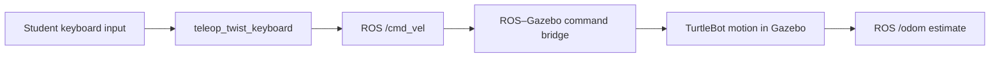

# Lab 2 — TurtleBot Playground

## Mission

**Take manual control of TurtleBot in Gazebo, explore how it moves, and complete a short obstacle-course challenge.**

This is an exploration lab. You are not expected to understand localization, Nav2, costmaps, or autonomous planning yet. Use observation and trial and error. The limitations of manual driving will motivate the technical system investigation in Lab 3.

Plan for approximately 45–60 minutes.

## Learning Objectives

- operate TurtleBot safely in a Gazebo simulation;
- use Gazebo camera, play, pause, and reset controls;
- command forward, reverse, curved, and in-place motion with the keyboard;
- relate keyboard commands to the ROS `/cmd_vel` topic;
- recognize `/odom` as the robot's changing motion estimate;
- explain why an autonomous vehicle needs sensing, state estimation, planning, and control rather than continuous human input.

## Prerequisites

- Complete [Lab 00 — Software Setup](../lab00_setup/README.md).
- Complete [Lab 1 — ROS 2 and Gazebo Fundamentals](../lab01_ros2_gazebo_fundamentals/README.md).
- Run commands in WSL/Ubuntu Terminals, not PowerShell.
- Confirm that no older Gazebo or TurtleBot simulation is still running.

No robotics mathematics or student-written code is required.

## Background

### Manual control before autonomy

An autonomous mobile robot eventually chooses its own motion from sensor measurements and a mission. In this lab, you temporarily replace the autonomy software: your keyboard decisions become velocity commands, and Gazebo shows the resulting physical motion.

The simplified control chain is:



The command topic does not say where the robot should ultimately go. It requests forward and angular velocity at the current instant. You must repeatedly observe, decide, command, and correct—the same broad loop that later autonomy software performs automatically.

### Why this lab uses only Gazebo

Gazebo is the 3-D physics view and is sufficient for this driving exercise. RViz2, localization, Nav2 lifecycle services, map initialization, and the dedicated TF bridge are intentionally excluded. Lab 3 introduces those layers after you are comfortable launching and moving the simulated platform.

TurtleBot uses idealized differential-drive motion in this simulation. It can turn by moving its left and right wheels at different speeds and can approximately rotate in place. Lab 4 develops the mathematical model behind that behavior and compares it with Goosebot's four-wheel skid steering.

## Provided Files

```text
lab02_turtlebot_playground/
├── README.md
├── answers.md
└── results/
```

The activity uses the installed Nav2 TurtleBot simulation and the installed `teleop_twist_keyboard` package. There is no controller code to modify.

## Step-by-Step Procedure

### Part 1 — Launch the Gazebo-only playground

In **WSL/Ubuntu Terminal 1**, verify the required packages:

```bash
source /opt/ros/jazzy/setup.bash
ros2 pkg prefix nav2_bringup
ros2 pkg prefix teleop_twist_keyboard
```

Both commands should print an installation path. Then launch TurtleBot with RViz2 and automatic Nav2 startup disabled:

```bash
ros2 launch nav2_bringup tb3_simulation_launch.py \
  headless:=False use_rviz:=False autostart:=False
```

Keep WSL/Ubuntu Terminal 1 open. Wait for Gazebo to show TurtleBot in the obstacle world.

**INSTRUCTOR VALIDATION REQUIRED:** verify this simplified launch and the exact teleoperation topic on the final course image before releasing the lab.

Before driving:

1. Make sure simulation time is running. If Gazebo shows a **play** triangle, click it.
2. Practice orbiting, panning, and zooming the camera without selecting or moving a model.
3. Find `turtlebot3_waffle` in the **Entity Tree**.
4. Observe the cylinders, walls, and open routes through the world.
5. Choose a camera view from which you can see both the robot and nearby obstacles.

Do not continue until you can see the robot clearly and the simulation is playing.

### Part 2 — Take keyboard control

Open **WSL/Ubuntu Terminal 2** and run:

```bash
source /opt/ros/jazzy/setup.bash
ros2 run teleop_twist_keyboard teleop_twist_keyboard --ros-args \
  -p speed:=0.15 -p turn:=0.8
```

The parameters set a beginner-friendly initial forward speed of `0.15 m/s` and turning rate of `0.8 rad/s`. Keep this terminal focused while driving. The program prints its complete key map. The most important keys are:

| Key | Motion |
|---|---|
| `i` | forward |
| `,` | reverse |
| `j` | rotate left |
| `l` | rotate right |
| `u` / `o` | curve forward left / right |
| `m` / `.` | curve backward left / right |
| `k` | stop |
| `x` / `c` | reduce linear / angular speed |

Use the key map printed by your installed package if it differs from this summary.

Start slowly:

1. Tap `i` briefly, then press `k`.
2. Tap `,` briefly, then press `k`.
3. Tap `j` and `l` to observe in-place rotation.
4. Try one forward curve with `u` or `o`.
5. Watch the robot in Gazebo after every command.

If the initial response feels too fast, press `x` and `c` several times to reduce speed. Press `k` whenever you are uncertain.

### Part 3 — Complete the driving challenges

Complete the following in order. Accuracy matters less than careful observation.

1. **Approach and stop:** drive toward a cylinder and stop before touching it.
2. **Turn in place:** rotate approximately one full revolution without translating far from the starting point.
3. **Slalom:** weave around at least three cylinders without collision.
4. **Parking:** choose an open region between obstacles and park the robot fully inside it.
5. **Return:** drive back near the location where the challenge began.

Optional challenges:

- complete the slalom using only curved-motion keys;
- drive the route in reverse;
- repeat the route with a lower maximum speed and compare controllability;
- have one partner operate the keyboard while another acts as a safety observer and calls `stop`.

This is not a racing competition. A failed attempt that reveals delayed stopping, poor camera placement, or an awkward turning approach is useful evidence.

### Part 4 — Peek at the ROS signals

This section is only a preview. Lab 3 examines the complete ROS system in detail.

While teleoperation remains active in WSL/Ubuntu Terminal 2, open **WSL/Ubuntu Terminal 3**:

```bash
source /opt/ros/jazzy/setup.bash
ros2 topic echo /cmd_vel
```

Press movement and stop keys in WSL/Ubuntu Terminal 2. Observe which `linear` and `angular` values change, then stop the echo with `Ctrl+C`.

Now inspect the odometry estimate:

```bash
ros2 topic echo /odom --once
```

Drive to a different location and run the same command again. Find the changed position or orientation fields. You do not need to interpret the quaternion yet.

Record one forward `/cmd_vel` message, one turning `/cmd_vel` message, and one qualitative change observed in `/odom`.

### Part 5 — Stop and recover safely

At the end of the activity:

1. Focus WSL/Ubuntu Terminal 2 and press `k`.
2. Press `Ctrl+C` to stop keyboard teleoperation.
3. Press `Ctrl+C` in WSL/Ubuntu Terminal 1 to stop the launch.
4. Wait for shutdown, then close any remaining Gazebo window.

If the robot becomes trapped, tips over, or leaves the useful area, stop teleoperation and restart the simulation. Recovery is part of learning the simulator; do not continue sending commands to a robot you cannot see.

## Experiment / Quantitative Analysis

Choose a short route containing at least two turns and one narrow passage. Complete two attempts and record:

| Attempt | Approximate time | Collisions | Stops/corrections | Observation |
|---|---:|---:|---:|---|
| 1 | | | | |
| 2 | | | | |

Use a phone timer or wall clock; precise synchronization is not required. Explain one reason the second attempt was easier, faster, safer, or more consistent—or why it was not.

## Engineering Questions

Answer these questions in `answers.md`:

1. Which motion was easiest to control, and which was hardest?
2. How did camera placement affect your driving?
3. What happened in `/cmd_vel` during forward motion, turning, and stopping?
4. What changed in `/odom` after the robot moved?
5. Why is a velocity command alone insufficient to complete a destination-based mission?
6. Which human tasks in this exercise will later be performed by sensing, localization, planning, and control software?
7. Why might the same keyboard commands produce different motion on physical Goosebot?

## Success Criteria

- [ ] TurtleBot launched and moved in Gazebo without RViz2 or Nav2 startup.
- [ ] Forward, reverse, curved, and in-place motion demonstrated.
- [ ] Approach, rotation, slalom, parking, and return challenges attempted.
- [ ] `/cmd_vel` and `/odom` changes observed.
- [ ] Two route attempts recorded and compared.
- [ ] Playground reflection completed.

## What to Submit

- completed `answers.md`;
- one screenshot showing TurtleBot during or after a driving challenge;
- the two-attempt route table;
- one captured or transcribed forward `/cmd_vel` message;
- one captured or transcribed turning `/cmd_vel` message.

Store screenshots or other local evidence in `lab02_turtlebot_playground/results/` unless the instructor specifies another submission method.

## Troubleshooting

| Problem | Check |
|---|---|
| Gazebo does not open | verify `nav2_bringup`, close older simulations, and retry from a sourced WSL/Ubuntu Terminal |
| robot does not move | click Gazebo's play button, focus the teleop terminal, and verify `/cmd_vel` has a subscriber |
| keys type characters but do not drive | click WSL/Ubuntu Terminal 2 and use the key map printed by `teleop_twist_keyboard` |
| robot moves too quickly | press `x` and `c` repeatedly, then test with short taps |
| robot continues moving | press `k`; if necessary, press `Ctrl+C` and restart the launch |
| robot is lost or overturned | stop teleoperation and restart the simulation |
| RViz2 opens unexpectedly | confirm the launch command includes `use_rviz:=False` |
| old warnings or stale state appear | stop every simulation window and launch one fresh instance |

After completing this lab, continue to [Lab 3 — Autonomous-System Architecture and Sensors](../lab03_system_architecture_sensors/README.md).
