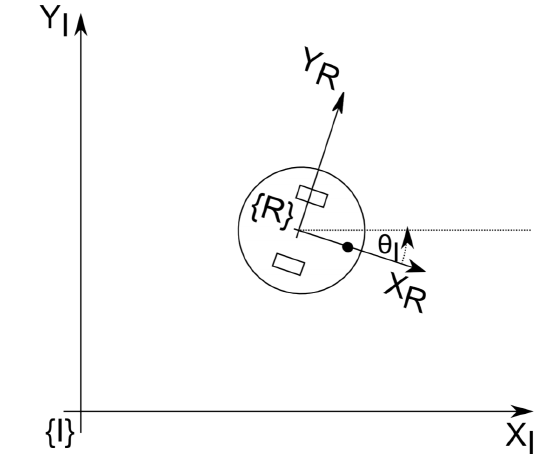
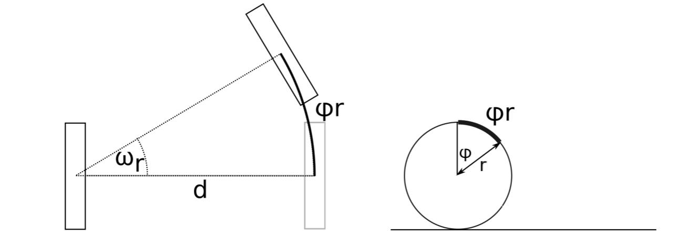
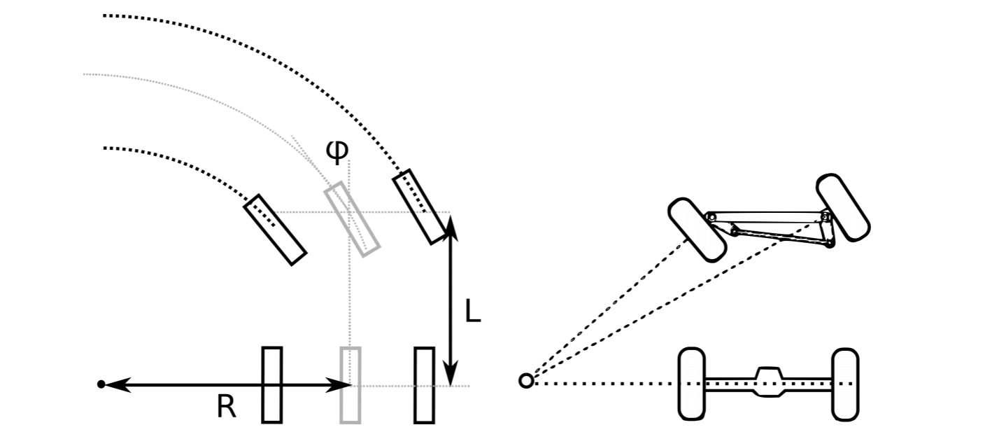
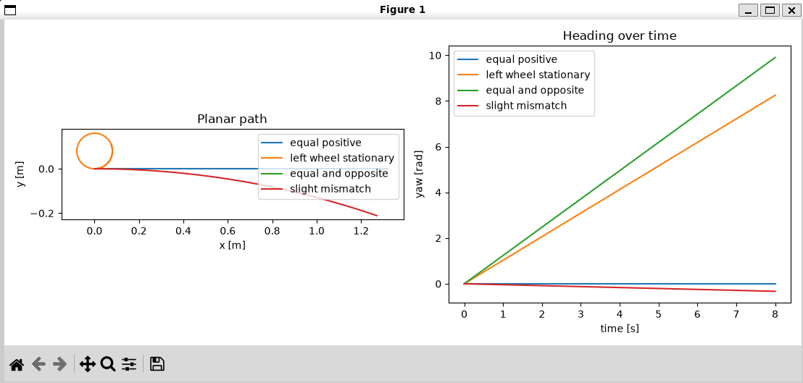
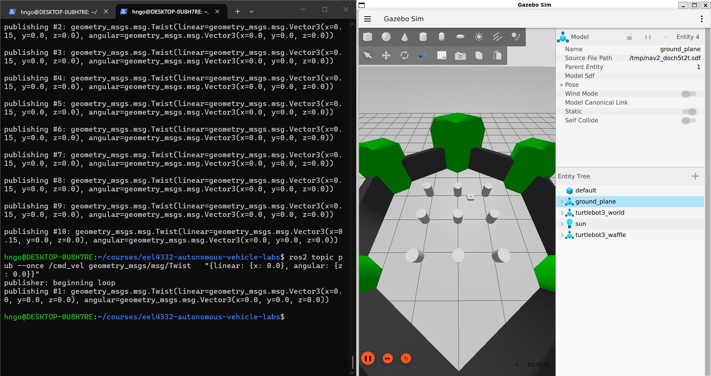
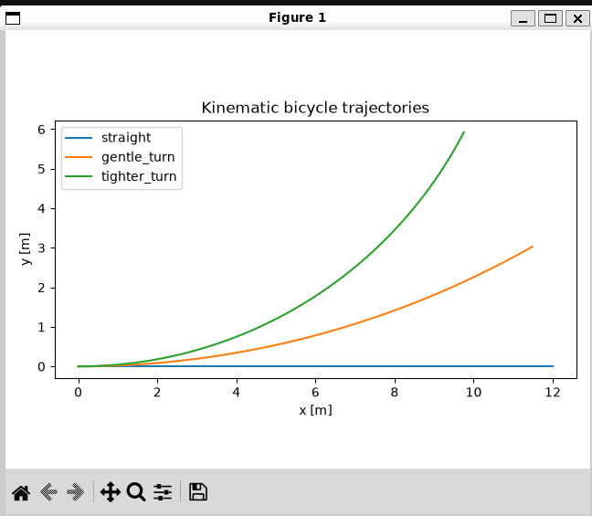

# Lab 3 — Differential-Drive Odometry and Vehicle Modeling

## Before You Begin — Update Course Files

In a **WSL/Ubuntu Terminal**, go to your local course repository and check for changes:

```bash
cd ~/courses/eel4332-autonomous-vehicle-labs
git status --short
```

**Command breakdown:** `cd` changes to the repository directory; `~` means your Ubuntu home directory. `git status --short` gives a compact list of local changes and prints nothing when the working tree is clean.

If the command prints nothing, run `git pull --rebase`. If it lists files, protect your work first by following [Updating the Course Repository](../docs/UPDATING_COURSE_REPOSITORY.md). Use your actual repository path if you cloned it elsewhere.

## Mission

**Predict planar robot motion from wheel rotation, construct a differential-drive odometry estimate, and compare that model with car-like bicycle motion.**

## Learning Objectives

- convert left and right wheel angular velocities into body-forward speed and vehicle yaw rate;
- convert a car-like model's driven-wheel angular velocity and steering angle into body-forward speed and vehicle yaw rate;
- numerically integrate differential-drive wheel odometry;
- recognize why odometry is an estimate rather than ground truth;
- compare differential-drive model predictions with visible TurtleBot motion in Gazebo;
- implement the planar kinematic bicycle model;
- compare differential-drive, bicycle, and four-wheel skid-steer motion;
- explain how persistent wheel or calibration error accumulates into odometry drift.

## Prerequisites

- Complete [Lab 2 — TurtleBot Playground](../lab02_turtlebot_playground/README.md).
- Recall how straight, curved, and in-place TurtleBot motion appeared in Gazebo, and how `/cmd_vel` and `/odom` changed while the robot moved.
- Review planar position, heading, vehicle yaw rate, and fixed-step numerical integration.
- Use the course Python virtual environment from Lab 00.

Both models use the planar pose

$$
\mathbf{x}=[x,\;y,\;\theta]^T,
$$

where $x$ and $y$ are expressed in a fixed world or odometry frame and $\theta$ is the robot heading.

## Background

### From wheel rotation to robot motion

Before using the equations, identify the frames and quantities in the differential-drive model:



**Figure 1.** The fixed inertial frame `{I}` is the world frame used in this lab. Correll's moving robot frame `{R}` is this lab's body frame `B`: its `x_R` axis points forward and its `y_R` axis points left. The heading `θ_I` is this lab's `θ`. Source: Correll, [“Forward Kinematics of Selected Mechanisms,” Figure 3.2.3](https://eng.libretexts.org/Bookshelves/Mechanical_Engineering/Introduction_to_Autonomous_Robots_%28Correll%29/03%3A_Forward_and_Inverse_Kinematics/3.02%3A_Forward_kinematics_of_selected_Mechanisms), used under [CC BY-NC 4.0](https://creativecommons.org/licenses/by-nc/4.0/).

The fixed **world frame** describes the pose $(x,y,\theta)$. The **body frame** $B$ is attached to the robot: $x_B$ points forward and $y_B$ points left. The ideal differential-drive model has two independently driven wheels with radius $r$, separated by track width $b$. Let $\omega_L$ and $\omega_R$ be the left and right **wheel angular velocities** in radians per second.

#### Why multiplying meters by radians gives meters

The right side of Figure 2 shows the wheel geometry behind this relationship:



**Figure 2.** Right: rotating a wheel through angle `φ` sweeps arc length `rφ`. Left: when one differential-drive wheel is stationary, the robot pivots about that wheel; Correll labels the wheel separation `d`, which is the track width `b` used in this lab. Source: Correll, [Figure 3.2.4](https://eng.libretexts.org/Bookshelves/Mechanical_Engineering/Introduction_to_Autonomous_Robots_%28Correll%29/03%3A_Forward_and_Inverse_Kinematics/3.02%3A_Forward_kinematics_of_selected_Mechanisms), used under [CC BY-NC 4.0](https://creativecommons.org/licenses/by-nc/4.0/).

An angle measured in radians is defined as a ratio:

$$
\phi=\frac{s}{r},
$$

where $s$ is arc length and $r$ is radius. Because both $s$ and $r$ have units of meters, their units cancel. A radian is therefore **dimensionless**; `rad` is retained as a descriptive label so that an angular quantity is not confused with an ordinary unitless number.

Rearranging the definition gives the rolling-distance relationship

$$
s=r\phi.
$$

Dimensionally, this is $\text{m}\times 1=\text{m}$. Differentiating with respect to time gives

$$
u=\frac{ds}{dt}=r\frac{d\phi}{dt}=r\omega,
$$

so $\text{m}\times\text{rad/s}$ is dimensionally $\text{m/s}$. The angle must be expressed in **radians**, not degrees, for these formulas to apply directly. Under ideal rolling without slip, applying this relationship to the two wheels gives

$$
u_L=r\omega_L,
\qquad
u_R=r\omega_R.
$$

Here, $u_L$ and $u_R$ have units of meters per second. The robot-center **body-forward speed** $v$ is the average of those two wheel-edge speeds, while the **vehicle yaw rate** $\dot{\theta}$ is their difference divided by the track width:

$$
v=\frac{u_R+u_L}{2}
  =\frac{r}{2}(\omega_R+\omega_L),
\qquad
\dot{\theta}=\frac{u_R-u_L}{b}
  =\frac{r}{b}(\omega_R-\omega_L).
$$

This is the wheel-angular-velocity-to-body-velocity conversion developed in [Correll's differential-wheel forward-kinematics derivation](https://eng.libretexts.org/Bookshelves/Mechanical_Engineering/Introduction_to_Autonomous_Robots_%28Correll%29/03%3A_Forward_and_Inverse_Kinematics/3.02%3A_Forward_kinematics_of_selected_Mechanisms). The body-forward speed must then be expressed in the fixed frame:

$$
\dot{x}=v\cos\theta,
\qquad
\dot{y}=v\sin\theta.
$$

These equations predict important special cases:

- equal wheel angular velocities produce straight motion;
- one stationary wheel produces a turn about the stationary side;
- equal and opposite wheel angular velocities produce an in-place rotation;
- a faster right wheel produces a counterclockwise turn under the sign convention used in this lab.

### From forward kinematics to odometry

**Forward kinematics** converts wheel angular velocities into instantaneous robot velocity. **Wheel odometry** repeatedly integrates that velocity to estimate pose:

$$
\mathbf{x}_{k+1}\approx \mathbf{x}_k+
\begin{bmatrix}
v_k\cos\theta_k\\
v_k\sin\theta_k\\
\dot{\theta}_k
\end{bmatrix}\Delta t.
$$

This is a dead-reckoning estimate, not a direct measurement of world position. Wheel-radius error, unequal wheels, slip, encoder quantization, timestamp error, and finite integration steps accumulate over time. A smooth odometry trajectory can therefore be precise but wrong.

This progression follows the textbook treatment from [differential-wheel forward kinematics to odometry, followed by car-like steering](https://eng.libretexts.org/Bookshelves/Mechanical_Engineering/Introduction_to_Autonomous_Robots_%28Correll%29/03%3A_Forward_and_Inverse_Kinematics/3.02%3A_Forward_kinematics_of_selected_Mechanisms).

TurtleBot is well approximated by a two-wheel differential-drive model. Goosebot also turns through left/right velocity differences, but it has four conventional wheels with fixed parallel axes. Its tires must scrub sideways during a turn, so ideal differential-drive odometry does not capture all Goosebot slip.

### Car-like bicycle model

Before using the bicycle equations, compare the geometry with the differential-drive figures:



**Figure 3.** Left: the front and rear wheel pairs are replaced by a bicycle model whose wheels follow circles about a common center. `L` is wheelbase and `R` is turning radius. Correll uses `φ` for the bicycle steering angle; this lab uses `δ` to avoid confusing steering angle with wheel rotation angle. Right: an Ackermann linkage gives the physical front wheels different steering angles so their rolling directions share the same center of rotation. Source: Correll, [Figure 3.2.5](https://eng.libretexts.org/Bookshelves/Mechanical_Engineering/Introduction_to_Autonomous_Robots_%28Correll%29/03%3A_Forward_and_Inverse_Kinematics/3.02%3A_Forward_kinematics_of_selected_Mechanisms), used under [CC BY-NC 4.0](https://creativecommons.org/licenses/by-nc/4.0/).

The kinematic bicycle model replaces a four-wheel car with equivalent front and rear contact points. Its inputs are **longitudinal speed**, also called **body-forward speed**, $v$, and steering angle $\delta$. Its wheelbase is $L$:

$$
\dot{x}=v\cos\theta,
\qquad
\dot{y}=v\sin\theta,
\qquad
\dot{\theta}=\frac{v}{L}\tan\delta.
$$

The core bicycle model may receive $v$ directly. In this lab, you first infer $v$ from the angular velocity $\omega_w$ of an equivalent driven rear wheel with effective radius $r_w$. Under ideal rolling without slip,

$$
v=r_w\omega_w,
\qquad
\dot{\theta}=\frac{r_w\omega_w}{L}\tan\delta.
$$

Here, $r_w$ is the effective driven-wheel radius in meters, $\omega_w$ is the driven-wheel angular velocity in rad/s, $L$ is the front-to-rear wheelbase in meters, and $\delta$ is the equivalent front-wheel steering angle in radians. The function `wheel_speed_to_twist` implements this conversion and returns $v$ and $\dot{\theta}$.

This simplified conversion uses the angular velocity of the equivalent rear/reference wheel. A measured steered-front-wheel speed or a slipping tire requires additional geometry or a more detailed model.

Unlike differential drive, this model cannot rotate in place. It represents car-like steering and remains useful for comparing platform assumptions and for the Pure Pursuit exercise in Lab 8. It is not a model of Goosebot.

### Terminology used in this lab

Several sources and ROS messages use different names for closely related quantities. This lab uses the terms below consistently:

| Quantity | Equivalent terminology used here | Symbol and units | Important distinction |
|---|---|---|---|
| wheel angular velocity | wheel rotational speed; wheel angular speed | $\omega_L$, $\omega_R$, or $\omega_w$ in rad/s | Rotation of a wheel about its axle. |
| wheel-edge speed | tangential wheel speed; linear wheel speed | $u=r\omega$ in m/s | Linear speed at the tire circumference under ideal rolling. |
| body-forward speed | forward speed; longitudinal speed; body-frame `linear.x` | $v$ in m/s | Translation along the vehicle's forward axis. |
| vehicle yaw rate | heading rate; angular velocity about the vertical $z$-axis; body-frame `angular.z` | $\dot{\theta}$ or $\omega_z$ in rad/s | Rotation of the whole vehicle, not rotation of a wheel. |
| heading | yaw angle | $\theta$ in rad | Vehicle orientation, whose time derivative is yaw rate. |

Avoid the unqualified phrase “angular speed” when the context could mean either wheel rotation or vehicle rotation. In equations and explanations, say **wheel angular velocity** for $\omega_L$, $\omega_R$, or $\omega_w$, and **vehicle yaw rate** for $\dot{\theta}$.

### Frames, signs, and units

Use meters, seconds, meters per second, radians, and radians per second. This lab defines positive $x$ as the initial forward direction, positive $y$ to the left, and positive yaw as counterclockwise. State the convention on every trajectory plot.

## Provided Files

```text
lab03_vehicle_modeling/
├── README.md
├── images/
│   ├── README.md
│   ├── correll-mobile-robot-frames.png
│   ├── correll-differential-wheel-kinematics.png
│   ├── correll-ackermann-bicycle.png
│   ├── differential-drive-validation-trajectories.png
│   ├── bicycle-model-validation-trajectories.png
│   └── turtlebot-part4-01-straight-motion.png
├── src/
│   ├── differential_drive.py
│   ├── bicycle_model.py
│   └── run_experiments.py
├── results/
└── answers.md
```

The propagation functions contain required `TODO` sections. Do not replace them with an external kinematics or vehicle-dynamics library.

## Learning Path and Visible Checkpoints

| Stage | What you are learning | Visible checkpoint |
|---|---|---|
| Predict | What each wheel-angular-velocity combination should do | A hand table identifies straight, curved, and in-place motion before coding. |
| Implement | How kinematic equations become pose updates | The required functions produce a trajectory containing the initial pose. |
| Test special cases | How simple cases isolate sign and unit errors | Straight motion has negligible yaw; in-place rotation has negligible translation. |
| Observe the robot | How mathematical motion categories appear physically | TurtleBot visibly performs the same straight, curved, and rotating cases. |
| Explain a limitation | Why persistent measurement or calibration bias causes odometry drift | A worked example shows a small wheel-speed error accumulating into a large heading error. |
| Compare platforms | Why robot geometry selects the model | Plots distinguish differential-drive motion from car-like bicycle motion. |

Do not accept a plausible-looking plot by itself. A result passes a checkpoint only when its direction, final pose, and limiting cases agree with your prediction.

**Optional challenge after the required work:** Choose wheel angular velocities that produce a visibly gentle curve, predict its direction and approximate radius, and test it with the completed simulator. State your assumptions; no additional submission is required unless assigned.

## Step-by-Step Procedure

The work progresses from hand predictions to code, visual simulation, a short odometry-drift example, and model comparison so that each implementation result has both a physical and mathematical reference.

### Part 1 — Predict differential-drive motion by hand

**Why this part matters:** Hand predictions provide a simple reference for catching sign, unit, and interpretation errors in the code that follows.

Before writing code, use the equations above to predict the sign of $v$ and $\dot{\theta}$ for:

1. $\omega_L=5\ \text{rad/s}$, $\omega_R=5\ \text{rad/s}$;
2. $\omega_L=0$, $\omega_R=5\ \text{rad/s}$;
3. $\omega_L=-3\ \text{rad/s}$, $\omega_R=3\ \text{rad/s}$;
4. $\omega_L=5\ \text{rad/s}$, $\omega_R=4.8\ \text{rad/s}$.

Record whether each case should move straight, curve left, curve right, or rotate in place. These predictions are your first debugging test.

### Part 2 — Implement differential-drive kinematics and odometry

**Why this part matters:** This step translates the wheel-motion equations from lecture into an executable estimate of robot pose.

Open:

```text
src/differential_drive.py
```

Complete the `TODO` sections in this order:

1. `wheel_speeds_to_twist`;
2. `step_differential_drive`;
3. `simulate_differential_drive`.

Use fixed-step Euler integration and include the initial pose as the first trajectory sample. Keep wheel angular velocities separate from linear wheel-edge speeds and verify their units.

### Part 3 — Validate differential-drive special cases

**Why this part matters:** Straight, rotating, and curved cases isolate different behaviors and make implementation errors easier to diagnose.

Use these fixed robot and simulation values:

| Symbol | Python variable | Meaning | Value and unit |
|---|---|---|---|
| $r$ | `wheel_radius` | radius of each drive wheel, measured from the wheel center to its rolling surface | 0.033 m |
| $b$ | `track_width` | lateral distance between the left and right wheel contact lines | 0.16 m |
| $\Delta t$ | `dt` | integration time step: the amount of simulated time advanced by each Euler update | 0.02 s |

Track width $b$ is the left-to-right wheel spacing; it is not the front-to-rear **wheelbase** $L$ used by the bicycle model. The time step $\Delta t$ is also not the total experiment duration. The driver repeatedly advances the state by 0.02 s until it reaches the separately defined `duration`.

With these values, simulate at least:

1. equal positive wheel angular velocities;
2. one stationary wheel;
3. equal and opposite wheel angular velocities;
4. slightly unequal positive wheel angular velocities.

The provided experiment driver contains these four validation cases. From the repository root, run:

```bash
source ~/venvs/eel4332/bin/activate
python lab03_vehicle_modeling/src/run_experiments.py --model differential
```

**Command breakdown:** `source` activates the course Python environment. The Python command runs only the differential-drive validation, so `bicycle_model.py` does not need to be complete yet. `--model differential` selects the four cases above.

The terminal command above is the recommended way to run this stage because it includes the required `--model differential` argument. The Microsoft Python extension for VS Code is helpful for editing and debugging, but it is not required for this terminal command; the Python interpreter and course virtual environment perform the execution. If VS Code reports that it cannot find Python, complete the Python-extension and interpreter-selection steps in Lab 00 and confirm that VS Code is connected to WSL.

The command prints a final-pose table containing $x$, $y$, and yaw and saves `results/differential_drive_trajectories.png`. The figure contains both the planar position path and yaw versus time.

For every case, compare the printed table and figure with your Part 1 prediction:

- equal positive wheel angular velocities should change position with approximately zero yaw change;
- one stationary wheel should produce both translation and rotation;
- equal and opposite wheel angular velocities should change yaw while $x$ and $y$ remain approximately constant;
- slightly unequal positive wheel angular velocities should produce a gentle curve rather than a perfectly straight path.

Do not validate from the planar-path panel alone. An in-place rotation appears as a single point there but is clearly visible in the yaw-versus-time panel and final-yaw value. If a result disagrees with the hand prediction, return to the corresponding conversion, sign, or integration step before continuing.



*Example output after a correct implementation. Equal positive wheel speeds produce a straight path with constant heading. One stationary wheel produces an arc, equal-and-opposite speeds change heading at essentially one position, and a small speed mismatch produces a gradual curve. Exact values depend on the supplied inputs.*

#### Student motion-design challenge

**Why this activity matters:** The four supplied cases check whether the model behaves correctly, but autonomous-vehicle work also requires solving the inverse question: “What wheel commands will create the motion I want?”

Open `src/run_experiments.py` and find `STUDENT_MOTION_CASES`. Choose **one** of the following targets. Without changing `wheel_radius`, `track_width`, `dt`, or `duration`, add one named wheel-command pair that produces:

1. straight backward travel ending between 0.75 m and 0.85 m behind the initial pose, with final yaw approximately zero;
2. one counterclockwise in-place revolution, with final yaw approximately $2\pi$ rad and essentially no position change;
3. a forward right-hand curve using two positive, nonzero wheel angular velocities.

Each entry uses this format:

```python
("descriptive case name", left_wheel_angular_velocity, right_wheel_angular_velocity)
```

Both numerical values are in rad/s. Before running the program, calculate or predict the required wheel-speed relationship and record your reasoning in `answers.md`. Then rerun the differential experiment, inspect both panels and the final-pose table, and adjust your values if necessary. Do not copy one of the supplied validation pairs unchanged; your command must satisfy the selected target.

Wheel angular velocities are the **inputs you command**. Wheel radius and track width describe the **robot you are modeling**. Changing a geometry value merely to reach a desired motion would describe a different robot. Part 5 explains how an incorrect measurement or geometry value can instead make the estimated motion drift away from the real motion.

### Part 4 — Observe the corresponding TurtleBot motions in Gazebo

**Why this part matters:** Watching TurtleBot move connects the mathematical motion categories from Part 3 to a simulated physical robot.

The TurtleBot simulator accepts body velocity on `/cmd_vel`, where `linear.x` corresponds to model output $v$ and `angular.z` corresponds to $\dot{\theta}$. It does not accept the model's left and right wheel angular velocities directly. Therefore, this is a qualitative comparison of motion type—not an independent numerical validation of your wheel equations.

#### How the kinematic model connects to Gazebo

The Python model from Part 3 and the Gazebo simulation do **not** call each other. They represent the same differential-drive geometry at different levels:

| Stage | What happens |
|---|---|
| Python model | Your code assumes ideal rolling and directly integrates wheel-derived $v$ and $\dot{\theta}$ to predict $x$, $y$, and $\theta$. It does not model mass, motor force, collision, or friction. |
| ROS–Gazebo bridge | The bridge translates the ROS 2 `Twist` message on `/cmd_vel` into the corresponding Gazebo Transport message. It changes the communication format; it does not calculate the robot pose. |
| Gazebo DiffDrive system | The controller uses wheel radius and track width to convert the requested body-forward speed and yaw rate into left and right wheel-joint velocity commands. This is **inverse differential-drive kinematics**. |
| Gazebo physics | The physics engine advances the linked robot using those joint commands together with gravity, collisions, and contact friction. The robot's simulated world pose therefore comes from the physics simulation, not from your Python Euler-integration function. |
| Gazebo odometry | The DiffDrive system reads the wheel-joint positions and uses differential-drive **forward kinematics** to estimate and publish odometry. This calculation is the closest counterpart to the code you write in Part 3. |

In short, Gazebo uses both kinematics and physics: kinematics converts between body motion and wheel motion, while physics determines how the simulated body actually moves. Under ideal free-space rolling, the kinematic prediction and Gazebo motion should look similar. Contact with an obstacle, wheel slip, or imperfect geometry can make the physical pose and wheel-derived odometry disagree. Gazebo's [DiffDrive source](https://github.com/gazebosim/gz-sim/blob/gz-sim8/src/systems/diff_drive/DiffDrive.cc#L475-L590) shows both the body-to-wheel conversion and the wheel-position odometry update.

Close any older TurtleBot, Gazebo, or keyboard-teleoperation processes. In **WSL/Ubuntu Terminal 1**, launch the same known-good simulator used in Lab 2:

```bash
source /opt/ros/jazzy/setup.bash
ros2 launch nav2_bringup tb3_simulation_launch.py \
  headless:=False use_rviz:=False autostart:=False
```

**Command breakdown:** `source` loads ROS 2 Jazzy. `ros2 launch` starts the TurtleBot simulation and its ROS–Gazebo bridges. `headless:=False` opens Gazebo, `use_rviz:=False` omits RViz, and `autostart:=False` keeps autonomous Nav2 behavior inactive.

Make sure Gazebo is playing, then prepare an overhead view:

1. Keep the arrow-shaped **Select** tool active and select `turtlebot3_waffle` in the Entity Tree so you can locate the robot.
2. Move the pointer over an empty part of the 3-D scene. Press and drag the mouse wheel to orbit the camera until you are looking nearly straight down at the ground. If middle-button dragging is unavailable, try **Shift + left-click and drag**.
3. Roll the mouse wheel to zoom until the robot and enough open driving space are visible.
4. Left-click and drag over empty space to pan and center the robot without changing the viewing direction.

Camera movement changes only the viewpoint; it does not move the robot. Avoid beginning a drag on the robot or another model. The complete [Lab 2 camera-control table](../lab02_turtlebot_playground/README.md#observe-the-world-and-choose-a-camera-view) and [split-screen layout](../lab02_turtlebot_playground/README.md#recommended-driving-layout) are useful references. Do **not** run `teleop_twist_keyboard` during these tests because the commands below should be the only `/cmd_vel` publisher.

> **Do not click Gazebo's circular Reset button in this simulation.** The launch process loads the playground world and then dynamically spawns `turtlebot3_waffle`. A full Gazebo reset can reload the base world without rerunning the ROS spawning action, causing the robot to disappear. The Entity Tree should contain both `turtlebot3_world` and `turtlebot3_waffle`. If `turtlebot3_waffle` is missing, stop the launch with `Ctrl+C` in Terminal 1 and run the launch command again.

In **WSL/Ubuntu Terminal 2**, run each test separately. The first command in each block publishes 10 messages at 10 Hz, so the command lasts approximately one second. Here, `-t 10` means **10 messages**, not 10 seconds. The second command sends an explicit stop.

**Straight motion:**

```bash
source /opt/ros/jazzy/setup.bash
ros2 topic pub -r 10 -t 10 /cmd_vel geometry_msgs/msg/Twist \
  "{linear: {x: 0.15}, angular: {z: 0.0}}"
ros2 topic pub --once /cmd_vel geometry_msgs/msg/Twist \
  "{linear: {x: 0.0}, angular: {z: 0.0}}"
```

**Command breakdown:** The first `ros2 topic pub` sends a `Twist` command to `/cmd_vel`; `-r 10` publishes at 10 Hz and `-t 10` stops after 10 messages, giving an approximate duration of 10 messages ÷ 10 messages/s = 1 second. Positive `linear.x` requests body-forward speed and zero `angular.z` requests zero vehicle yaw rate. The second command uses `--once` to replace the motion request with zero forward speed and yaw rate.



*The terminal shows the repeated forward commands ending at `publishing #10`, followed by one zero-velocity message. Gazebo remains visible beside the terminal, and `turtlebot3_waffle` remains present in the Entity Tree. The exact robot position and camera angle may differ.*

**Curved motion:**

```bash
ros2 topic pub -r 10 -t 10 /cmd_vel geometry_msgs/msg/Twist \
  "{linear: {x: 0.15}, angular: {z: 0.5}}"
ros2 topic pub --once /cmd_vel geometry_msgs/msg/Twist \
  "{linear: {x: 0.0}, angular: {z: 0.0}}"
```

**Command breakdown:** This uses the same forward speed while adding a positive yaw rate. TurtleBot should trace a counterclockwise arc. The final one-time zero message stops the robot.

**In-place rotation:**

```bash
ros2 topic pub -r 10 -t 10 /cmd_vel geometry_msgs/msg/Twist \
  "{linear: {x: 0.0}, angular: {z: 0.8}}"
ros2 topic pub --once /cmd_vel geometry_msgs/msg/Twist \
  "{linear: {x: 0.0}, angular: {z: 0.0}}"
```

**Command breakdown:** Zero `linear.x` requests no forward translation, while positive `angular.z` requests counterclockwise rotation. Publishing the zero message afterward stops the turn.

Press `Ctrl+C` and immediately send the one-time zero command if a repeated publisher does not finish normally.

Because these are qualitative path-shape tests, you may perform the next test from the robot's current stopped pose if it has enough open space. If you need the original pose for a fair comparison, use this restart procedure instead of Gazebo Reset:

1. Stop the simulation launch with `Ctrl+C` in Terminal 1.
2. Press the Up Arrow key in the same terminal to recall the launch command, verify that it matches the command shown at the beginning of Part 4, and press Enter to run it again.
3. Wait until `turtlebot3_waffle` appears in the Entity Tree and Gazebo is playing.
4. Reestablish the overhead view, then run the next motion command from Terminal 2.

Observe the straight, curved, and in-place motions. No additional prediction table is required. Save one screenshot that clearly shows one commanded motion case and identify which case it shows in `answers.md`.

You may inspect `/odom` as in Lab 2, but do not treat it as Gazebo ground truth. TurtleBot's odometry is generated from the simulated drive system and can continue accumulating wheel motion when the body is blocked by an obstacle.

When finished, send the zero command once more and stop the launch with `Ctrl+C` in Terminal 1.

### Part 5 — Understand how odometry drift accumulates

**Why this part matters:** A small persistent measurement or calibration error can become a large pose error because odometry repeatedly integrates it.

Suppose a robot is actually driving straight, but a 1% encoder-scale error makes its odometry calculation report

$$
\omega_L=5.00\ \text{rad/s},
\qquad
\omega_R=5.05\ \text{rad/s}.
$$

Using $r=0.033\ \text{m}$ and $b=0.16\ \text{m}$, the odometry calculation produces a small false yaw rate:

$$
\dot{\theta}_{\text{estimated}}
=\frac{0.033(5.05-5.00)}{0.16}
\approx 0.0103\ \text{rad/s}.
$$

After 60 seconds, that persistent error accumulates to approximately

$$
\Delta\theta
\approx 0.0103(60)
\approx 0.62\ \text{rad}
\approx 35^\circ.
$$

The error does not disappear merely because each individual time step is small: every update adds another heading error, and the incorrect heading also rotates future forward-motion updates into the wrong world-frame direction. The estimated $x$ and $y$ therefore drift as well. A biased encoder scale, unequal effective wheel radii, an incorrect track width, and wheel slip can all create this kind of systematic disagreement. No additional experiment or submission is required for this part.

### Part 6 — Implement and test the bicycle model

**Why this part matters:** Comparing a car-like steering model with differential drive clarifies why vehicle geometry determines the appropriate kinematics.

Open:

```text
src/bicycle_model.py
```

Complete its `TODO` sections in this order:

1. `wheel_speed_to_twist`;
2. `step_bicycle`;
3. `simulate`.

The provided `run_bicycle_experiments` function supplies $r_w=0.30\ \text{m}$, $\omega_w=5.0\ \text{rad/s}$, and $L=2.8\ \text{m}$ to all three cases. It changes only the steering angle:

| Driver case | Wheel angular velocity | Steering angle | Expected check |
|---|---:|---:|---|
| `straight` | 5.0 rad/s | 0 rad | zero yaw rate and a straight path |
| `gentle_turn` | 5.0 rad/s | 0.12 rad | positive yaw rate and a left-curving path |
| `tighter_turn` | 5.0 rad/s | 0.25 rad | larger positive yaw rate and a tighter left curve |

After completing all three bicycle-model functions, test them from the repository root:

```bash
source ~/venvs/eel4332/bin/activate
python lab03_vehicle_modeling/src/run_experiments.py --model bicycle
```

**Command breakdown:** `source` activates the course Python environment. The Python command runs only the three bicycle cases, so a problem in the differential-drive implementation cannot interrupt this test. `--model bicycle` selects those cases.

Use the output in this order:

1. Check the printed conversion table. All three cases use the same wheel angular velocity and radius, so they should have the same positive body-forward speed. The zero-steering case should have zero yaw rate, and the larger positive steering angle should produce the larger positive yaw rate.
2. Check the displayed trajectory figure. `straight` should remain on a line, while `gentle_turn` and `tighter_turn` should curve left. The tighter-turn path should have the smaller turning radius.
3. Confirm that the same figure was saved as `lab03_vehicle_modeling/results/bicycle_trajectories.png`.



*Example output after a correct implementation. Zero steering produces the horizontal straight path. With the same wheel speed, positive steering curves left, and the larger steering angle produces the tighter curve.*

If the conversion table is wrong, inspect `wheel_speed_to_twist`. If the table is correct but the paths are wrong, inspect `step_bicycle` and then `simulate`. The bicycle portion is intentionally smaller than the differential-drive portion.

### Part 7 — Run and compare the models

**Why this part matters:** Common plots and metrics make similarities, limitations, and modeling errors easier to evaluate objectively.

From the Lab 3 directory, run:

```bash
source ~/venvs/eel4332/bin/activate
python src/run_experiments.py --model all
```

**Command breakdown:** `source` activates the course Python environment. The Python command runs both completed model experiment sets; `--model all` makes that choice explicit.

The script saves plots in `results/`. Add plot titles or captions that identify each model, its inputs, its parameters, and the coordinate convention.

Use your results to compare:

| Platform/model | Motion inputs | Can rotate in place? | Important limitation |
|---|---|---:|---|
| TurtleBot ideal differential drive | left/right wheel angular velocities | yes | omits real slip and calibration error |
| kinematic bicycle | driven-wheel angular velocity and steering angle | no | assumes ideal wheel rolling and omits tire-force dynamics and lateral slip |
| Goosebot four-wheel skid steer | four motor commands reduced to left/right motion | physically possible | turning depends strongly on tire scrub and slip |

## Experiment / Quantitative Analysis

Your results must include:

- differential-drive plots for the four special cases;
- a table of final $x$, $y$, and $\theta$ for those cases;
- one student-designed wheel-command case, including the calculation or prediction and final pose;
- one Part 4 TurtleBot motion screenshot;
- one bicycle-model plot containing the three Part 6 cases;
- a concise comparison of the assumptions behind all three platform models.

Do not compare trajectories point by point unless they use the same time samples, initial pose, and compatible commands. A bicycle-model driven-wheel angular velocity plus steering angle and a differential-drive left/right wheel-angular-velocity pair are different physical inputs.

## Engineering Questions

1. Why is integrating wheel-derived velocity called dead reckoning?
2. Which differential wheel-angular-velocity combinations produce straight motion, curved motion, and an in-place turn?
3. Why can a small wheel-radius or wheel-angular-velocity mismatch create a large position error after a long drive?
4. Why is `/odom` an estimate rather than ground truth?
5. Why can the bicycle model not represent an in-place turn?
6. How do wheelbase and steering angle affect bicycle-model turning radius?
7. Why can TurtleBot’s differential-drive model approximate Goosebot while missing four-wheel tire scrub and slip?
8. Which model should be used for the Pure Pursuit steering-angle exercise in Lab 8, and which model better prepares you to interpret TurtleBot odometry?

## Success Criteria

- [ ] differential-drive forward kinematics implemented and unit-checked;
- [ ] wheel odometry integrated from an initial pose;
- [ ] straight, curved, pivot, and in-place cases verified;
- [ ] one wheel-angular-velocity pair designed and tested against a selected Part 3 motion target;
- [ ] straight, curved, and in-place TurtleBot motions observed in Gazebo;
- [ ] bicycle driven-wheel angular velocity converted to body-forward speed and vehicle yaw rate with correct units;
- [ ] bicycle-model straight and turning cases verified;
- [ ] differential-drive, bicycle, and skid-steer assumptions compared;
- [ ] required plots and tables saved in `results/`.

## What to Submit

- completed `src/differential_drive.py` and `src/bicycle_model.py`;
- completed `STUDENT_MOTION_CASES` in `src/run_experiments.py`;
- differential-drive and bicycle-model plots;
- one screenshot of a commanded TurtleBot motion case, identified in `answers.md`;
- final-pose table;
- completed `answers.md`.

## Troubleshooting

- If TurtleBot does not respond, confirm that Gazebo is playing and that `ros2 topic info /cmd_vel` reports the bridge as a subscriber.
- If TurtleBot continues moving after a test, publish the one-time zero `Twist` command again before doing anything else.
- If motion is inconsistent, stop any `teleop_twist_keyboard` process so only the test publisher writes to `/cmd_vel`.
- If TurtleBot becomes trapped, leaves the useful area, or disappears after Gazebo Reset, send the zero command if the robot still exists, stop the launch, and relaunch the simulation. Do not use the Gazebo Reset button with this dynamically spawned robot.
- Verify the wheel-angular-velocity-to-twist calculation before debugging pose integration.
- Print one update and compare it with a hand calculation.
- If equal positive wheel angular velocities do not produce zero yaw rate, check the subtraction order.
- If a left turn appears as a right turn, check wheel labels and the yaw sign convention.
- If in-place rotation seems motionless on the planar-path plot, inspect yaw versus time.
- Check radians versus degrees, wheel angular velocity versus linear wheel-edge speed, and wheel rotation versus vehicle yaw rate.
- If results change greatly when the time step is halved, investigate integration error before interpreting vehicle behavior.

After completing this lab, continue to [Lab 4 — Autonomous-System Architecture and Sensors](../lab04_system_architecture_sensors/README.md).
